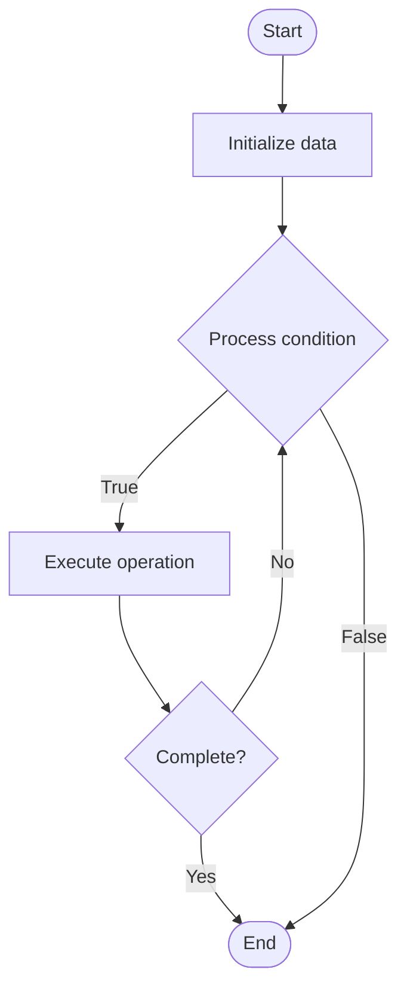

# Smart Contract Security

## Учебные материалы

- [Школьный уровень](school.ru.md)
- [Университетский уровень](univer.ru.md)

## Algorithm Visualization

### Flowchart (ASCII)

```
Smart Contract Security Flowchart:

┌─────────────┐
│   Start     │
└──────┬──────┘
       │
       ▼
┌─────────────┐
│  Initialize │
│   data      │
└──────┬──────┘
       │
       ▼
┌─────────────┐      Yes
│  Process   ├──────┐
│  condition?│      │
└──────┬──────┘      │
       │ No          │
       ▼             │
┌─────────────┐      │
│  Execute   │      │
│  operation │      │
└──────┬──────┘      │
       │             │
       └─────────────┘
       │
       ▼
┌─────────────┐
│    End      │
└─────────────┘
```

### Step-by-Step Execution

```
Smart Contract Security Step-by-Step Execution:

Input: [example data]

Step 1: Initialize
State: [initial state]

Step 2: Process
State: [intermediate state]

Step 3: Finalize
State: [final state]

Result: [output]
```

### Interactive Flowchart (Mermaid)



> **Note**: Mermaid diagrams are rendered automatically on GitHub. For local viewing, use a Mermaid-compatible Markdown viewer.

- [Python Implementation](/code/semester_13/lecture_90_blockchain_security/smart_contract_security/algorithm.py)
- [Java Implementation](/code/semester_13/lecture_90_blockchain_security/smart_contract_security/Algorithm.java)
- [Python Tests](/code/semester_13/lecture_90_blockchain_security/smart_contract_security/test_algorithm.py)

What problem does it solve? (1 sentence)  
   Ensures security of smart contracts through comprehensive security practices, including secure coding, vulnerability prevention, access controls, and defense against common attack vectors.

Intuition (plain-language explanation)  
   Like security for smart contracts: Smart Contract Security is like security for software but for smart contracts - you protect contracts (like protecting software) from attacks and bugs - just as software security protects applications, smart contract security protects blockchain contracts.

Inputs & Outputs  

  - Input: Smart contracts, security requirements, threat models, security tools, best practices, security standards.  
  - Output: Secure contracts, security mechanisms, vulnerability prevention, hardened code, security documentation.

Step-by-step description (5–10 lines max)  
Design: design contracts with security in mind.
Code: code securely following best practices.
Validate: validate all inputs and state.
Control: implement access controls.
Test: test for security vulnerabilities.
Audit: audit contracts for security.
Verify: formally verify if possible.
Deploy: deploy with security measures.
Monitor: monitor for security issues.
Update: update security as needed.

Tiny example (hand-simulated)  
   Smart Contract Security: contract: DeFi protocol → design: secure architecture → code: secure coding practices → validate: input validation → audit: security audit → result: secure contract deployed → Smart Contract Security operational.

Time & Space Complexity  

  - Time: O(d + c + a) where d is design time, c is coding time, a is audit time (security process).  
  - Space: O(s + c) where s is security storage, c is contract storage (security mechanisms, contracts).

Strengths  

- Protection: protects contracts from attacks.
- Trust: increases trust in contracts.
- Reliability: improves contract reliability.

Weaknesses / limitations  

- Complexity: security adds complexity.
- Cost: security measures have costs.
- Evolution: threats evolve, requiring ongoing security.

Compare with alternatives  
    Alternatives: No Security, Basic Security, Reactive Security, Comprehensive Security

30-second explanation (your own words)  
    Ensures security of smart contracts through comprehensive security practices, including secure coding, vulnerability prevention, access controls, and defense against common attack vectors.

*Sources: Adapted from standard university textbooks and Wikipedia summaries.*
