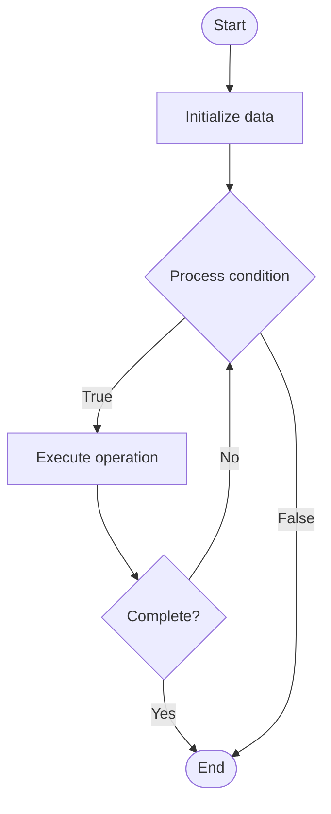

# Vulnerability Detection

1. **Name of Algorithm**  

## Code Files


## Algorithm Visualization

### Flowchart (ASCII)


```
Vulnerability Detection Flowchart:

┌─────────────┐
│   Start     │
└──────┬──────┘
       │
       ▼
┌─────────────┐
│  Initialize │
│   data      │
└──────┬──────┘
       │
       ▼
┌─────────────┐      Yes
│  Process   ├──────┐
│  condition?│      │
└──────┬──────┘      │
       │ No          │
       ▼             │
┌─────────────┐      │
│  Execute   │      │
│  operation │      │
└──────┬──────┘      │
       │             │
       └─────────────┘
       │
       ▼
┌─────────────┐
│    End      │
└─────────────┘
```


### Step-by-Step Execution


```
Vulnerability Detection Step-by-Step Execution:

Input: [example data]

Step 1: Initialize
State: [initial state]

Step 2: Process
State: [intermediate state]

Step 3: Finalize
State: [final state]

Result: [output]
```


### Interactive Flowchart (Mermaid)





> **Note**: Mermaid diagrams are rendered automatically on GitHub. For local viewing, use a Mermaid-compatible Markdown viewer.
- [Python Implementation](semester_13/lecture_90_blockchain_security/vulnerability_detection/algorithm.py)
- [Java Implementation](semester_13/lecture_90_blockchain_security/vulnerability_detection/Algorithm.java)
- [Python Tests](semester_13/lecture_90_blockchain_security/vulnerability_detection/test_algorithm.py)


   Vulnerability Detection

2. **What problem does it solve? (1 sentence)**  
   Detects security vulnerabilities in smart contracts and blockchain systems using automated tools, static analysis, dynamic analysis, and manual techniques to identify potential security issues.

3. **Intuition (plain-language explanation)**  
   Like security scanning: Vulnerability Detection is like security scanning - you scan code (like scanning for viruses) to find vulnerabilities - just as antivirus finds malware, vulnerability detection finds security issues.

4. **Inputs & Outputs**  
   - Input: Smart contracts, code, analysis tools, vulnerability databases, detection rules, security patterns.  
   - Output: Vulnerability reports, detected issues, risk assessments, remediation guidance, security findings.

5. **Step-by-step description (5–10 lines max)**  
1. Scan: scan code with automated tools.
2. Analyze: analyze code statically and dynamically.
3. Check: check against vulnerability databases.
4. Detect: detect known vulnerability patterns.
5. Identify: identify potential security issues.
6. Classify: classify vulnerabilities by severity.
7. Report: report detected vulnerabilities.
8. Prioritize: prioritize for remediation.
9. Track: track vulnerability status.
10. Verify: verify fixes.

6. **Tiny example (hand-simulated)**  
   Vulnerability Detection: contract: token contract → scan: automated scanner → detect: integer overflow vulnerability → classify: high severity → report: vulnerability report → fix: use SafeMath → result: vulnerability fixed → Vulnerability Detection successful.

7. **Time & Space Complexity**  
   - Time: O(c + a) where c is code size, a is analysis time (varies by tools and code complexity).  
   - Space: O(c + v) where c is code storage, v is vulnerability data storage (code and findings).

8. **Strengths**  
- Automation: automated detection is fast.
- Coverage: can detect many vulnerability types.
- Early: detects issues early in development.

9. **Weaknesses / limitations**  
- False positives: may produce false positives.
- Coverage: may not detect all vulnerabilities.
- Tools: depends on quality of detection tools.

10. **Compare with alternatives**  
    Alternatives: Manual Review, No Detection, Auditing Only, Hybrid Approaches

11. **30-second explanation (your own words)**  
    Detects security vulnerabilities in smart contracts and blockchain systems using automated tools, static analysis, dynamic analysis, and manual techniques to identify potential security issues.

*Sources: Adapted from standard university textbooks and Wikipedia summaries.*
