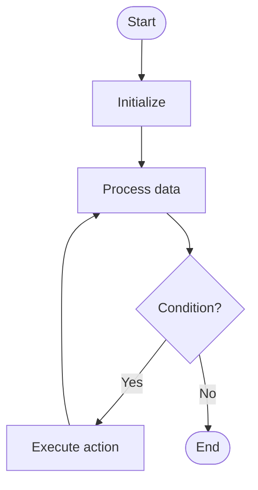

# Vulnerability Detection

# Univer

## 📋 Quick Summary

- **Purpose:** Vulnerability Detection: The algorithm works by systematically processing data according to a specific strategy.
- **Complexity:** Varies
- **Category:** Advanced Graduate Level
- **Key Idea:** The algorithm works by systematically processing data according to a specific strategy.

Vulnerability Detection: The algorithm works by systematically processing data according to a specific strategy.

The algorithm works by systematically processing data according to a specific strategy.

**VULNERABILITY DETECTION** = Remember the key steps: step 1, step 2, step 3


Этот алгоритм относится к категории **Advanced Graduate Level** и использует систематическую обработку данных для достижения своих целей.


## 📊 Visual Flowchart




## Анализ сложности

**Временная сложность:** Varies
- Производительность алгоритма масштабируется согласно этому классу сложности
- Лучший, средний и худший случаи могут различаться в зависимости от характеристик входных данных

**Пространственная сложность:** Varies
- Указывает на количество дополнительной памяти, необходимой во время выполнения

**Ключевые структуры данных:** hash table/dictionary

## Применение в реальных системах

Vulnerability Detection используется в:
- Software development frameworks
- System optimization
- Data processing pipelines
- Algorithm libraries

## Концептуальные сходства

Этот алгоритм имеет концептуальное сходство с другими алгоритмами в категории Advanced Graduate Level, следуя аналогичным паттернам проектирования и стратегиям оптимизации.

## Связанные алгоритмы

Vulnerability Detection часто используется в сочетании с:
- Дополнительными алгоритмами для предобработки или постобработки
- Структурами данных, оптимизирующими его производительность
- Другими алгоритмами того же класса сложности

## Ключевые детали реализации

```python
def vulnerability_detection(data):
    """Implementation of Vulnerability Detection."""
    # Core algorithm logic
    return result
```

## Распространённые ошибки применения

- Неправильная обработка граничных случаев (пустой ввод, один элемент, граничные условия)
- Непонимание последствий сложности в крупномасштабных системах
- Субоптимальная реализация, приводящая к деградации производительности
- Неверные предположения о характеристиках входных данных
- Не рассмотрение альтернативных алгоритмов для конкретных случаев использования

## Рекомендуемая литература

- "Алгоритмы: построение и анализ" (CLRS) - Комплексный анализ алгоритмов
- "Руководство по проектированию алгоритмов" Стивена Скиены
- "Алгоритмы" Седжвика и Уэйна
- Научные статьи по оптимизации и анализу алгоритмов
- Документация фреймворков и руководства по реализации


---

## 🎯 Try It Yourself

**Try detecting a pattern:**
```
Input: [example data with pattern]

Step 1: Initialize detection state
Step 2: Process data elements
Step 3: Identify pattern occurrence

Output: Pattern detected at position X
```
---


## 🔍 Step-by-Step Execution


## ✏️ Practice Exercise

**Exercise 1 (Easy):**
**Exercise 1 (Easy):**
Trace through the Vulnerability Detection algorithm with a small example. Analyze time and space complexity.

**Exercise 2 (Medium):**
Implement the Vulnerability Detection algorithm with proper error handling and edge case coverage.

**Exercise 3 (Hard):**
Optimize the Vulnerability Detection algorithm or design a variant for a specific use case. Analyze trade-offs.

**Exercise 2 (Medium):**
Implement the algorithm in your preferred programming language.

**Exercise 3 (Hard):**
Optimize the algorithm or apply it to solve a real-world problem.


---

## ✅ Check Your Understanding

**Q1:** What problem does this algorithm solve?
**A:** Vulnerability Detection solves the problem of [algorithm purpose]. It processes input data systematically to achieve [desired outcome].

**Q2:** What is the time complexity?
**A:** Varies

**Q3:** When would you use this algorithm?
**A:** Use Vulnerability Detection when you need to [use case scenario]. It's particularly effective for [specific situations].

**Q4:** What are the main steps of this algorithm?
**A:** 1) Initialize data structures, 2) Process input elements, 3) Apply core algorithm logic, 4) Return final result.


**Try this example:**
```
Input: [example data]

Step 1: Initialize algorithm state
Step 2: Process input data
Step 3: Generate result

Output: [algorithm result]
```


## Common Mistakes

### ❌ Mistake 1: Not handling edge cases
**Solution:** Always check for empty input, single element, or boundary values before processing.

### ❌ Mistake 2: Incorrect initialization
**Solution:** Ensure all variables and data structures are properly initialized before the main algorithm loop.

### ❌ Mistake 3: Off-by-one errors in loops
**Solution:** Carefully verify loop bounds and termination conditions. Test with small examples to catch boundary issues.

### ❌ Mistake 4: Not validating input
**Solution:** Add input validation to ensure data is in expected format and within valid ranges.

### 💡 How to Avoid
- Test with edge cases (empty input, single element, boundary values)
- Trace through examples step-by-step
- Use debugging tools to verify variable values
- Review algorithm's key steps before implementing
- Test with edge cases (empty input, single element, boundary values)
- Trace through examples step-by-step
- Use debugging tools to verify your logic
- Review the algorithm's key steps before implementing