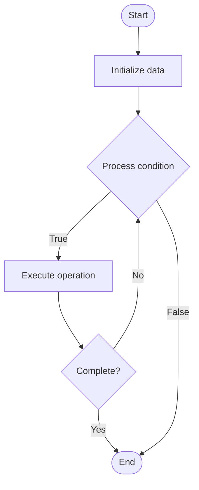

# Confidential Transactions

## Учебные материалы

- [Школьный уровень](school.ru.md)
- [Университетский уровень](univer.ru.md)

## Algorithm Visualization

### Flowchart (ASCII)

```
Confidential Transactions Flowchart:

┌─────────────┐
│   Start     │
└──────┬──────┘
       │
       ▼
┌─────────────┐
│  Initialize │
│   data      │
└──────┬──────┘
       │
       ▼
┌─────────────┐      Yes
│  Process   ├──────┐
│  condition?│      │
└──────┬──────┘      │
       │ No          │
       ▼             │
┌─────────────┐      │
│  Execute   │      │
│  operation │      │
└──────┬──────┘      │
       │             │
       └─────────────┘
       │
       ▼
┌─────────────┐
│    End      │
└─────────────┘
```

### Step-by-Step Execution

```
Confidential Transactions Step-by-Step Execution:

Input: [example data]

Step 1: Initialize
State: [initial state]

Step 2: Process
State: [intermediate state]

Step 3: Finalize
State: [final state]

Result: [output]
```

### Interactive Flowchart (Mermaid)



> **Note**: Mermaid diagrams are rendered automatically on GitHub. For local viewing, use a Mermaid-compatible Markdown viewer.

- [Python Implementation](/code/semester_13/lecture_91_blockchain_privacy/confidential_transactions/algorithm.py)
- [Java Implementation](/code/semester_13/lecture_91_blockchain_privacy/confidential_transactions/Algorithm.java)
- [Python Tests](/code/semester_13/lecture_91_blockchain_privacy/confidential_transactions/test_algorithm.py)

What problem does it solve? (1 sentence)  
   Implements confidential transactions that hide transaction amounts while maintaining verifiability, enabling privacy-preserving blockchain transactions where amounts are encrypted but still verifiable.

Intuition (plain-language explanation)  
   Like private transactions: Confidential Transactions are like private transactions - you hide the amounts (like hiding prices) but still prove they're valid - just as you can have private but verifiable transactions, confidential transactions hide amounts but remain verifiable.

Inputs & Outputs  

  - Input: Transaction amounts, public keys, commitment schemes, range proofs, encryption keys.  
  - Output: Confidential transactions, encrypted amounts, verifiable commitments, range proofs, private transactions.

Step-by-step description (5–10 lines max)  
Commit: commit to transaction amount using commitment scheme.
Encrypt: encrypt amount information.
Prove: generate range proof (amount is valid).
Sign: sign transaction.
Broadcast: broadcast confidential transaction.
Verify: verify commitment and range proof.
Validate: validate transaction without seeing amount.
Record: record on blockchain.
Reveal: optionally reveal amount to authorized parties.
Audit: enable auditing if needed.

Tiny example (hand-simulated)  
   Confidential Transactions: amount: 10 BTC → commit: create commitment → encrypt: encrypt amount → prove: range proof (0 < amount < max) → verify: verify without seeing amount → result: private transaction verified → Confidential Transactions successful.

Time & Space Complexity  

  - Time: O(1) for transaction operations (constant time commitment and proof operations).  
  - Space: O(1) per transaction (commitment and proof storage).

Strengths  

- Privacy: hides transaction amounts.
- Verifiability: maintains transaction verifiability.
- Auditability: enables optional auditing.

Weaknesses / limitations  

- Overhead: adds overhead to transactions.
- Complexity: cryptographic operations are complex.
- Scalability: may impact scalability.

Compare with alternatives  
    Alternatives: Transparent Transactions, Full Anonymity, Selective Privacy, Other Privacy Methods

30-second explanation (your own words)  
    Implements confidential transactions that hide transaction amounts while maintaining verifiability, enabling privacy-preserving blockchain transactions where amounts are encrypted but still verifiable.

*Sources: Adapted from standard university textbooks and Wikipedia summaries.*


## References

- [Confidential Transactions - Wikipedia](https://en.wikipedia.org/wiki/Confidential%20Transactions)
