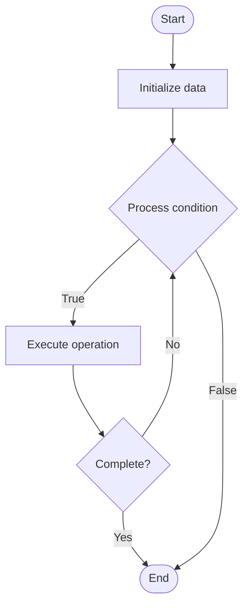

# Privacy Coins

Name of Algorithm  

## Code Files


## Algorithm Visualization

### Flowchart (ASCII)


```
Privacy Coins Flowchart:

┌─────────────┐
│   Start     │
└──────┬──────┘
       │
       ▼
┌─────────────┐
│  Initialize │
│   data      │
└──────┬──────┘
       │
       ▼
┌─────────────┐      Yes
│  Process   ├──────┐
│  condition?│      │
└──────┬──────┘      │
       │ No          │
       ▼             │
┌─────────────┐      │
│  Execute   │      │
│  operation │      │
└──────┬──────┘      │
       │             │
       └─────────────┘
       │
       ▼
┌─────────────┐
│    End      │
└─────────────┘
```


### Step-by-Step Execution


```
Privacy Coins Step-by-Step Execution:

Input: [example data]

Step 1: Initialize
State: [initial state]

Step 2: Process
State: [intermediate state]

Step 3: Finalize
State: [final state]

Result: [output]
```


### Interactive Flowchart (Mermaid)





> **Note**: Mermaid diagrams are rendered automatically on GitHub. For local viewing, use a Mermaid-compatible Markdown viewer.
- [Python Implementation](/code/semester_13/lecture_91_blockchain_privacy/privacy_coins/algorithm.py)
- [Java Implementation](/code/semester_13/lecture_91_blockchain_privacy/privacy_coins/Algorithm.java)
- [Python Tests](/code/semester_13/lecture_91_blockchain_privacy/privacy_coins/test_algorithm.py)


   Privacy Coins

What problem does it solve? (1 sentence)  
   Implements privacy-focused cryptocurrencies that provide enhanced privacy and anonymity for transactions, hiding sender, receiver, and amount information through various cryptographic techniques.

Intuition (plain-language explanation)  
   Like private money: Privacy Coins are like private money - you can send money (like cash) without revealing who sent it, who received it, or how much - just as cash is private, privacy coins provide private transactions.

Inputs & Outputs  
   - Input: Transactions, sender addresses, receiver addresses, amounts, privacy mechanisms, cryptographic keys.  
   - Output: Private transactions, anonymous payments, hidden amounts, untraceable transactions, privacy-preserving coins.

Step-by-step description (5–10 lines max)  
Create: create private transaction.
Hide: hide sender identity (ring signatures, etc.).
Hide: hide receiver identity (stealth addresses, etc.).
Hide: hide transaction amount (confidential transactions, etc.).
Mix: optionally mix with other transactions.
Sign: sign transaction privately.
Broadcast: broadcast private transaction.
Verify: verify transaction validity.
Record: record on blockchain (private details hidden).
Complete: transaction complete with privacy.

Tiny example (hand-simulated)  
   Privacy Coins: transaction: send 10 coins → hide: hide sender (ring signature) → hide: hide receiver (stealth address) → hide: hide amount (confidential transaction) → result: completely private transaction → Privacy Coins successful.

Time & Space Complexity  
   - Time: O(1) for transaction operations (varies by privacy mechanism).  
   - Space: O(1) per transaction (transaction storage, may be larger due to privacy overhead).

Strengths  
- Privacy: strong privacy and anonymity.
- Untraceability: transactions are untraceable.
- Fungibility: improved fungibility through privacy.

Weaknesses / limitations  
- Regulation: regulatory concerns about privacy.
- Overhead: privacy mechanisms add overhead.
- Adoption: may have limited adoption due to regulation.

Compare with alternatives  
    Alternatives: Transparent Cryptocurrencies, Selective Privacy, Mixers, Other Privacy Methods

30-second explanation (your own words)  
    Implements privacy-focused cryptocurrencies that provide enhanced privacy and anonymity for transactions, hiding sender, receiver, and amount information through various cryptographic techniques.

*Sources: Adapted from standard university textbooks and Wikipedia summaries.*
