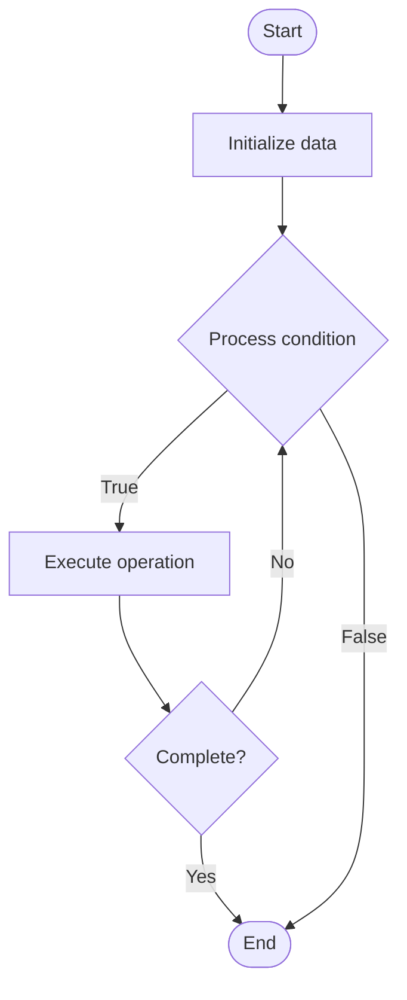

# Ring Signatures

1. **Name of Algorithm**  

## Code Files


## Algorithm Visualization

### Flowchart (ASCII)


```
Ring Signatures Flowchart:

┌─────────────┐
│   Start     │
└──────┬──────┘
       │
       ▼
┌─────────────┐
│  Initialize │
│   data      │
└──────┬──────┘
       │
       ▼
┌─────────────┐      Yes
│  Process   ├──────┐
│  condition?│      │
└──────┬──────┘      │
       │ No          │
       ▼             │
┌─────────────┐      │
│  Execute   │      │
│  operation │      │
└──────┬──────┘      │
       │             │
       └─────────────┘
       │
       ▼
┌─────────────┐
│    End      │
└─────────────┘
```


### Step-by-Step Execution


```
Ring Signatures Step-by-Step Execution:

Input: [example data]

Step 1: Initialize
State: [initial state]

Step 2: Process
State: [intermediate state]

Step 3: Finalize
State: [final state]

Result: [output]
```


### Interactive Flowchart (Mermaid)





> **Note**: Mermaid diagrams are rendered automatically on GitHub. For local viewing, use a Mermaid-compatible Markdown viewer.
- [Python Implementation](semester_13/lecture_91_blockchain_privacy/ring_signatures/algorithm.py)
- [Java Implementation](semester_13/lecture_91_blockchain_privacy/ring_signatures/Algorithm.java)
- [Python Tests](semester_13/lecture_91_blockchain_privacy/ring_signatures/test_algorithm.py)


   Ring Signatures

2. **What problem does it solve? (1 sentence)**  
   Implements ring signatures, cryptographic signatures that provide signer anonymity by allowing a signer to sign on behalf of a group (ring) without revealing which member signed, enabling anonymous transactions.

3. **Intuition (plain-language explanation)**  
   Like anonymous group signatures: Ring Signatures are like anonymous group signatures - you sign as part of a group (like signing as 'one of us') without revealing who you are - just as you can sign anonymously in a group, ring signatures provide anonymity.

4. **Inputs & Outputs**  
   - Input: Message, ring members, private key, public keys, signature parameters.  
   - Output: Ring signatures, anonymous signatures, verifiable signatures, transaction anonymity.

5. **Step-by-step description (5–10 lines max)**  
1. Select: select ring of public keys.
2. Generate: generate ring signature using private key.
3. Sign: sign message with ring signature.
4. Verify: verify signature belongs to ring.
5. Anonymize: signer identity remains hidden.
6. Validate: validate signature without knowing signer.
7. Broadcast: broadcast signed transaction.
8. Record: record on blockchain.
9. Trace: cannot trace to specific signer.
10. Complete: transaction complete with anonymity.

6. **Tiny example (hand-simulated)**  
   Ring Signatures: message: transaction → ring: 10 public keys → sign: generate ring signature → verify: signature valid, signer unknown → result: anonymous transaction → Ring Signatures successful.

7. **Time & Space Complexity**  
   - Time: O(n) where n is ring size (signature generation and verification).  
   - Space: O(n) where n is ring size (ring signature storage).

8. **Strengths**  
- Anonymity: provides signer anonymity.
- Privacy: enables private transactions.

9. **Weaknesses / limitations**  
- Ring size: larger rings provide better anonymity but more overhead.
- Complexity: ring signatures are complex.
- Linkability: may have linkability issues.

10. **Compare with alternatives**  
    Alternatives: Regular Signatures, Other Anonymous Signatures, Mixers, Zero-Knowledge Proofs

11. **30-second explanation (your own words)**  
    Implements ring signatures, cryptographic signatures that provide signer anonymity by allowing a signer to sign on behalf of a group (ring) without revealing which member signed, enabling anonymous transactions.

*Sources: Adapted from standard university textbooks and Wikipedia summaries.*
