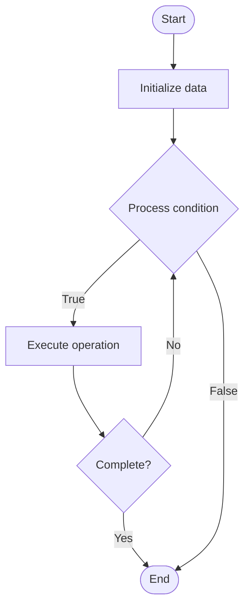

# Zero Knowledge Proofs

1. **Name of Algorithm**  

## Code Files


## Algorithm Visualization

### Flowchart (ASCII)


```
Zero Knowledge Proofs Flowchart:

┌─────────────┐
│   Start     │
└──────┬──────┘
       │
       ▼
┌─────────────┐
│  Initialize │
│   data      │
└──────┬──────┘
       │
       ▼
┌─────────────┐      Yes
│  Process   ├──────┐
│  condition?│      │
└──────┬──────┘      │
       │ No          │
       ▼             │
┌─────────────┐      │
│  Execute   │      │
│  operation │      │
└──────┬──────┘      │
       │             │
       └─────────────┘
       │
       ▼
┌─────────────┐
│    End      │
└─────────────┘
```


### Step-by-Step Execution


```
Zero Knowledge Proofs Step-by-Step Execution:

Input: [example data]

Step 1: Initialize
State: [initial state]

Step 2: Process
State: [intermediate state]

Step 3: Finalize
State: [final state]

Result: [output]
```


### Interactive Flowchart (Mermaid)





> **Note**: Mermaid diagrams are rendered automatically on GitHub. For local viewing, use a Mermaid-compatible Markdown viewer.
- [Python Implementation](semester_13/lecture_91_blockchain_privacy/zero_knowledge_proofs/algorithm.py)
- [Java Implementation](semester_13/lecture_91_blockchain_privacy/zero_knowledge_proofs/Algorithm.java)
- [Python Tests](semester_13/lecture_91_blockchain_privacy/zero_knowledge_proofs/test_algorithm.py)


   Zero Knowledge Proofs

2. **What problem does it solve? (1 sentence)**  
   Implements zero-knowledge proofs that allow one party to prove knowledge of information to another party without revealing the information itself, enabling privacy-preserving blockchain applications.

3. **Intuition (plain-language explanation)**  
   Like proving without revealing: Zero Knowledge Proofs are like proving you know something without telling what it is - you prove knowledge (like proving you have a key) without revealing the secret - just as you can prove you know something without revealing it, ZK proofs enable private verification.

4. **Inputs & Outputs**  
   - Input: Secret information, public statement, proof system, verification parameters, witness.  
   - Output: Zero-knowledge proofs, verifiable proofs, private verification, proof of knowledge.

5. **Step-by-step description (5–10 lines max)**  
1. Setup: setup proof system parameters.
2. Witness: create witness from secret.
3. Prove: generate zero-knowledge proof.
4. Verify: verify proof without seeing secret.
5. Validate: validate statement is true.
6. Privacy: secret remains private.
7. Complete: proof complete and verified.
8. Use: use in privacy applications.
9. Optimize: optimize proof size and verification.
10. Deploy: deploy in blockchain systems.

6. **Tiny example (hand-simulated)**  
   Zero Knowledge Proofs: secret: private key → statement: 'I know private key for address X' → prove: generate ZK proof → verify: verify proof without seeing key → result: knowledge proven, key remains secret → Zero Knowledge Proofs successful.

7. **Time & Space Complexity**  
   - Time: O(p) where p is proof generation time (varies by proof system, can be polynomial).  
   - Space: O(s) where s is proof size (proof storage, varies by system).

8. **Strengths**  
- Privacy: enables privacy-preserving verification.
- Verifiability: maintains verifiability without revealing secrets.
- Applications: enables many privacy applications.

9. **Weaknesses / limitations**  
- Complexity: ZK proofs are complex.
- Overhead: proof generation and verification have overhead.
- Trust: setup may require trusted setup (for some systems).

10. **Compare with alternatives**  
    Alternatives: Reveal Secrets, Other Privacy Methods, Trusted Third Parties, Hybrid Approaches

11. **30-second explanation (your own words)**  
    Implements zero-knowledge proofs that allow one party to prove knowledge of information to another party without revealing the information itself, enabling privacy-preserving blockchain applications.

*Sources: Adapted from standard university textbooks and Wikipedia summaries.*
