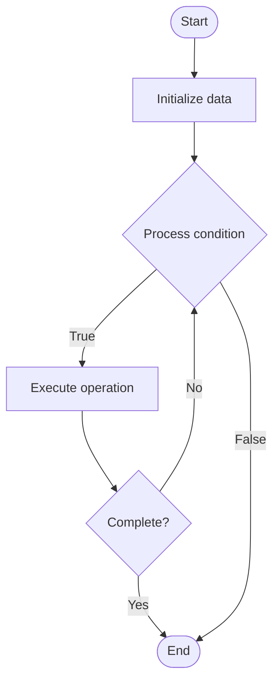

# ZK-SNARKs (Zero-Knowledge Succinct Non-Interactive Arguments of Knowledge)

1. **Name of Algorithm**  

## Code Files


## Algorithm Visualization

### Flowchart (ASCII)


```
ZK-SNARKs (Zero-Knowledge Succinct Non-Interactive Arguments of Knowledge) Flowchart:

┌─────────────┐
│   Start     │
└──────┬──────┘
       │
       ▼
┌─────────────┐
│  Initialize │
│   data      │
└──────┬──────┘
       │
       ▼
┌─────────────┐      Yes
│  Process   ├──────┐
│  condition?│      │
└──────┬──────┘      │
       │ No          │
       ▼             │
┌─────────────┐      │
│  Execute   │      │
│  operation │      │
└──────┬──────┘      │
       │             │
       └─────────────┘
       │
       ▼
┌─────────────┐
│    End      │
└─────────────┘
```


### Step-by-Step Execution


```
ZK-SNARKs (Zero-Knowledge Succinct Non-Interactive Arguments of Knowledge) Step-by-Step Execution:

Input: [example data]

Step 1: Initialize
State: [initial state]

Step 2: Process
State: [intermediate state]

Step 3: Finalize
State: [final state]

Result: [output]
```


### Interactive Flowchart (Mermaid)





> **Note**: Mermaid diagrams are rendered automatically on GitHub. For local viewing, use a Mermaid-compatible Markdown viewer.
- [Python Implementation](semester_13/lecture_91_blockchain_privacy/zk_snarks/algorithm.py)
- [Java Implementation](semester_13/lecture_91_blockchain_privacy/zk_snarks/Algorithm.java)
- [Python Tests](semester_13/lecture_91_blockchain_privacy/zk_snarks/test_algorithm.py)


   ZK-SNARKs (Zero-Knowledge Succinct Non-Interactive Arguments of Knowledge)

2. **What problem does it solve? (1 sentence)**  
Implements ZK-SNARKs, a type of zero-knowledge proof that is succinct (small proof size), non-interactive (no back-and-forth), and enables efficient privacy-preserving blockchain transactions and smart contracts.

3. **Intuition (plain-language explanation)**  
Like compact private proofs: ZK-SNARKs are like compact private proofs - you prove something privately (like ZK proofs) but the proof is small and doesn't require interaction - just as compact proofs are efficient, ZK-SNARKs provide efficient private proofs.

4. **Inputs & Outputs**  
   - Input: Secret witness, public statement, circuit, trusted setup, proving key, verification key.  
- Output: ZK-SNARK proofs, succinct proofs, verifiable proofs, private verification, efficient proofs.

5. **Step-by-step description (5–10 lines max)**  
1. Setup: perform trusted setup (generate keys).
2. Circuit: represent statement as arithmetic circuit.
3. Witness: create witness from secret.
4. Prove: generate ZK-SNARK proof.
5. Verify: verify proof using verification key.
6. Validate: validate statement without seeing witness.
7. Complete: proof complete (small, fast verification).
8. Use: use in privacy applications.
9. Optimize: optimize circuit and proof generation.
10. Deploy: deploy in blockchain systems.

6. **Tiny example (hand-simulated)**  
   ZK-SNARKs: statement: transaction valid → circuit: represent as circuit → prove: generate ZK-SNARK → verify: verify in milliseconds → result: valid transaction, private details hidden → ZK-SNARKs successful.

7. **Time & Space Complexity**  
   - Time: O(c) where c is circuit size (proof generation), O(1) for verification (constant time).  
   - Space: O(1) for proof size (succinct, constant size regardless of witness size).

8. **Strengths**  
- Succinct: very small proof size.
- Fast: fast verification (constant time).
- Privacy: enables strong privacy.

9. **Weaknesses / limitations**  
- Setup: requires trusted setup ceremony.
- Complexity: circuit design is complex.
- Trust: trusted setup requires trust.

10. **Compare with alternatives**  
    Alternatives: ZK-STARKs, Other ZK Proofs, Interactive Proofs, No Privacy

11. **30-second explanation (your own words)**  
Implements ZK-SNARKs, a type of zero-knowledge proof that is succinct (small proof size), non-interactive (no back-and-forth), and enables efficient privacy-preserving blockchain transactions and smart contracts.

*Sources: Adapted from standard university textbooks and Wikipedia summaries.*
