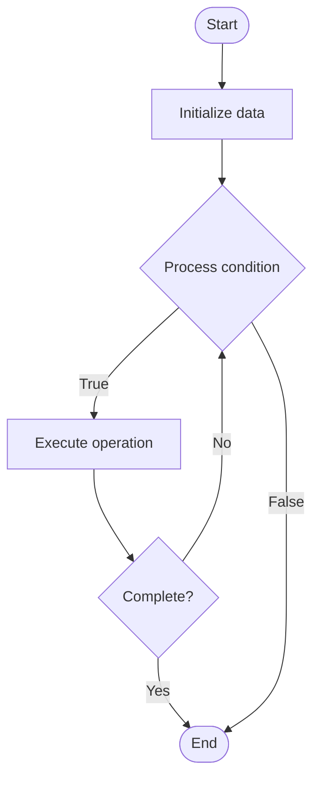

# ZK-STARKs (Zero-Knowledge Scalable Transparent Arguments of Knowledge)

## Учебные материалы

- [Школьный уровень](school.ru.md)
- [Университетский уровень](univer.ru.md)

## Algorithm Visualization

### Flowchart (ASCII)

```
ZK-STARKs (Zero-Knowledge Scalable Transparent Arguments of Knowledge) Flowchart:

┌─────────────┐
│   Start     │
└──────┬──────┘
       │
       ▼
┌─────────────┐
│  Initialize │
│   data      │
└──────┬──────┘
       │
       ▼
┌─────────────┐      Yes
│  Process   ├──────┐
│  condition?│      │
└──────┬──────┘      │
       │ No          │
       ▼             │
┌─────────────┐      │
│  Execute   │      │
│  operation │      │
└──────┬──────┘      │
       │             │
       └─────────────┘
       │
       ▼
┌─────────────┐
│    End      │
└─────────────┘
```

### Step-by-Step Execution

```
ZK-STARKs (Zero-Knowledge Scalable Transparent Arguments of Knowledge) Step-by-Step Execution:

Input: [example data]

Step 1: Initialize
State: [initial state]

Step 2: Process
State: [intermediate state]

Step 3: Finalize
State: [final state]

Result: [output]
```

### Interactive Flowchart (Mermaid)



> **Note**: Mermaid diagrams are rendered automatically on GitHub. For local viewing, use a Mermaid-compatible Markdown viewer.

- [Python Implementation](/code/semester_13/lecture_91_blockchain_privacy/zk_starks/algorithm.py)
- [Java Implementation](/code/semester_13/lecture_91_blockchain_privacy/zk_starks/Algorithm.java)
- [Python Tests](/code/semester_13/lecture_91_blockchain_privacy/zk_starks/test_algorithm.py)

   ZK-STARKs (Zero-Knowledge Scalable Transparent Arguments of Knowledge)

What problem does it solve? (1 sentence)  
Implements ZK-STARKs, a type of zero-knowledge proof that is transparent (no trusted setup), scalable (efficient for large computations), and provides post-quantum security, enabling privacy without trusted setup.

Intuition (plain-language explanation)  
   Like transparent private proofs: ZK-STARKs are like transparent private proofs - you prove something privately (like ZK proofs) but without needing trusted setup (transparent) - just as transparent processes don't need trust, ZK-STARKs don't need trusted setup.

Inputs & Outputs  

  - Input: Secret witness, public statement, computation, transparent setup, proof parameters.  
  - Output: ZK-STARK proofs, transparent proofs, verifiable proofs, private verification, scalable proofs.

Step-by-step description (5–10 lines max)  
Setup: perform transparent setup (no trust needed).
Compute: represent computation.
Witness: create witness from secret.
Prove: generate ZK-STARK proof.
Verify: verify proof transparently.
Validate: validate statement without seeing witness.
Complete: proof complete (transparent, scalable).
Use: use in privacy applications.
Scale: scale to large computations.
Deploy: deploy in blockchain systems.

Tiny example (hand-simulated)  
   ZK-STARKs: statement: computation result correct → compute: represent computation → prove: generate ZK-STARK → verify: verify transparently → result: computation verified, inputs private → ZK-STARKs successful.

Time & Space Complexity  

  - Time: O(n log n) where n is computation size (proof generation), O(log n) for verification.  
  - Space: O(log n) where n is computation size (proof size, logarithmic).

Strengths  

- Transparency: no trusted setup required.
- Scalability: efficient for large computations.
- Security: post-quantum secure.

Weaknesses / limitations  

- Proof size: larger proof size than SNARKs.
- Complexity: STARK construction is complex.
- Verification: verification time is logarithmic (vs constant for SNARKs).

Compare with alternatives  
    Alternatives: ZK-SNARKs, Other ZK Proofs, Trusted Setup Proofs, No Privacy

30-second explanation (your own words)  
Implements ZK-STARKs, a type of zero-knowledge proof that is transparent (no trusted setup), scalable (efficient for large computations), and provides post-quantum security, enabling privacy without trusted setup.

*Sources: Adapted from standard university textbooks and Wikipedia summaries.*
