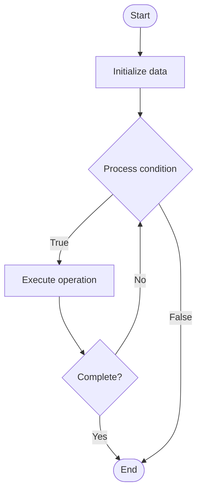

# Atomic Swaps

1. **Name of Algorithm**  

## Code Files


## Algorithm Visualization

### Flowchart (ASCII)


```
Atomic Swaps Flowchart:

┌─────────────┐
│   Start     │
└──────┬──────┘
       │
       ▼
┌─────────────┐
│  Initialize │
│   data      │
└──────┬──────┘
       │
       ▼
┌─────────────┐      Yes
│  Process   ├──────┐
│  condition?│      │
└──────┬──────┘      │
       │ No          │
       ▼             │
┌─────────────┐      │
│  Execute   │      │
│  operation │      │
└──────┬──────┘      │
       │             │
       └─────────────┘
       │
       ▼
┌─────────────┐
│    End      │
└─────────────┘
```


### Step-by-Step Execution


```
Atomic Swaps Step-by-Step Execution:

Input: [example data]

Step 1: Initialize
State: [initial state]

Step 2: Process
State: [intermediate state]

Step 3: Finalize
State: [final state]

Result: [output]
```


### Interactive Flowchart (Mermaid)





> **Note**: Mermaid diagrams are rendered automatically on GitHub. For local viewing, use a Mermaid-compatible Markdown viewer.
- [Python Implementation](semester_13/lecture_92_blockchain_interoperability/atomic_swaps/algorithm.py)
- [Java Implementation](semester_13/lecture_92_blockchain_interoperability/atomic_swaps/Algorithm.java)
- [Python Tests](semester_13/lecture_92_blockchain_interoperability/atomic_swaps/test_algorithm.py)


   Atomic Swaps

2. **What problem does it solve? (1 sentence)**  
   Implements atomic swaps, trustless cross-chain cryptocurrency exchanges that enable users to exchange cryptocurrencies from different blockchains without intermediaries, using hash time-locked contracts (HTLCs).

3. **Intuition (plain-language explanation)**  
   Like trustless exchange: Atomic Swaps are like trustless exchange - you exchange coins from different blockchains (like exchanging currencies) without needing a trusted middleman - just as you can exchange currencies directly, atomic swaps enable direct cross-chain exchange.

4. **Inputs & Outputs**  
   - Input: Cryptocurrencies, blockchain networks, hash time-locked contracts, secret hashes, time locks, exchange rates.  
   - Output: Atomic swaps, cross-chain exchanges, trustless trades, exchanged cryptocurrencies, completed swaps.

5. **Step-by-step description (5–10 lines max)**  
1. Initiate: initiate swap on first blockchain.
2. Lock: lock funds in HTLC on first chain.
3. Hash: create secret hash.
6. Reveal: reveal secret to claim funds.
7. Claim: claim funds on both chains.
8. Complete: swap completes atomically (both or neither).
9. Timeout: funds return if swap not completed.
10. Verify: verify swap completion.

6. **Tiny example (hand-simulated)**  
   Atomic Swaps: swap: 1 BTC for 30 ETH → lock: lock BTC in HTLC → lock: lock ETH in HTLC → reveal: reveal secret → claim: claim BTC and ETH → result: trustless cross-chain exchange → Atomic Swaps successful.

7. **Time & Space Complexity**  
   - Time: O(b) where b is block time (swap completion time, depends on block times).  
   - Space: O(s) where s is swap data (HTLC and swap storage).

8. **Strengths**  
- Trustless: no need for trusted intermediaries.
- Decentralization: fully decentralized exchange.
- Security: atomic (both or neither) ensures security.

9. **Weaknesses / limitations**  
- Time: swaps take time (block confirmation times).
- Complexity: atomic swaps are complex to implement.
- Liquidity: requires counterparty for swap.

10. **Compare with alternatives**  
    Alternatives: Centralized Exchanges, Wrapped Tokens, Bridges, Other Cross-Chain Methods

11. **30-second explanation (your own words)**  
    Implements atomic swaps, trustless cross-chain cryptocurrency exchanges that enable users to exchange cryptocurrencies from different blockchains without intermediaries, using hash time-locked contracts (HTLCs).

*Sources: Adapted from standard university textbooks and Wikipedia summaries.*
