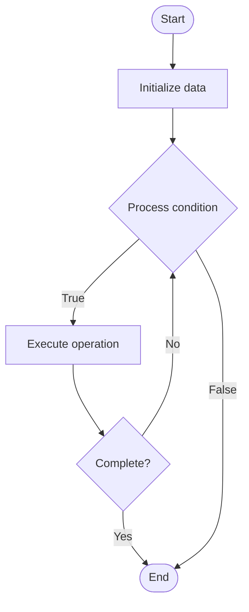

# Chain Abstraction

Name of Algorithm  

## Code Files


## Algorithm Visualization

### Flowchart (ASCII)


```
Chain Abstraction Flowchart:

┌─────────────┐
│   Start     │
└──────┬──────┘
       │
       ▼
┌─────────────┐
│  Initialize │
│   data      │
└──────┬──────┘
       │
       ▼
┌─────────────┐      Yes
│  Process   ├──────┐
│  condition?│      │
└──────┬──────┘      │
       │ No          │
       ▼             │
┌─────────────┐      │
│  Execute   │      │
│  operation │      │
└──────┬──────┘      │
       │             │
       └─────────────┘
       │
       ▼
┌─────────────┐
│    End      │
└─────────────┘
```


### Step-by-Step Execution


```
Chain Abstraction Step-by-Step Execution:

Input: [example data]

Step 1: Initialize
State: [initial state]

Step 2: Process
State: [intermediate state]

Step 3: Finalize
State: [final state]

Result: [output]
```


### Interactive Flowchart (Mermaid)





> **Note**: Mermaid diagrams are rendered automatically on GitHub. For local viewing, use a Mermaid-compatible Markdown viewer.
- [Python Implementation](/code/semester_13/lecture_92_blockchain_interoperability/chain_abstraction/algorithm.py)
- [Java Implementation](/code/semester_13/lecture_92_blockchain_interoperability/chain_abstraction/Algorithm.java)
- [Python Tests](/code/semester_13/lecture_92_blockchain_interoperability/chain_abstraction/test_algorithm.py)


   Chain Abstraction

What problem does it solve? (1 sentence)  
   Implements chain abstraction layers that hide blockchain complexity from users and applications, enabling seamless interaction with multiple blockchains through unified interfaces without needing to understand underlying chain differences.

Intuition (plain-language explanation)  
   Like abstraction layers: Chain Abstraction is like abstraction layers in programming - you hide complexity (like hiding hardware details) so users don't need to know which blockchain they're using - just as abstraction simplifies programming, chain abstraction simplifies blockchain interaction.

Inputs & Outputs  
   - Input: Blockchain operations, user requests, multiple chains, abstraction layer, unified interfaces.  
   - Output: Abstracted operations, unified interactions, seamless multi-chain access, simplified blockchain usage.

Step-by-step description (5–10 lines max)  
Request: user makes request through abstraction layer.
Route: route to appropriate blockchain.
Translate: translate to chain-specific format.
Execute: execute on target blockchain.
Monitor: monitor execution across chains.
Aggregate: aggregate results from multiple chains.
Present: present unified results to user.
Handle: handle chain-specific differences.
Optimize: optimize for best chain selection.
Complete: complete operation seamlessly.

Tiny example (hand-simulated)  
   Chain Abstraction: request: send payment → route: route to Ethereum → translate: translate to Ethereum format → execute: execute transaction → result: payment sent, user didn't need to know chain details → Chain Abstraction successful.

Time & Space Complexity  
   - Time: O(r + e) where r is routing time, e is execution time (abstraction overhead).  
   - Space: O(a + c) where a is abstraction layer storage, c is chain data storage.

Strengths  
- Simplicity: simplifies blockchain interaction for users.
- Flexibility: enables easy switching between chains.
- Accessibility: makes blockchain more accessible.

Weaknesses / limitations  
- Complexity: abstraction layer adds complexity.
- Overhead: abstraction adds overhead.
- Limitations: may not support all chain features.

Compare with alternatives  
    Alternatives: Direct Chain Access, Chain-Specific Interfaces, Multi-Chain Wallets, Hybrid Approaches

30-second explanation (your own words)  
    Implements chain abstraction layers that hide blockchain complexity from users and applications, enabling seamless interaction with multiple blockchains through unified interfaces without needing to understand underlying chain differences.

*Sources: Adapted from standard university textbooks and Wikipedia summaries.*
