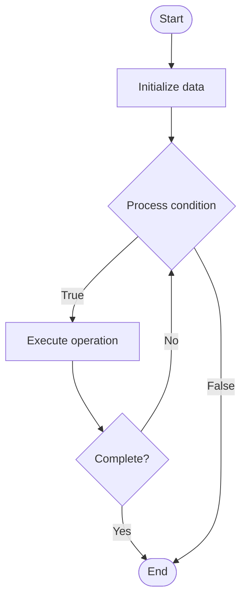

# Cross Chain Bridges

1. **Name of Algorithm**  

## Code Files


## Algorithm Visualization

### Flowchart (ASCII)


```
Cross Chain Bridges Flowchart:

┌─────────────┐
│   Start     │
└──────┬──────┘
       │
       ▼
┌─────────────┐
│  Initialize │
│   data      │
└──────┬──────┘
       │
       ▼
┌─────────────┐      Yes
│  Process   ├──────┐
│  condition?│      │
└──────┬──────┘      │
       │ No          │
       ▼             │
┌─────────────┐      │
│  Execute   │      │
│  operation │      │
└──────┬──────┘      │
       │             │
       └─────────────┘
       │
       ▼
┌─────────────┐
│    End      │
└─────────────┘
```


### Step-by-Step Execution


```
Cross Chain Bridges Step-by-Step Execution:

Input: [example data]

Step 1: Initialize
State: [initial state]

Step 2: Process
State: [intermediate state]

Step 3: Finalize
State: [final state]

Result: [output]
```


### Interactive Flowchart (Mermaid)





> **Note**: Mermaid diagrams are rendered automatically on GitHub. For local viewing, use a Mermaid-compatible Markdown viewer.
- [Python Implementation](semester_13/lecture_92_blockchain_interoperability/cross_chain_bridges/algorithm.py)
- [Java Implementation](semester_13/lecture_92_blockchain_interoperability/cross_chain_bridges/Algorithm.java)
- [Python Tests](semester_13/lecture_92_blockchain_interoperability/cross_chain_bridges/test_algorithm.py)


   Cross Chain Bridges

2. **What problem does it solve? (1 sentence)**  
   Implements cross-chain bridges that enable transfer of assets and data between different blockchains, connecting isolated blockchain networks and enabling interoperability.

3. **Intuition (plain-language explanation)**  
   Like bridges between islands: Cross Chain Bridges are like bridges between islands - you connect different blockchains (like connecting islands) to move assets and data between them - just as bridges connect places, cross-chain bridges connect blockchains.

4. **Inputs & Outputs**  
   - Input: Assets, source blockchain, destination blockchain, bridge protocols, lock mechanisms, mint/burn operations.  
   - Output: Bridged assets, cross-chain transfers, connected blockchains, interoperability, asset mobility.

5. **Step-by-step description (5–10 lines max)**  
1. Lock: lock assets on source chain.
2. Verify: verify lock on source chain.
3. Mint: mint equivalent assets on destination chain.
4. Transfer: transfer assets to user on destination.
5. Monitor: monitor bridge operations.
6. Unlock: unlock assets when returning.
7. Burn: burn assets on destination when returning.
8. Release: release assets on source chain.
9. Validate: validate bridge operations.
10. Secure: secure bridge against attacks.

6. **Tiny example (hand-simulated)**  
   Cross Chain Bridges: asset: 10 ETH on Ethereum → lock: lock ETH on Ethereum → mint: mint 10 WETH on Polygon → transfer: user receives WETH on Polygon → result: ETH bridged to Polygon → Cross Chain Bridges successful.

7. **Time & Space Complexity**  
   - Time: O(b + v) where b is block time, v is verification time (bridge operation time).  
   - Space: O(b + a) where b is bridge storage, a is asset storage (bridge and asset data).

8. **Strengths**  
- Interoperability: enables blockchain interoperability.
- Mobility: enables asset mobility across chains.
- Connectivity: connects isolated blockchain networks.

9. **Weaknesses / limitations**  
- Security: bridges are security-critical and vulnerable.
- Trust: may require trust in bridge operators.
- Complexity: bridge implementation is complex.

10. **Compare with alternatives**  
    Alternatives: Atomic Swaps, Wrapped Tokens, No Bridges, Other Interoperability Methods

11. **30-second explanation (your own words)**  
    Implements cross-chain bridges that enable transfer of assets and data between different blockchains, connecting isolated blockchain networks and enabling interoperability.

*Sources: Adapted from standard university textbooks and Wikipedia summaries.*
