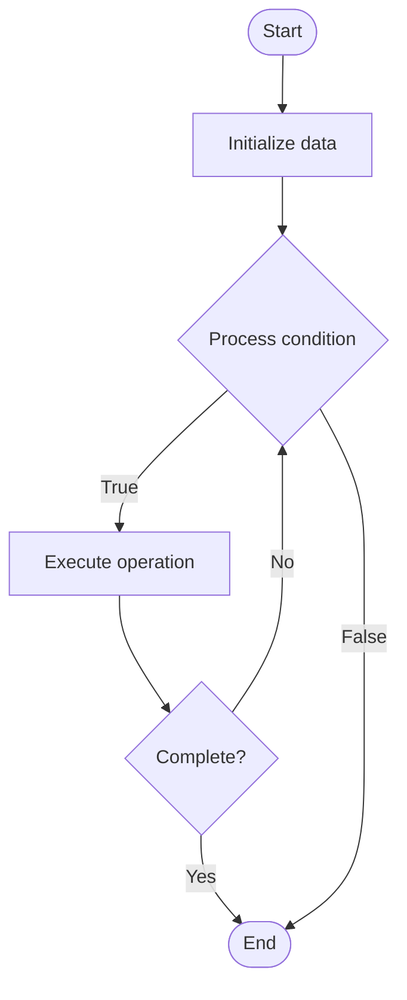

# Interoperability Protocols

Name of Algorithm  

## Code Files


## Algorithm Visualization

### Flowchart (ASCII)


```
Interoperability Protocols Flowchart:

┌─────────────┐
│   Start     │
└──────┬──────┘
       │
       ▼
┌─────────────┐
│  Initialize │
│   data      │
└──────┬──────┘
       │
       ▼
┌─────────────┐      Yes
│  Process   ├──────┐
│  condition?│      │
└──────┬──────┘      │
       │ No          │
       ▼             │
┌─────────────┐      │
│  Execute   │      │
│  operation │      │
└──────┬──────┘      │
       │             │
       └─────────────┘
       │
       ▼
┌─────────────┐
│    End      │
└─────────────┘
```


### Step-by-Step Execution


```
Interoperability Protocols Step-by-Step Execution:

Input: [example data]

Step 1: Initialize
State: [initial state]

Step 2: Process
State: [intermediate state]

Step 3: Finalize
State: [final state]

Result: [output]
```


### Interactive Flowchart (Mermaid)





> **Note**: Mermaid diagrams are rendered automatically on GitHub. For local viewing, use a Mermaid-compatible Markdown viewer.
- [Python Implementation](/code/semester_13/lecture_92_blockchain_interoperability/interoperability_protocols/algorithm.py)
- [Java Implementation](/code/semester_13/lecture_92_blockchain_interoperability/interoperability_protocols/Algorithm.java)
- [Python Tests](/code/semester_13/lecture_92_blockchain_interoperability/interoperability_protocols/test_algorithm.py)


   Interoperability Protocols

What problem does it solve? (1 sentence)  
   Implements protocols and standards that enable different blockchains to communicate and interoperate, facilitating cross-chain transactions, data sharing, and unified blockchain ecosystems.

Intuition (plain-language explanation)  
   Like communication protocols: Interoperability Protocols are like communication protocols - you define standards (like network protocols) so different blockchains can talk to each other - just as protocols enable network communication, interoperability protocols enable blockchain communication.

Inputs & Outputs  
   - Input: Cross-chain requests, protocol messages, blockchain networks, interoperability standards, communication channels.  
   - Output: Interoperable blockchains, cross-chain communication, unified ecosystems, protocol compliance, seamless interaction.

Step-by-step description (5–10 lines max)  
Define: define interoperability standards.
Implement: implement protocols on blockchains.
Connect: connect blockchains via protocols.
Communicate: enable cross-chain communication.
Validate: validate cross-chain messages.
Execute: execute cross-chain operations.
Synchronize: synchronize state across chains.
Verify: verify protocol compliance.
Monitor: monitor interoperability operations.
Maintain: maintain protocol standards.

Tiny example (hand-simulated)  
   Interoperability Protocols: protocol: IBC (Inter-Blockchain Communication) → implement: implement on Cosmos chains → connect: connect chains → communicate: send messages between chains → result: interoperable blockchain network → Interoperability Protocols operational.

Time & Space Complexity  
   - Time: O(p + c) where p is protocol overhead, c is communication time (varies by protocol).  
   - Space: O(p + n) where p is protocol storage, n is network storage (protocol and network data).

Strengths  
- Standards: provides standards for interoperability.
- Communication: enables blockchain communication.
- Ecosystem: enables unified blockchain ecosystems.

Weaknesses / limitations  
- Complexity: interoperability protocols are complex.
- Adoption: requires adoption across blockchains.
- Compatibility: may have compatibility issues.

Compare with alternatives  
    Alternatives: No Interoperability, Bridges Only, Atomic Swaps, Hybrid Approaches

30-second explanation (your own words)  
    Implements protocols and standards that enable different blockchains to communicate and interoperate, facilitating cross-chain transactions, data sharing, and unified blockchain ecosystems.

*Sources: Adapted from standard university textbooks and Wikipedia summaries.*
