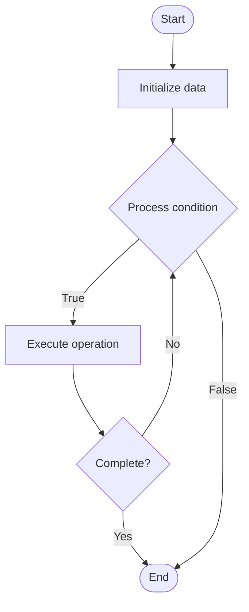

# Multi Chain Apps

Name of Algorithm  

## Code Files


## Algorithm Visualization

### Flowchart (ASCII)


```
Multi Chain Apps Flowchart:

┌─────────────┐
│   Start     │
└──────┬──────┘
       │
       ▼
┌─────────────┐
│  Initialize │
│   data      │
└──────┬──────┘
       │
       ▼
┌─────────────┐      Yes
│  Process   ├──────┐
│  condition?│      │
└──────┬──────┘      │
       │ No          │
       ▼             │
┌─────────────┐      │
│  Execute   │      │
│  operation │      │
└──────┬──────┘      │
       │             │
       └─────────────┘
       │
       ▼
┌─────────────┐
│    End      │
└─────────────┘
```


### Step-by-Step Execution


```
Multi Chain Apps Step-by-Step Execution:

Input: [example data]

Step 1: Initialize
State: [initial state]

Step 2: Process
State: [intermediate state]

Step 3: Finalize
State: [final state]

Result: [output]
```


### Interactive Flowchart (Mermaid)





> **Note**: Mermaid diagrams are rendered automatically on GitHub. For local viewing, use a Mermaid-compatible Markdown viewer.
- [Python Implementation](/code/semester_13/lecture_92_blockchain_interoperability/multi_chain_apps/algorithm.py)
- [Java Implementation](/code/semester_13/lecture_92_blockchain_interoperability/multi_chain_apps/Algorithm.java)
- [Python Tests](/code/semester_13/lecture_92_blockchain_interoperability/multi_chain_apps/test_algorithm.py)


   Multi Chain Apps

What problem does it solve? (1 sentence)  
   Implements applications that operate across multiple blockchains simultaneously, leveraging different chains for different purposes and providing unified user experiences across chains.

Intuition (plain-language explanation)  
   Like apps on multiple platforms: Multi Chain Apps are like apps that work on multiple platforms - you build one app (like a cross-platform app) that works on multiple blockchains - just as cross-platform apps work everywhere, multi-chain apps work across blockchains.

Inputs & Outputs  
   - Input: User requests, multiple blockchains, app logic, chain selection, cross-chain operations.  
   - Output: Multi-chain applications, unified experiences, cross-chain functionality, optimized operations, seamless apps.

Step-by-step description (5–10 lines max)  
Design: design app for multiple chains.
Deploy: deploy app on multiple blockchains.
Route: route operations to appropriate chains.
Execute: execute operations on selected chains.
Sync: synchronize state across chains.
Aggregate: aggregate results from multiple chains.
Present: present unified interface to users.
Optimize: optimize for best chain selection.
Manage: manage multi-chain state.
Scale: scale across more chains.

Tiny example (hand-simulated)  
   Multi Chain Apps: app: DeFi protocol → deploy: deploy on Ethereum, Polygon, Arbitrum → route: route transactions to cheapest chain → execute: execute on selected chain → result: unified DeFi experience across chains → Multi Chain Apps successful.

Time & Space Complexity  
   - Time: O(r + e) where r is routing time, e is execution time (varies by chain selection).  
   - Space: O(a + c) where a is app storage, c is chain storage (app and chain data).

Strengths  
- Flexibility: leverages strengths of different chains.
- User experience: provides unified user experience.
- Optimization: optimizes for cost and performance.

Weaknesses / limitations  
- Complexity: multi-chain apps are complex.
- State: managing state across chains is challenging.
- Testing: testing across chains is complex.

Compare with alternatives  
    Alternatives: Single Chain Apps, Chain-Specific Apps, Bridged Apps, Hybrid Approaches

30-second explanation (your own words)  
    Implements applications that operate across multiple blockchains simultaneously, leveraging different chains for different purposes and providing unified user experiences across chains.

*Sources: Adapted from standard university textbooks and Wikipedia summaries.*
