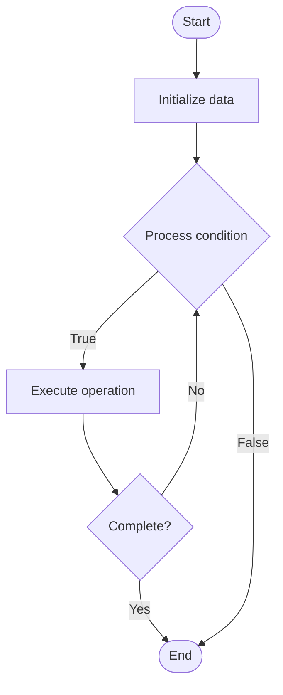

# Universal Protocols

1. **Name of Algorithm**  

## Code Files


## Algorithm Visualization

### Flowchart (ASCII)


```
Universal Protocols Flowchart:

┌─────────────┐
│   Start     │
└──────┬──────┘
       │
       ▼
┌─────────────┐
│  Initialize │
│   data      │
└──────┬──────┘
       │
       ▼
┌─────────────┐      Yes
│  Process   ├──────┐
│  condition?│      │
└──────┬──────┘      │
       │ No          │
       ▼             │
┌─────────────┐      │
│  Execute   │      │
│  operation │      │
└──────┬──────┘      │
       │             │
       └─────────────┘
       │
       ▼
┌─────────────┐
│    End      │
└─────────────┘
```


### Step-by-Step Execution


```
Universal Protocols Step-by-Step Execution:

Input: [example data]

Step 1: Initialize
State: [initial state]

Step 2: Process
State: [intermediate state]

Step 3: Finalize
State: [final state]

Result: [output]
```


### Interactive Flowchart (Mermaid)





> **Note**: Mermaid diagrams are rendered automatically on GitHub. For local viewing, use a Mermaid-compatible Markdown viewer.
- [Python Implementation](semester_13/lecture_92_blockchain_interoperability/universal_protocols/algorithm.py)
- [Java Implementation](semester_13/lecture_92_blockchain_interoperability/universal_protocols/Algorithm.java)
- [Python Tests](semester_13/lecture_92_blockchain_interoperability/universal_protocols/test_algorithm.py)


   Universal Protocols

2. **What problem does it solve? (1 sentence)**  
   Implements universal protocols that work across all blockchains, providing standardized interfaces and operations that enable seamless interaction with any blockchain through a single protocol.

3. **Intuition (plain-language explanation)**  
   Like universal standards: Universal Protocols are like universal standards - you create one protocol (like universal standards) that works with all blockchains - just as universal standards work everywhere, universal protocols work with all blockchains.

4. **Inputs & Outputs**  
   - Input: Blockchain operations, universal protocol messages, any blockchain, standardized interfaces, protocol adapters.  
   - Output: Universal blockchain access, standardized operations, protocol compliance, seamless interaction, unified protocols.

5. **Step-by-step description (5–10 lines max)**  
1. Define: define universal protocol standards.
2. Implement: implement protocol adapters for chains.
3. Standardize: standardize operations across chains.
4. Connect: connect blockchains via universal protocol.
5. Operate: operate on any blockchain through protocol.
6. Translate: translate protocol to chain-specific.
7. Execute: execute operations on any chain.
8. Verify: verify protocol compliance.
9. Extend: extend protocol to new chains.
10. Maintain: maintain universal standards.

6. **Tiny example (hand-simulated)**  
   Universal Protocols: protocol: universal DeFi protocol → implement: adapters for Ethereum, Polygon, BSC → operate: use same interface for all chains → result: universal DeFi access → Universal Protocols operational.

7. **Time & Space Complexity**  
   - Time: O(p + t) where p is protocol overhead, t is translation time (varies by chain).  
   - Space: O(p + a) where p is protocol storage, a is adapter storage (protocol and adapters).

8. **Strengths**  
- Universality: works with all blockchains.
- Simplicity: provides simple, unified interface.
- Extensibility: easily extends to new chains.

9. **Weaknesses / limitations**  
- Complexity: universal protocols are complex.
- Limitations: may not support all chain features.
- Adoption: requires adoption across ecosystem.

10. **Compare with alternatives**  
    Alternatives: Chain-Specific Protocols, Multi-Protocol, No Universal Standards, Hybrid Approaches

11. **30-second explanation (your own words)**  
    Implements universal protocols that work across all blockchains, providing standardized interfaces and operations that enable seamless interaction with any blockchain through a single protocol.

*Sources: Adapted from standard university textbooks and Wikipedia summaries.*
