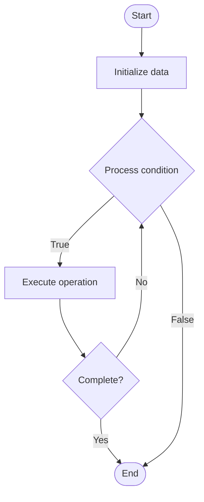

# DAO Governance

## Учебные материалы

- [Школьный уровень](school.ru.md)
- [Университетский уровень](univer.ru.md)

## Algorithm Visualization

### Flowchart (ASCII)

```
DAO Governance Flowchart:

┌─────────────┐
│   Start     │
└──────┬──────┘
       │
       ▼
┌─────────────┐
│  Initialize │
│   data      │
└──────┬──────┘
       │
       ▼
┌─────────────┐      Yes
│  Process   ├──────┐
│  condition?│      │
└──────┬──────┘      │
       │ No          │
       ▼             │
┌─────────────┐      │
│  Execute   │      │
│  operation │      │
└──────┬──────┘      │
       │             │
       └─────────────┘
       │
       ▼
┌─────────────┐
│    End      │
└─────────────┘
```

### Step-by-Step Execution

```
DAO Governance Step-by-Step Execution:

Input: [example data]

Step 1: Initialize
State: [initial state]

Step 2: Process
State: [intermediate state]

Step 3: Finalize
State: [final state]

Result: [output]
```

### Interactive Flowchart (Mermaid)



> **Note**: Mermaid diagrams are rendered automatically on GitHub. For local viewing, use a Mermaid-compatible Markdown viewer.

- [Python Implementation](/code/semester_13/lecture_93_blockchain_governance/dao_governance/algorithm.py)
- [Java Implementation](/code/semester_13/lecture_93_blockchain_governance/dao_governance/Algorithm.java)
- [Python Tests](/code/semester_13/lecture_93_blockchain_governance/dao_governance/test_algorithm.py)

   DAO Governance

What problem does it solve? (1 sentence)  
   Implements Decentralized Autonomous Organization (DAO) governance mechanisms that enable token holders to collectively make decisions about protocol changes, treasury management, and organizational direction through on-chain voting.

Intuition (plain-language explanation)  
   Like democratic organization: DAO Governance is like democratic organization - token holders vote (like shareholders voting) to make decisions about the organization - just as democracy enables collective decision-making, DAO governance enables decentralized organizational management.

Inputs & Outputs  

  - Input: Governance proposals, token holdings, voting power, quorum requirements, execution parameters, DAO rules.  
  - Output: DAO decisions, executed proposals, treasury management, protocol updates, organizational direction, governance outcomes.

Step-by-step description (5–10 lines max)  
Propose: submit governance proposal.
Discuss: discuss proposal in forums.
Vote: token holders vote on proposal.
Count: count votes weighted by token holdings.
Quorum: check if quorum reached.
Execute: execute proposal if passed.
Implement: implement changes.
Monitor: monitor proposal execution.
Govern: govern DAO operations.
Iterate: iterate governance process.

Tiny example (hand-simulated)  
   DAO Governance: proposal: increase protocol fee → discuss: community discussion → vote: 70% vote yes, 30% vote no → quorum: quorum reached → execute: proposal executed → result: fee increased → DAO Governance successful.

Time & Space Complexity  

  - Time: O(v) where v is voters (voting and counting time).  
  - Space: O(p + v + t) where p is proposals, v is votes, t is treasury (governance data storage).

Strengths  

- Decentralization: enables decentralized organizational management.
- Participation: enables token holder participation.
- Transparency: transparent voting and execution.

Weaknesses / limitations  

- Participation: low voter participation common.
- Complexity: governance can be complex.
- Manipulation: potential for vote manipulation.

Compare with alternatives  
    Alternatives: Centralized Governance, No Governance, Off-Chain Governance, Hybrid Governance

30-second explanation (your own words)  
    Implements Decentralized Autonomous Organization (DAO) governance mechanisms that enable token holders to collectively make decisions about protocol changes, treasury management, and organizational direction through on-chain voting.

*Sources: Adapted from standard university textbooks and Wikipedia summaries.*


## References

- [Dao Governance - Wikipedia](https://en.wikipedia.org/wiki/Dao%20Governance)
