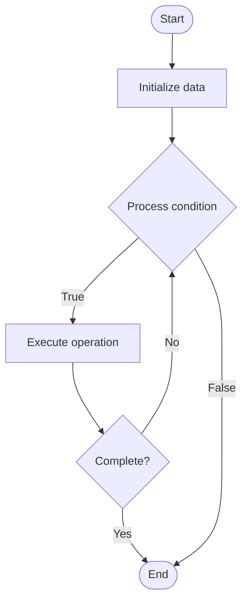

# Governance Tokens

## Учебные материалы

- [Школьный уровень](school.ru.md)
- [Университетский уровень](univer.ru.md)

## Algorithm Visualization

### Flowchart (ASCII)

```
Governance Tokens Flowchart:

┌─────────────┐
│   Start     │
└──────┬──────┘
       │
       ▼
┌─────────────┐
│  Initialize │
│   data      │
└──────┬──────┘
       │
       ▼
┌─────────────┐      Yes
│  Process   ├──────┐
│  condition?│      │
└──────┬──────┘      │
       │ No          │
       ▼             │
┌─────────────┐      │
│  Execute   │      │
│  operation │      │
└──────┬──────┘      │
       │             │
       └─────────────┘
       │
       ▼
┌─────────────┐
│    End      │
└─────────────┘
```

### Step-by-Step Execution

```
Governance Tokens Step-by-Step Execution:

Input: [example data]

Step 1: Initialize
State: [initial state]

Step 2: Process
State: [intermediate state]

Step 3: Finalize
State: [final state]

Result: [output]
```

### Interactive Flowchart (Mermaid)



> **Note**: Mermaid diagrams are rendered automatically on GitHub. For local viewing, use a Mermaid-compatible Markdown viewer.

- [Python Implementation](/code/semester_13/lecture_93_blockchain_governance/governance_tokens/algorithm.py)
- [Java Implementation](/code/semester_13/lecture_93_blockchain_governance/governance_tokens/Algorithm.java)
- [Python Tests](/code/semester_13/lecture_93_blockchain_governance/governance_tokens/test_algorithm.py)

What problem does it solve? (1 sentence)  
   Enables decentralized governance by giving token holders voting rights proportional to their token holdings, allowing them to participate in protocol decisions, parameter changes, and treasury management.

Intuition (plain-language explanation)  
   Like shares in a company: Governance tokens are like shares in a company - the more shares (tokens) you own, the more voting power you have in company decisions (protocol governance) - token holders can vote on proposals (like board resolutions), and decisions are executed automatically (like smart contracts) - this enables decentralized, transparent governance.

Inputs & Outputs  

  - Input: Token holdings, governance proposals, voting parameters, delegation options, execution conditions.  
  - Output: Voting results, executed proposals, updated protocol parameters, treasury allocations, governance decisions.

Step-by-step description (5–10 lines max)  
Propose: submit governance proposal with parameters.
Review: community reviews proposal (discussion period).
Vote: token holders vote (weighted by holdings).
Delegate: optional delegation of voting power.
Count: count votes and calculate results.
Threshold: check if proposal meets quorum and threshold.
Execute: execute proposal if approved (via smart contract).
Update: update protocol parameters or treasury.
Monitor: monitor proposal execution and effects.
Iterate: iterate on governance process improvements.

Tiny example (hand-simulated)  
   Governance: propose increase fee to 0.3% → review 3 days → vote: 60% yes, 30% no, 10% abstain → quorum met → execute → update fee parameter → Governance successful.

Time & Space Complexity  

  - Time: O(v) for voting where v is voters, O(1) for execution (governance complexity).  
  - Space: O(t + p) where t is token holdings, p is proposals (governance storage).

Strengths  

- Decentralization: enables decentralized decision-making.
- Transparency: all proposals and votes are on-chain.
- Alignment: aligns incentives with token holders.

Weaknesses / limitations  

- Centralization: large holders may dominate decisions.
- Participation: low voter participation is common.
- Complexity: complex proposals may be hard to evaluate.

Compare with alternatives  
    Alternatives: Off-Chain Governance, Multisig Governance, Foundation Governance, Hybrid Governance

30-second explanation (your own words)  
Tokens that grant voting rights to holders, enabling decentralized governance where token-weighted votes determine protocol decisions and parameter changes.

*Sources: Adapted from standard university textbooks and Wikipedia summaries.*


## References

- [Governance Tokens - Wikipedia](https://en.wikipedia.org/wiki/Governance%20Tokens)
