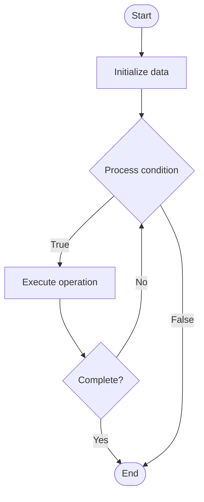

# Governance Proposal Systems

1. **Name of Algorithm**  

## Code Files


## Algorithm Visualization

### Flowchart (ASCII)


```
Governance Proposal Systems Flowchart:

┌─────────────┐
│   Start     │
└──────┬──────┘
       │
       ▼
┌─────────────┐
│  Initialize │
│   data      │
└──────┬──────┘
       │
       ▼
┌─────────────┐      Yes
│  Process   ├──────┐
│  condition?│      │
└──────┬──────┘      │
       │ No          │
       ▼             │
┌─────────────┐      │
│  Execute   │      │
│  operation │      │
└──────┬──────┘      │
       │             │
       └─────────────┘
       │
       ▼
┌─────────────┐
│    End      │
└─────────────┘
```


### Step-by-Step Execution


```
Governance Proposal Systems Step-by-Step Execution:

Input: [example data]

Step 1: Initialize
State: [initial state]

Step 2: Process
State: [intermediate state]

Step 3: Finalize
State: [final state]

Result: [output]
```


### Interactive Flowchart (Mermaid)





> **Note**: Mermaid diagrams are rendered automatically on GitHub. For local viewing, use a Mermaid-compatible Markdown viewer.
- [Python Implementation](semester_13/lecture_93_blockchain_governance/proposal_systems/algorithm.py)
- [Java Implementation](semester_13/lecture_93_blockchain_governance/proposal_systems/Algorithm.java)
- [Python Tests](semester_13/lecture_93_blockchain_governance/proposal_systems/test_algorithm.py)


   Governance Proposal Systems

2. **What problem does it solve? (1 sentence)**  
   Facilitates structured governance by providing frameworks for creating, discussing, voting on, and executing proposals that modify protocol parameters, allocate resources, or change system behavior.

3. **Intuition (plain-language explanation)**  
   Like a formal petition system: Governance proposal systems are like a formal petition system - you write a proposal (petition), gather support (discussion), vote on it (ballot), and if approved, it's implemented (execution) - the system ensures proposals are well-formed, discussed, and executed fairly and transparently.

4. **Inputs & Outputs**  
   - Input: Proposal content, proposer credentials, voting parameters, discussion period, execution logic, quorum requirements.  
   - Output: Formal proposals, voting results, executed changes, governance history, protocol updates.

5. **Step-by-step description (5–10 lines max)**  
1. Draft: draft proposal with clear description and parameters.
2. Submit: submit proposal to governance system.
3. Review: community reviews and discusses proposal.
4. Amend: optionally amend proposal based on feedback.
5. Vote: open voting period with specified duration.
6. Cast: token holders cast votes (for/against/abstain).
7. Tally: tally votes and check quorum/threshold.
8. Execute: execute proposal if approved (smart contract).
9. Verify: verify execution and parameter changes.
10. Archive: archive proposal and results for transparency.

6. **Tiny example (hand-simulated)**  
   Proposal System: draft 'Increase max supply to 1B' → submit → review 7 days → vote 3 days → 55% yes, quorum met → execute → update max supply → Proposal System successful.

7. **Time & Space Complexity**  
   - Time: O(p + v) where p is proposal processing, v is voting (proposal complexity).  
   - Space: O(p + h) where p is proposals, h is history (proposal storage).

8. **Strengths**  
- Structure: provides clear framework for governance.
- Transparency: all proposals and outcomes are recorded.
- Automation: automated execution via smart contracts.

9. **Weaknesses / limitations**  
- Complexity: complex proposals may be hard to understand.
- Spam: requires mechanisms to prevent proposal spam.
- Execution: execution bugs can have serious consequences.

10. **Compare with alternatives**  
    Alternatives: Informal Governance, Off-Chain Voting, Multisig Decisions, Foundation Control

11. **30-second explanation (your own words)**  
    Structured systems for creating, discussing, voting on, and executing governance proposals that modify protocol parameters and behavior.

*Sources: Adapted from standard university textbooks and Wikipedia summaries.*
