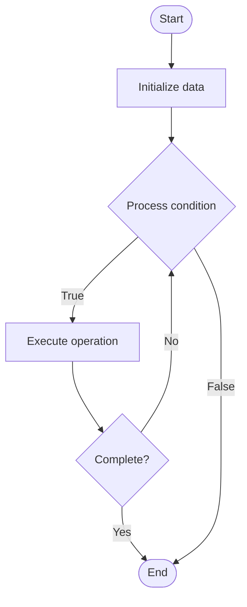

# Treasury Management

## Учебные материалы

- [Школьный уровень](school.ru.md)
- [Университетский уровень](univer.ru.md)

## Algorithm Visualization

### Flowchart (ASCII)

```
Treasury Management Flowchart:

┌─────────────┐
│   Start     │
└──────┬──────┘
       │
       ▼
┌─────────────┐
│  Initialize │
│   data      │
└──────┬──────┘
       │
       ▼
┌─────────────┐      Yes
│  Process   ├──────┐
│  condition?│      │
└──────┬──────┘      │
       │ No          │
       ▼             │
┌─────────────┐      │
│  Execute   │      │
│  operation │      │
└──────┬──────┘      │
       │             │
       └─────────────┘
       │
       ▼
┌─────────────┐
│    End      │
└─────────────┘
```

### Step-by-Step Execution

```
Treasury Management Step-by-Step Execution:

Input: [example data]

Step 1: Initialize
State: [initial state]

Step 2: Process
State: [intermediate state]

Step 3: Finalize
State: [final state]

Result: [output]
```

### Interactive Flowchart (Mermaid)



> **Note**: Mermaid diagrams are rendered automatically on GitHub. For local viewing, use a Mermaid-compatible Markdown viewer.

- [Python Implementation](/code/semester_13/lecture_93_blockchain_governance/treasury_management/algorithm.py)
- [Java Implementation](/code/semester_13/lecture_93_blockchain_governance/treasury_management/Algorithm.java)
- [Python Tests](/code/semester_13/lecture_93_blockchain_governance/treasury_management/test_algorithm.py)

What problem does it solve? (1 sentence)  
   Implements treasury management systems for blockchain protocols and DAOs, managing protocol funds, allocating resources, and making financial decisions through governance mechanisms.

Intuition (plain-language explanation)  
   Like managing organization funds: Treasury Management is like managing organization funds - you manage money (like managing a budget) for the protocol or DAO - just as organizations manage finances, treasury management manages blockchain protocol finances.

Inputs & Outputs  

  - Input: Treasury funds, allocation requests, governance proposals, financial parameters, spending rules, investment strategies.  
  - Output: Managed treasury, fund allocations, financial decisions, resource distribution, treasury reports, optimized finances.

Step-by-step description (5–10 lines max)  
Collect: collect protocol fees and revenue.
Store: store funds in treasury.
Propose: propose fund allocation.
Vote: vote on allocation proposals.
Allocate: allocate funds if approved.
Invest: invest treasury funds if desired.
Spend: spend on protocol development.
Track: track treasury balance and spending.
Report: report treasury status.
Optimize: optimize treasury management.

Tiny example (hand-simulated)  
   Treasury Management: treasury: 1M tokens → propose: allocate 100k for development → vote: proposal passes → allocate: allocate 100k tokens → result: funds allocated for development → Treasury Management operational.

Time & Space Complexity  

  - Time: O(a + g) where a is allocation time, g is governance time (treasury operations).  
  - Space: O(t + a) where t is treasury storage, a is allocation storage (treasury and allocation data).

Strengths  

- Transparency: transparent treasury management.
- Governance: governed by token holders.
- Sustainability: supports protocol sustainability.

Weaknesses / limitations  

- Complexity: treasury management can be complex.
- Decisions: requires good governance decisions.
- Risk: treasury management has risks.

Compare with alternatives  
    Alternatives: No Treasury, Centralized Management, Manual Management, Hybrid Approaches

30-second explanation (your own words)  
    Implements treasury management systems for blockchain protocols and DAOs, managing protocol funds, allocating resources, and making financial decisions through governance mechanisms.

*Sources: Adapted from standard university textbooks and Wikipedia summaries.*


## References

- [Treasury management](https://en.wikipedia.org/wiki/Treasury_management) - Wikipedia
