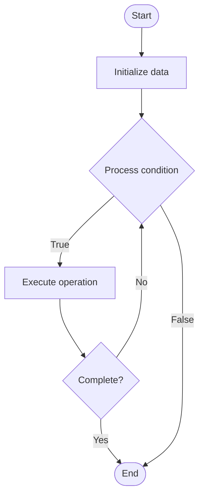

# Blockchain Upgrade Mechanisms

## Учебные материалы

- [Школьный уровень](school.ru.md)
- [Университетский уровень](univer.ru.md)

## Algorithm Visualization

### Flowchart (ASCII)

```
Blockchain Upgrade Mechanisms Flowchart:

┌─────────────┐
│   Start     │
└──────┬──────┘
       │
       ▼
┌─────────────┐
│  Initialize │
│   data      │
└──────┬──────┘
       │
       ▼
┌─────────────┐      Yes
│  Process   ├──────┐
│  condition?│      │
└──────┬──────┘      │
       │ No          │
       ▼             │
┌─────────────┐      │
│  Execute   │      │
│  operation │      │
└──────┬──────┘      │
       │             │
       └─────────────┘
       │
       ▼
┌─────────────┐
│    End      │
└─────────────┘
```

### Step-by-Step Execution

```
Blockchain Upgrade Mechanisms Step-by-Step Execution:

Input: [example data]

Step 1: Initialize
State: [initial state]

Step 2: Process
State: [intermediate state]

Step 3: Finalize
State: [final state]

Result: [output]
```

### Interactive Flowchart (Mermaid)



> **Note**: Mermaid diagrams are rendered automatically on GitHub. For local viewing, use a Mermaid-compatible Markdown viewer.

- [Python Implementation](/code/semester_13/lecture_93_blockchain_governance/upgrade_mechanisms/algorithm.py)
- [Java Implementation](/code/semester_13/lecture_93_blockchain_governance/upgrade_mechanisms/Algorithm.java)
- [Python Tests](/code/semester_13/lecture_93_blockchain_governance/upgrade_mechanisms/test_algorithm.py)

What problem does it solve? (1 sentence)  
   Enables protocol upgrades and improvements while maintaining network consensus and backward compatibility, using mechanisms like hard forks, soft forks, or upgradeable smart contracts.

Intuition (plain-language explanation)  
Like updating an operating system: Blockchain upgrade mechanisms are like updating an operating system - you need to upgrade to get new features and fixes, but you must ensure compatibility (soft fork) or coordinate a major update (hard fork) - some systems allow seamless upgrades (upgradeable contracts), while others require network-wide coordination - the goal is to improve the system without breaking it.

Inputs & Outputs  

  - Input: Upgrade proposal, new protocol version, compatibility requirements, migration plan, consensus mechanism, node software updates.  
  - Output: Upgraded protocol, migrated state, updated nodes, network consensus, backward compatibility (if soft fork).

Step-by-step description (5–10 lines max)  
Design: design upgrade with new features and fixes.
Propose: propose upgrade through governance or development team.
Review: review upgrade for security and compatibility.
Implement: implement upgrade in node software.
Test: test upgrade on testnet or fork.
Coordinate: coordinate upgrade activation (block height or timestamp).
Activate: activate upgrade at specified block/time.
Migrate: migrate state and data if needed.
Validate: validate upgrade success and compatibility.
Monitor: monitor network health post-upgrade.

Tiny example (hand-simulated)  
   Upgrade: design EIP-1559 → propose → review → implement → test on testnet → coordinate activation at block 12,965,000 → activate → migrate → validate → Upgrade successful.

Time & Space Complexity  

  - Time: O(n + m) where n is nodes, m is migration complexity (upgrade complexity).  
  - Space: O(s + u) where s is state, u is upgrade data (upgrade storage).

Strengths  

- Evolution: enables protocol evolution and improvements.
- Flexibility: supports various upgrade mechanisms.
- Coordination: provides structured upgrade process.

Weaknesses / limitations  

- Risk: upgrades can introduce bugs or break compatibility.
- Coordination: requires network-wide coordination.
- Forks: hard forks can split the network.

Compare with alternatives  
    Alternatives: No Upgrades, Soft Forks Only, Upgradeable Smart Contracts, Layer 2 Solutions

30-second explanation (your own words)  
    Mechanisms for upgrading blockchain protocols while maintaining consensus, including hard forks, soft forks, and upgradeable contract patterns.

*Sources: Adapted from standard university textbooks and Wikipedia summaries.*
