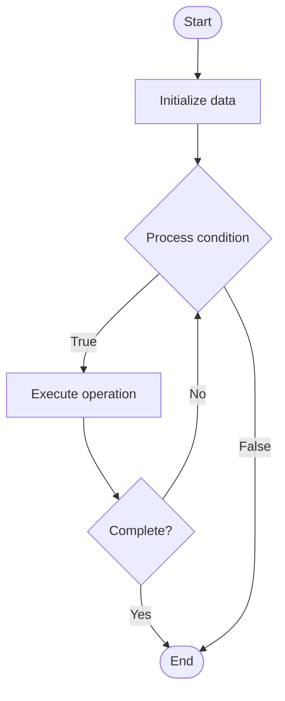

# Blockchain Voting Mechanisms

Name of Algorithm  

## Code Files


## Algorithm Visualization

### Flowchart (ASCII)


```
Blockchain Voting Mechanisms Flowchart:

┌─────────────┐
│   Start     │
└──────┬──────┘
       │
       ▼
┌─────────────┐
│  Initialize │
│   data      │
└──────┬──────┘
       │
       ▼
┌─────────────┐      Yes
│  Process   ├──────┐
│  condition?│      │
└──────┬──────┘      │
       │ No          │
       ▼             │
┌─────────────┐      │
│  Execute   │      │
│  operation │      │
└──────┬──────┘      │
       │             │
       └─────────────┘
       │
       ▼
┌─────────────┐
│    End      │
└─────────────┘
```


### Step-by-Step Execution


```
Blockchain Voting Mechanisms Step-by-Step Execution:

Input: [example data]

Step 1: Initialize
State: [initial state]

Step 2: Process
State: [intermediate state]

Step 3: Finalize
State: [final state]

Result: [output]
```


### Interactive Flowchart (Mermaid)





> **Note**: Mermaid diagrams are rendered automatically on GitHub. For local viewing, use a Mermaid-compatible Markdown viewer.
- [Python Implementation](/code/semester_13/lecture_93_blockchain_governance/voting_mechanisms/algorithm.py)
- [Java Implementation](/code/semester_13/lecture_93_blockchain_governance/voting_mechanisms/Algorithm.java)
- [Python Tests](/code/semester_13/lecture_93_blockchain_governance/voting_mechanisms/test_algorithm.py)


   Blockchain Voting Mechanisms

What problem does it solve? (1 sentence)  
   Enables decentralized decision-making by implementing secure, transparent, and verifiable voting systems that allow token holders to participate in governance decisions with cryptographic guarantees.

Intuition (plain-language explanation)  
   Like a secure digital ballot box: Blockchain voting mechanisms are like a secure digital ballot box - you cast your vote (weighted by tokens), it's recorded immutably on the blockchain (transparent and verifiable), and the results are calculated automatically (no manipulation) - everyone can verify the votes and results, ensuring fair and transparent governance.

Inputs & Outputs  
   - Input: Voting proposals, token holdings, vote choices (for/against/abstain), voting period, quorum requirements, delegation options.  
   - Output: Vote records, voting results, executed decisions, governance history, verification proofs.

Step-by-step description (5–10 lines max)  
Propose: submit governance proposal for voting.
Announce: announce voting period and parameters.
Cast: token holders cast votes (weighted by holdings).
Delegate: optional delegation of voting power.
Record: record votes on blockchain immutably.
Count: count votes and calculate results.
Verify: verify vote integrity and eligibility.
Execute: execute proposal if approved.
Archive: archive voting results for transparency.
Audit: enable audit of voting process.

Tiny example (hand-simulated)  
   Voting: propose 'Increase fee to 0.3%' → announce 3-day vote → cast votes (60% yes, 30% no) → record on-chain → count → verify → execute → Voting successful.

Time & Space Complexity  
   - Time: O(v) for vote counting where v is voters, O(1) for verification (voting complexity).  
   - Space: O(v + p) where v is votes, p is proposals (voting storage).

Strengths  
- Transparency: all votes are publicly verifiable.
- Security: cryptographic guarantees prevent manipulation.
- Decentralization: enables decentralized decision-making.

Weaknesses / limitations  
- Participation: low voter participation is common.
- Complexity: complex proposals may be hard to evaluate.
- Sybil: requires mechanisms to prevent Sybil attacks.

Compare with alternatives  
    Alternatives: Off-Chain Voting, Multisig Decisions, Foundation Control, Hybrid Governance

30-second explanation (your own words)  
    Cryptographically secure voting systems that enable token holders to participate in blockchain governance decisions with transparency and verifiability.

*Sources: Adapted from standard university textbooks and Wikipedia summaries.*
