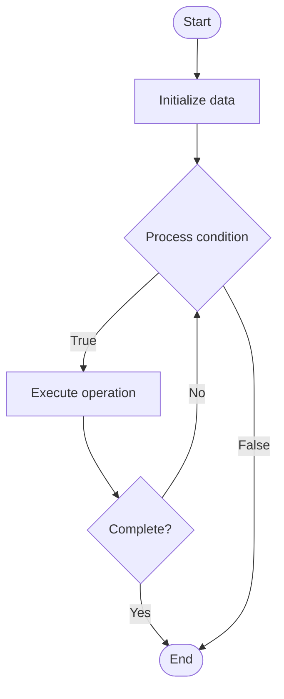

# Blockchain Address Clustering

## Учебные материалы

- [Школьный уровень](school.ru.md)
- [Университетский уровень](univer.ru.md)

## Algorithm Visualization

### Flowchart (ASCII)

```
Blockchain Address Clustering Flowchart:

┌─────────────┐
│   Start     │
└──────┬──────┘
       │
       ▼
┌─────────────┐
│  Initialize │
│   data      │
└──────┬──────┘
       │
       ▼
┌─────────────┐      Yes
│  Process   ├──────┐
│  condition?│      │
└──────┬──────┘      │
       │ No          │
       ▼             │
┌─────────────┐      │
│  Execute   │      │
│  operation │      │
└──────┬──────┘      │
       │             │
       └─────────────┘
       │
       ▼
┌─────────────┐
│    End      │
└─────────────┘
```

### Step-by-Step Execution

```
Blockchain Address Clustering Step-by-Step Execution:

Input: [example data]

Step 1: Initialize
State: [initial state]

Step 2: Process
State: [intermediate state]

Step 3: Finalize
State: [final state]

Result: [output]
```

### Interactive Flowchart (Mermaid)



> **Note**: Mermaid diagrams are rendered automatically on GitHub. For local viewing, use a Mermaid-compatible Markdown viewer.

- [Python Implementation](/code/semester_13/lecture_94_blockchain_analytics/address_clustering/algorithm.py)
- [Java Implementation](/code/semester_13/lecture_94_blockchain_analytics/address_clustering/Algorithm.java)
- [Python Tests](/code/semester_13/lecture_94_blockchain_analytics/address_clustering/test_algorithm.py)

What problem does it solve? (1 sentence)  
   Identifies and groups blockchain addresses that belong to the same entity by analyzing transaction patterns, heuristics, and graph analysis to understand ownership and behavior.

Intuition (plain-language explanation)  
Like detective work: Address clustering is like detective work - you analyze clues (transaction patterns, common inputs, change addresses) to figure out which addresses belong to the same person or entity - just as a detective connects evidence, you connect addresses based on behavioral patterns and heuristics to reveal the true ownership structure.

Inputs & Outputs  

  - Input: Blockchain transactions, addresses, transaction graphs, heuristics, clustering algorithms, analysis parameters.  
  - Output: Address clusters, entity mappings, ownership graphs, behavioral patterns, clustering confidence scores.

Step-by-step description (5–10 lines max)  
Collect: collect blockchain transaction data.
Analyze: analyze transaction patterns and relationships.
Apply: apply clustering heuristics (common inputs, change addresses).
Graph: build transaction graph and analyze connections.
Cluster: group addresses using clustering algorithms.
Validate: validate clusters using additional heuristics.
Score: assign confidence scores to clusters.
Visualize: visualize address clusters and relationships.
Refine: refine clusters based on new data.
Report: generate clustering reports and insights.

Tiny example (hand-simulated)  
   Clustering: collect tx data → analyze patterns → apply heuristics → build graph → cluster addresses → validate → score → identify entity with 5 addresses → Clustering successful.

Time & Space Complexity  

  - Time: O(n²) for graph analysis, O(c) for clustering where n is addresses, c is clusters (clustering complexity).  
  - Space: O(n + e) where n is addresses, e is edges (graph storage).

Strengths  

- Insights: reveals ownership and behavioral patterns.
- Privacy: helps understand privacy implications.
- Compliance: useful for regulatory compliance.

Weaknesses / limitations  

- Accuracy: heuristics may produce false positives.
- Privacy: raises privacy concerns for users.
- Complexity: requires sophisticated analysis techniques.

Compare with alternatives  
    Alternatives: No Clustering, Manual Analysis, Machine Learning Clustering, Privacy-Preserving Methods

30-second explanation (your own words)  
    Techniques for identifying and grouping blockchain addresses that belong to the same entity through transaction pattern analysis and graph clustering.

*Sources: Adapted from standard university textbooks and Wikipedia summaries.*
