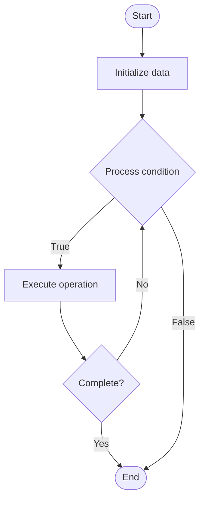

# Blockchain Anomaly Detection

## Учебные материалы

- [Школьный уровень](school.ru.md)
- [Университетский уровень](univer.ru.md)

## Algorithm Visualization

### Flowchart (ASCII)

```
Blockchain Anomaly Detection Flowchart:

┌─────────────┐
│   Start     │
└──────┬──────┘
       │
       ▼
┌─────────────┐
│  Initialize │
│   data      │
└──────┬──────┘
       │
       ▼
┌─────────────┐      Yes
│  Process   ├──────┐
│  condition?│      │
└──────┬──────┘      │
       │ No          │
       ▼             │
┌─────────────┐      │
│  Execute   │      │
│  operation │      │
└──────┬──────┘      │
       │             │
       └─────────────┘
       │
       ▼
┌─────────────┐
│    End      │
└─────────────┘
```

### Step-by-Step Execution

```
Blockchain Anomaly Detection Step-by-Step Execution:

Input: [example data]

Step 1: Initialize
State: [initial state]

Step 2: Process
State: [intermediate state]

Step 3: Finalize
State: [final state]

Result: [output]
```

### Interactive Flowchart (Mermaid)



> **Note**: Mermaid diagrams are rendered automatically on GitHub. For local viewing, use a Mermaid-compatible Markdown viewer.

- [Python Implementation](/code/semester_13/lecture_94_blockchain_analytics/anomaly_detection_blockchain/algorithm.py)
- [Java Implementation](/code/semester_13/lecture_94_blockchain_analytics/anomaly_detection_blockchain/Algorithm.java)
- [Python Tests](/code/semester_13/lecture_94_blockchain_analytics/anomaly_detection_blockchain/test_algorithm.py)

What problem does it solve? (1 sentence)  
   Identifies unusual patterns, suspicious activities, and potential security threats in blockchain transactions by analyzing transaction behavior, network patterns, and statistical deviations.

Intuition (plain-language explanation)  
   Like a security alarm system: Blockchain anomaly detection is like a security alarm system - you monitor normal behavior (typical transaction patterns), and when something unusual happens (anomalies like large transfers, rapid movements, suspicious patterns), the alarm goes off - this helps detect fraud, attacks, or suspicious activities early.

Inputs & Outputs  

  - Input: Blockchain transactions, historical data, network metrics, behavioral patterns, detection rules, machine learning models.  
  - Output: Anomaly alerts, suspicious transactions, risk scores, detection reports, pattern analysis.

Step-by-step description (5–10 lines max)  
Collect: collect blockchain transaction and network data.
Baseline: establish baseline of normal behavior.
Analyze: analyze transactions for unusual patterns.
Detect: apply detection algorithms (statistical, ML, rule-based).
Score: assign risk scores to detected anomalies.
Alert: generate alerts for high-risk anomalies.
Investigate: investigate flagged transactions.
Learn: update models based on investigation results.
Refine: refine detection rules and thresholds.
Report: generate anomaly detection reports.

Tiny example (hand-simulated)  
   Anomaly Detection: collect data → baseline → analyze → detect large transfer (1000 ETH) → score high risk → alert → investigate → confirm suspicious → Anomaly Detection successful.

Time & Space Complexity  

  - Time: O(n * d) where n is transactions, d is detection complexity (anomaly detection complexity).  
  - Space: O(n + m) where n is transaction data, m is model storage (detection storage).

Strengths  

- Security: helps detect fraud and attacks early.
- Automation: automates threat detection.
- Insights: provides insights into network behavior.

Weaknesses / limitations  

- False positives: may generate false alarms.
- Complexity: requires sophisticated detection algorithms.
- Privacy: raises privacy concerns.

Compare with alternatives  
    Alternatives: Manual Monitoring, Rule-Based Detection, Machine Learning Detection, Hybrid Approaches

30-second explanation (your own words)  
    Techniques for identifying unusual patterns and suspicious activities in blockchain transactions to detect fraud, attacks, and security threats.

*Sources: Adapted from standard university textbooks and Wikipedia summaries.*


## References

- [Anomaly Detection Blockchain - Wikipedia](https://en.wikipedia.org/wiki/Anomaly%20Detection%20Blockchain)
