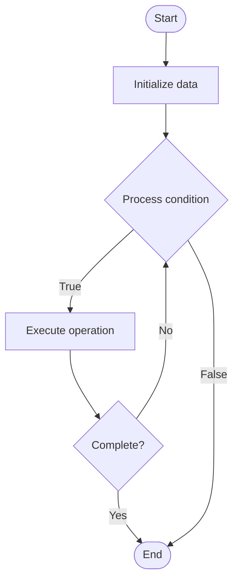

# Blockchain Compliance Tools

1. **Name of Algorithm**  

## Code Files


## Algorithm Visualization

### Flowchart (ASCII)


```
Blockchain Compliance Tools Flowchart:

┌─────────────┐
│   Start     │
└──────┬──────┘
       │
       ▼
┌─────────────┐
│  Initialize │
│   data      │
└──────┬──────┘
       │
       ▼
┌─────────────┐      Yes
│  Process   ├──────┐
│  condition?│      │
└──────┬──────┘      │
       │ No          │
       ▼             │
┌─────────────┐      │
│  Execute   │      │
│  operation │      │
└──────┬──────┘      │
       │             │
       └─────────────┘
       │
       ▼
┌─────────────┐
│    End      │
└─────────────┘
```


### Step-by-Step Execution


```
Blockchain Compliance Tools Step-by-Step Execution:

Input: [example data]

Step 1: Initialize
State: [initial state]

Step 2: Process
State: [intermediate state]

Step 3: Finalize
State: [final state]

Result: [output]
```


### Interactive Flowchart (Mermaid)





> **Note**: Mermaid diagrams are rendered automatically on GitHub. For local viewing, use a Mermaid-compatible Markdown viewer.
- [Python Implementation](semester_13/lecture_94_blockchain_analytics/compliance_tools/algorithm.py)
- [Java Implementation](semester_13/lecture_94_blockchain_analytics/compliance_tools/Algorithm.java)
- [Python Tests](semester_13/lecture_94_blockchain_analytics/compliance_tools/test_algorithm.py)


   Blockchain Compliance Tools

2. **What problem does it solve? (1 sentence)**  
   Ensures blockchain transactions and entities comply with regulatory requirements by implementing KYC/AML checks, transaction monitoring, and reporting tools for regulatory compliance.

3. **Intuition (plain-language explanation)**  
Like a compliance officer: Blockchain compliance tools are like a compliance officer for blockchain - they check identities (KYC), monitor transactions (AML), flag suspicious activities, and generate reports for regulators - just as a compliance officer ensures a company follows regulations, these tools ensure blockchain activities comply with financial regulations.

4. **Inputs & Outputs**  
   - Input: Transaction data, user identities, regulatory rules, compliance policies, risk parameters, reporting requirements.  
   - Output: Compliance reports, risk assessments, flagged transactions, KYC/AML results, regulatory filings.

5. **Step-by-step description (5–10 lines max)**  
1. Collect: collect transaction and user data.
2. KYC: perform Know Your Customer checks.
3. Monitor: monitor transactions for suspicious patterns.
4. Screen: screen against sanctions and watchlists.
5. Assess: assess risk levels for transactions and users.
6. Flag: flag high-risk transactions and users.
7. Report: generate compliance reports.
8. File: file reports with regulators.
9. Audit: maintain audit trails.
10. Update: update compliance rules and policies.

6. **Tiny example (hand-simulated)**  
   Compliance: collect data → KYC check user → monitor tx → screen against watchlist → assess risk → flag high-risk → report → file with regulator → Compliance successful.

7. **Time & Space Complexity**  
   - Time: O(n * c) where n is transactions, c is compliance check complexity (compliance complexity).  
   - Space: O(n + r) where n is transaction data, r is regulatory data (compliance storage).

8. **Strengths**  
- Regulatory: ensures regulatory compliance.
- Risk: helps identify and mitigate risks.
- Automation: automates compliance processes.

9. **Weaknesses / limitations**  
- Complexity: complex regulatory requirements.
- Privacy: raises privacy concerns.
- Cost: compliance can be expensive.

10. **Compare with alternatives**  
    Alternatives: Manual Compliance, Basic Screening, Advanced Analytics, Third-Party Services

11. **30-second explanation (your own words)**  
Tools and systems that ensure blockchain transactions and entities comply with regulatory requirements through KYC/AML checks and transaction monitoring.

*Sources: Adapted from standard university textbooks and Wikipedia summaries.*
