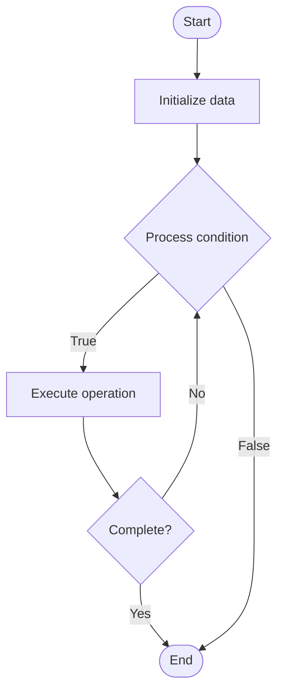

# Blockchain Flow Analysis

Name of Algorithm  

## Code Files


## Algorithm Visualization

### Flowchart (ASCII)


```
Blockchain Flow Analysis Flowchart:

┌─────────────┐
│   Start     │
└──────┬──────┘
       │
       ▼
┌─────────────┐
│  Initialize │
│   data      │
└──────┬──────┘
       │
       ▼
┌─────────────┐      Yes
│  Process   ├──────┐
│  condition?│      │
└──────┬──────┘      │
       │ No          │
       ▼             │
┌─────────────┐      │
│  Execute   │      │
│  operation │      │
└──────┬──────┘      │
       │             │
       └─────────────┘
       │
       ▼
┌─────────────┐
│    End      │
└─────────────┘
```


### Step-by-Step Execution


```
Blockchain Flow Analysis Step-by-Step Execution:

Input: [example data]

Step 1: Initialize
State: [initial state]

Step 2: Process
State: [intermediate state]

Step 3: Finalize
State: [final state]

Result: [output]
```


### Interactive Flowchart (Mermaid)





> **Note**: Mermaid diagrams are rendered automatically on GitHub. For local viewing, use a Mermaid-compatible Markdown viewer.
- [Python Implementation](/code/semester_13/lecture_94_blockchain_analytics/flow_analysis/algorithm.py)
- [Java Implementation](/code/semester_13/lecture_94_blockchain_analytics/flow_analysis/Algorithm.java)
- [Python Tests](/code/semester_13/lecture_94_blockchain_analytics/flow_analysis/test_algorithm.py)


   Blockchain Flow Analysis

What problem does it solve? (1 sentence)  
   Tracks and visualizes the movement of funds through blockchain networks by analyzing transaction flows, identifying fund sources and destinations, and mapping money movement patterns.

Intuition (plain-language explanation)  
   Like tracking money through a bank: Blockchain flow analysis is like tracking money through a bank - you follow transactions (money movements) from source to destination, identify patterns (where money goes), and visualize the flow (money trail) - this helps understand fund movements, detect money laundering, or trace stolen funds.

Inputs & Outputs  
   - Input: Blockchain transactions, addresses, transaction graphs, time windows, analysis parameters, visualization settings.  
   - Output: Flow graphs, fund trails, source/destination analysis, flow patterns, visualization diagrams.

Step-by-step description (5–10 lines max)  
Collect: collect blockchain transaction data.
Build: build transaction graph.
Trace: trace fund flows from source to destination.
Analyze: analyze flow patterns and paths.
Identify: identify sources and destinations.
Visualize: visualize fund flows and paths.
Pattern: detect patterns in fund movements.
Report: generate flow analysis reports.
Query: enable queries on flow data.
Monitor: monitor flows in real-time.

Tiny example (hand-simulated)  
   Flow Analysis: collect tx → build graph → trace 100 ETH from address A → follow through 5 addresses → identify destination B → visualize path → Flow Analysis successful.

Time & Space Complexity  
   - Time: O(n * d) where n is transactions, d is graph depth (flow analysis complexity).  
   - Space: O(n + e) where n is transactions, e is edges (graph storage).

Strengths  
- Transparency: provides transparency into fund movements.
- Tracing: enables fund tracing and investigation.
- Insights: reveals flow patterns and behaviors.

Weaknesses / limitations  
- Privacy: raises privacy concerns.
- Complexity: complex flows can be hard to analyze.
- Scale: large-scale analysis is computationally expensive.

Compare with alternatives  
    Alternatives: Manual Tracing, Basic Queries, Advanced Graph Analysis, Privacy-Preserving Methods

30-second explanation (your own words)  
    Techniques for tracking and visualizing the movement of funds through blockchain networks to understand transaction flows and patterns.

*Sources: Adapted from standard university textbooks and Wikipedia summaries.*
