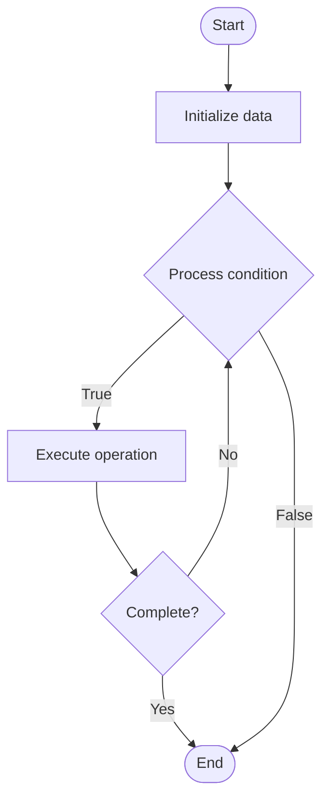

# On-Chain Analytics

## Учебные материалы

- [Школьный уровень](school.ru.md)
- [Университетский уровень](univer.ru.md)

## Algorithm Visualization

### Flowchart (ASCII)

```
On-Chain Analytics Flowchart:

┌─────────────┐
│   Start     │
└──────┬──────┘
       │
       ▼
┌─────────────┐
│  Initialize │
│   data      │
└──────┬──────┘
       │
       ▼
┌─────────────┐      Yes
│  Process   ├──────┐
│  condition?│      │
└──────┬──────┘      │
       │ No          │
       ▼             │
┌─────────────┐      │
│  Execute   │      │
│  operation │      │
└──────┬──────┘      │
       │             │
       └─────────────┘
       │
       ▼
┌─────────────┐
│    End      │
└─────────────┘
```

### Step-by-Step Execution

```
On-Chain Analytics Step-by-Step Execution:

Input: [example data]

Step 1: Initialize
State: [initial state]

Step 2: Process
State: [intermediate state]

Step 3: Finalize
State: [final state]

Result: [output]
```

### Interactive Flowchart (Mermaid)



> **Note**: Mermaid diagrams are rendered automatically on GitHub. For local viewing, use a Mermaid-compatible Markdown viewer.

- [Python Implementation](/code/semester_13/lecture_94_blockchain_analytics/on_chain_analytics/algorithm.py)
- [Java Implementation](/code/semester_13/lecture_94_blockchain_analytics/on_chain_analytics/Algorithm.java)
- [Python Tests](/code/semester_13/lecture_94_blockchain_analytics/on_chain_analytics/test_algorithm.py)

   On-Chain Analytics

What problem does it solve? (1 sentence)  
Implements on-chain analytics systems that analyze blockchain data to extract insights, trends, and patterns, providing valuable information about blockchain usage, token flows, and network activity.

Intuition (plain-language explanation)  
Like analytics for blockchain: On-Chain Analytics is like analytics for websites but for blockchain - you analyze blockchain data (like analyzing web traffic) to understand usage and trends - just as web analytics provide insights, on-chain analytics provide blockchain insights.

Inputs & Outputs  

  - Input: Blockchain data, transactions, addresses, blocks, analytics queries, time ranges, filter criteria.  
  - Output: Analytics insights, trends, patterns, usage statistics, token flows, network metrics, analytical reports.

Step-by-step description (5–10 lines max)  
Collect: collect blockchain data.
Process: process and clean data.
Analyze: analyze data for patterns.
Aggregate: aggregate statistics.
Calculate: calculate metrics and KPIs.
Visualize: visualize analytics.
Report: generate analytics reports.
Track: track trends over time.
Alert: alert on significant changes.
Optimize: optimize analytics performance.

Tiny example (hand-simulated)  
   On-Chain Analytics: data: Ethereum transactions → analyze: analyze transaction patterns → calculate: calculate daily active addresses, transaction volume → visualize: charts and graphs → result: insights about Ethereum usage → On-Chain Analytics successful.

Time & Space Complexity  

  - Time: O(d + a) where d is data processing time, a is analysis time (varies by analytics complexity).  
  - Space: O(d + a) where d is data storage, a is analytics storage (data and analytics results).

Strengths  

- Insights: provides valuable blockchain insights.
- Transparency: enables blockchain transparency.
- Decision-making: supports data-driven decisions.

Weaknesses / limitations  

- Data: requires processing large amounts of data.
- Complexity: analytics can be complex.
- Privacy: may raise privacy concerns.

Compare with alternatives  
    Alternatives: No Analytics, Basic Metrics, Off-Chain Analytics, Hybrid Analytics

30-second explanation (your own words)  
Implements on-chain analytics systems that analyze blockchain data to extract insights, trends, and patterns, providing valuable information about blockchain usage, token flows, and network activity.

*Sources: Adapted from standard university textbooks and Wikipedia summaries.*


## References

- [On Chain Analytics - Wikipedia](https://en.wikipedia.org/wiki/On%20Chain%20Analytics)
