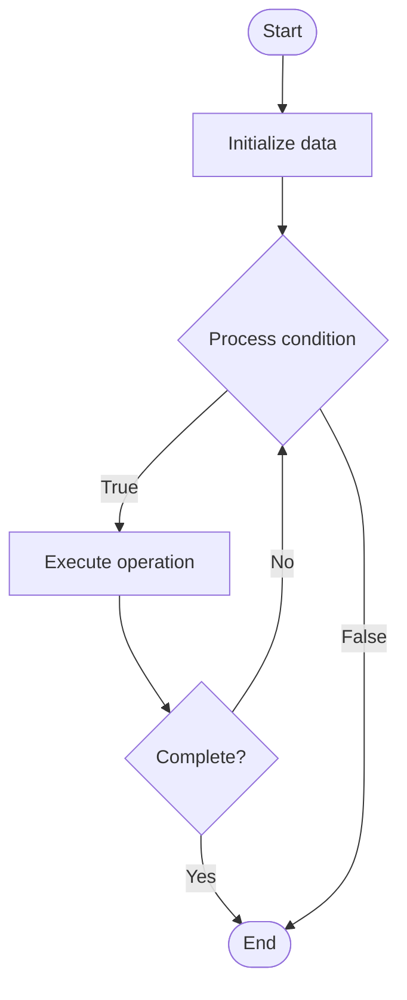

# Blockchain Transaction Analysis

1. **Name of Algorithm**  

## Code Files


## Algorithm Visualization

### Flowchart (ASCII)


```
Blockchain Transaction Analysis Flowchart:

┌─────────────┐
│   Start     │
└──────┬──────┘
       │
       ▼
┌─────────────┐
│  Initialize │
│   data      │
└──────┬──────┘
       │
       ▼
┌─────────────┐      Yes
│  Process   ├──────┐
│  condition?│      │
└──────┬──────┘      │
       │ No          │
       ▼             │
┌─────────────┐      │
│  Execute   │      │
│  operation │      │
└──────┬──────┘      │
       │             │
       └─────────────┘
       │
       ▼
┌─────────────┐
│    End      │
└─────────────┘
```


### Step-by-Step Execution


```
Blockchain Transaction Analysis Step-by-Step Execution:

Input: [example data]

Step 1: Initialize
State: [initial state]

Step 2: Process
State: [intermediate state]

Step 3: Finalize
State: [final state]

Result: [output]
```


### Interactive Flowchart (Mermaid)





> **Note**: Mermaid diagrams are rendered automatically on GitHub. For local viewing, use a Mermaid-compatible Markdown viewer.
- [Python Implementation](semester_13/lecture_94_blockchain_analytics/transaction_analysis/algorithm.py)
- [Java Implementation](semester_13/lecture_94_blockchain_analytics/transaction_analysis/Algorithm.java)
- [Python Tests](semester_13/lecture_94_blockchain_analytics/transaction_analysis/test_algorithm.py)


   Blockchain Transaction Analysis

2. **What problem does it solve? (1 sentence)**  
   Analyzes blockchain transactions to extract insights, identify patterns, detect anomalies, and understand transaction behavior through statistical analysis, graph analysis, and machine learning.

3. **Intuition (plain-language explanation)**  
   Like analyzing financial records: Blockchain transaction analysis is like analyzing financial records - you examine transactions (records), identify patterns (spending habits), detect anomalies (unusual activities), and extract insights (trends) - this helps understand network behavior, detect fraud, or make informed decisions.

4. **Inputs & Outputs**  
   - Input: Blockchain transactions, historical data, analysis parameters, statistical methods, ML models, query criteria.  
   - Output: Transaction insights, pattern analysis, anomaly detection, statistical summaries, behavioral analysis.

5. **Step-by-step description (5–10 lines max)**  
1. Collect: collect blockchain transaction data.
2. Parse: parse and structure transaction data.
3. Analyze: apply statistical and analytical methods.
4. Pattern: identify patterns in transactions.
5. Anomaly: detect anomalies and outliers.
6. Graph: perform graph analysis on transaction network.
7. ML: apply machine learning for pattern recognition.
8. Summarize: generate statistical summaries.
9. Visualize: visualize transaction data and patterns.
10. Report: generate analysis reports.

6. **Tiny example (hand-simulated)**  
   Transaction Analysis: collect 1M tx → parse → analyze → identify pattern (daily spikes at 9am) → detect anomaly (unusual large tx) → graph analysis → ML classification → summarize → Transaction Analysis successful.

7. **Time & Space Complexity**  
   - Time: O(n * a) where n is transactions, a is analysis complexity (transaction analysis complexity).  
   - Space: O(n + r) where n is transaction data, r is results (analysis storage).

8. **Strengths**  
- Insights: provides valuable insights into transactions.
- Detection: helps detect fraud and anomalies.
- Understanding: improves understanding of network behavior.

9. **Weaknesses / limitations**  
- Scale: large-scale analysis is computationally expensive.
- Complexity: requires sophisticated analysis techniques.
- Privacy: raises privacy concerns.

10. **Compare with alternatives**  
    Alternatives: Basic Queries, Manual Analysis, Advanced Analytics, Real-Time Analysis

11. **30-second explanation (your own words)**  
    Comprehensive analysis of blockchain transactions to extract insights, identify patterns, and detect anomalies through statistical and machine learning methods.

*Sources: Adapted from standard university textbooks and Wikipedia summaries.*
