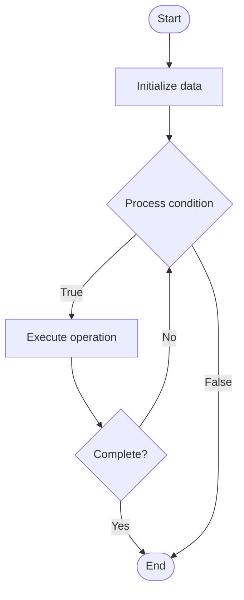

# AI-Powered Documentation Generation

1. **Name of Algorithm**  

## Code Files


## Algorithm Visualization

### Flowchart (ASCII)


```
AI-Powered Documentation Generation Flowchart:

┌─────────────┐
│   Start     │
└──────┬──────┘
       │
       ▼
┌─────────────┐
│  Initialize │
│   data      │
└──────┬──────┘
       │
       ▼
┌─────────────┐      Yes
│  Process   ├──────┐
│  condition?│      │
└──────┬──────┘      │
       │ No          │
       ▼             │
┌─────────────┐      │
│  Execute   │      │
│  operation │      │
└──────┬──────┘      │
       │             │
       └─────────────┘
       │
       ▼
┌─────────────┐
│    End      │
└─────────────┘
```


### Step-by-Step Execution


```
AI-Powered Documentation Generation Step-by-Step Execution:

Input: [example data]

Step 1: Initialize
State: [initial state]

Step 2: Process
State: [intermediate state]

Step 3: Finalize
State: [final state]

Result: [output]
```


### Interactive Flowchart (Mermaid)





> **Note**: Mermaid diagrams are rendered automatically on GitHub. For local viewing, use a Mermaid-compatible Markdown viewer.
- [Python Implementation](semester_14/lecture_100_documentation_ai/ai_doc_generation/algorithm.py)
- [Java Implementation](semester_14/lecture_100_documentation_ai/ai_doc_generation/Algorithm.java)
- [Python Tests](semester_14/lecture_100_documentation_ai/ai_doc_generation/test_algorithm.py)


   AI-Powered Documentation Generation

2. **What problem does it solve? (1 sentence)**  
   Automatically generates technical documentation from code, comments, and project context using AI models that understand code structure, extract information, and produce comprehensive documentation.

3. **Intuition (plain-language explanation)**  
   Like an AI technical writer: AI doc generation is like having an AI technical writer - you give it code (source material), and it reads the code, understands what it does, and writes documentation (explanation) - just as a human writer would, but faster and more consistently - it can generate API docs, tutorials, and explanations automatically.

4. **Inputs & Outputs**  
   - Input: Source code, code comments, project context, documentation templates, AI models, generation parameters.  
   - Output: Generated documentation, API references, code explanations, tutorials, documentation updates.

5. **Step-by-step description (5–10 lines max)**  
1. Parse: parse source code and extract structure.
2. Analyze: analyze code semantics and relationships.
3. Extract: extract information from code and comments.
4. Generate: use AI to generate documentation content.
5. Format: format documentation according to templates.
6. Review: review generated documentation for accuracy.
7. Refine: refine documentation based on feedback.
8. Update: update documentation as code changes.
9. Maintain: maintain documentation consistency.
10. Publish: publish documentation to appropriate platforms.

6. **Tiny example (hand-simulated)**  
   AI Doc Gen: parse code → analyze function signatures → extract docstrings → generate API docs → format → review → publish → AI Doc Gen successful.

7. **Time & Space Complexity**  
   - Time: O(c * g) where c is code size, g is generation complexity (doc generation complexity).  
   - Space: O(c + d) where c is code, d is documentation (doc storage).

8. **Strengths**  
- Automation: automates documentation generation.
- Consistency: ensures consistent documentation style.
- Speed: generates documentation quickly.

9. **Weaknesses / limitations**  
- Quality: may require human review and refinement.
- Context: may miss project-specific context.
- Maintenance: requires maintenance as code evolves.

10. **Compare with alternatives**  
    Alternatives: Manual Documentation, Template-Based Generation, Comment Extraction, Hybrid Approaches

11. **30-second explanation (your own words)**  
    AI-powered systems that automatically generate technical documentation from source code, comments, and project context.

*Sources: Adapted from standard university textbooks and Wikipedia summaries.*
