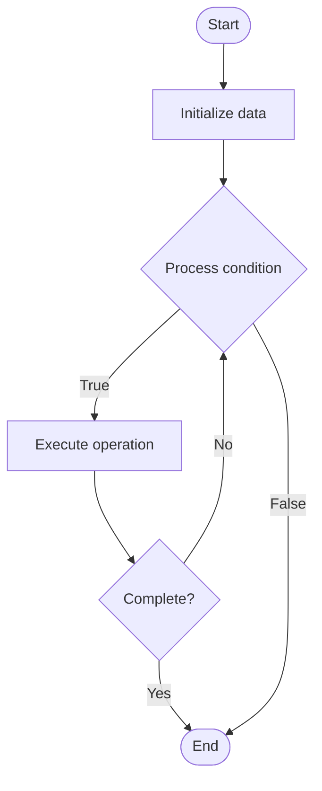

# Code-to-Documentation Conversion

## Учебные материалы

- [Школьный уровень](school.ru.md)
- [Университетский уровень](univer.ru.md)

## Algorithm Visualization

### Flowchart (ASCII)

```
Code-to-Documentation Conversion Flowchart:

┌─────────────┐
│   Start     │
└──────┬──────┘
       │
       ▼
┌─────────────┐
│  Initialize │
│   data      │
└──────┬──────┘
       │
       ▼
┌─────────────┐      Yes
│  Process   ├──────┐
│  condition?│      │
└──────┬──────┘      │
       │ No          │
       ▼             │
┌─────────────┐      │
│  Execute   │      │
│  operation │      │
└──────┬──────┘      │
       │             │
       └─────────────┘
       │
       ▼
┌─────────────┐
│    End      │
└─────────────┘
```

### Step-by-Step Execution

```
Code-to-Documentation Conversion Step-by-Step Execution:

Input: [example data]

Step 1: Initialize
State: [initial state]

Step 2: Process
State: [intermediate state]

Step 3: Finalize
State: [final state]

Result: [output]
```

### Interactive Flowchart (Mermaid)



> **Note**: Mermaid diagrams are rendered automatically on GitHub. For local viewing, use a Mermaid-compatible Markdown viewer.

- [Python Implementation](/code/semester_14/lecture_100_documentation_ai/code_to_docs/algorithm.py)
- [Java Implementation](/code/semester_14/lecture_100_documentation_ai/code_to_docs/Algorithm.java)
- [Python Tests](/code/semester_14/lecture_100_documentation_ai/code_to_docs/test_algorithm.py)

   Code-to-Documentation Conversion

What problem does it solve? (1 sentence)  
   Converts source code into readable documentation by extracting code structure, analyzing logic, and generating human-readable explanations that help developers understand code functionality.

Intuition (plain-language explanation)  
   Like translating code to English: Code-to-docs conversion is like translating code (a foreign language) to English (documentation) - you read the code, understand what it does, and write an explanation in plain language - this helps developers who aren't familiar with the code understand it quickly.

Inputs & Outputs  

  - Input: Source code, code structure, comments, analysis tools, documentation templates, conversion rules.  
  - Output: Documentation files, code explanations, function descriptions, usage examples, API references.

Step-by-step description (5–10 lines max)  
Parse: parse source code into abstract syntax tree.
Extract: extract code structure and elements.
Analyze: analyze code logic and relationships.
Map: map code elements to documentation sections.
Generate: generate documentation from code structure.
Format: format documentation in target format.
Enhance: enhance with examples and explanations.
Validate: validate documentation completeness.
Export: export documentation in desired format.
Update: update documentation when code changes.

Tiny example (hand-simulated)  
   Code-to-Docs: parse Python file → extract functions → analyze logic → generate docstrings → format as Markdown → enhance with examples → export → Code-to-Docs successful.

Time & Space Complexity  

  - Time: O(c * p) where c is code size, p is parsing complexity (conversion complexity).  
  - Space: O(c + d) where c is code, d is documentation (conversion storage).

Strengths  

- Automation: automates documentation creation.
- Accuracy: documentation matches code structure.
- Maintenance: easier to keep docs in sync with code.

Weaknesses / limitations  

- Depth: may lack deep explanations of logic.
- Context: may miss project-specific context.
- Quality: may require human refinement.

Compare with alternatives  
    Alternatives: Manual Documentation, Comment-Based Docs, AI Generation, Hybrid Approaches

30-second explanation (your own words)  
    Tools and techniques that convert source code into readable documentation by extracting structure and generating explanations.

*Sources: Adapted from standard university textbooks and Wikipedia summaries.*
