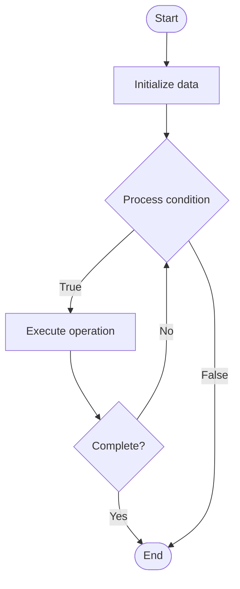

# Contextual Documentation Help

1. **Name of Algorithm**  

## Code Files


## Algorithm Visualization

### Flowchart (ASCII)


```
Contextual Documentation Help Flowchart:

┌─────────────┐
│   Start     │
└──────┬──────┘
       │
       ▼
┌─────────────┐
│  Initialize │
│   data      │
└──────┬──────┘
       │
       ▼
┌─────────────┐      Yes
│  Process   ├──────┐
│  condition?│      │
└──────┬──────┘      │
       │ No          │
       ▼             │
┌─────────────┐      │
│  Execute   │      │
│  operation │      │
└──────┬──────┘      │
       │             │
       └─────────────┘
       │
       ▼
┌─────────────┐
│    End      │
└─────────────┘
```


### Step-by-Step Execution


```
Contextual Documentation Help Step-by-Step Execution:

Input: [example data]

Step 1: Initialize
State: [initial state]

Step 2: Process
State: [intermediate state]

Step 3: Finalize
State: [final state]

Result: [output]
```


### Interactive Flowchart (Mermaid)





> **Note**: Mermaid diagrams are rendered automatically on GitHub. For local viewing, use a Mermaid-compatible Markdown viewer.
- [Python Implementation](semester_14/lecture_100_documentation_ai/contextual_help/algorithm.py)
- [Java Implementation](semester_14/lecture_100_documentation_ai/contextual_help/Algorithm.java)
- [Python Tests](semester_14/lecture_100_documentation_ai/contextual_help/test_algorithm.py)


   Contextual Documentation Help

2. **What problem does it solve? (1 sentence)**  
   Provides context-aware documentation assistance by analyzing user context (code location, task, error messages) and delivering relevant documentation, examples, and guidance at the right moment.

3. **Intuition (plain-language explanation)**  
   Like a helpful colleague: Contextual help is like having a helpful colleague nearby - when you're stuck on code (context), they notice what you're working on and provide relevant help (documentation) - just as a colleague would, but available 24/7 and with perfect memory of all documentation.

4. **Inputs & Outputs**  
   - Input: User context (code, cursor position, errors), documentation corpus, help queries, user preferences, context analysis.  
   - Output: Relevant documentation snippets, code examples, troubleshooting guides, contextual suggestions, help responses.

5. **Step-by-step description (5–10 lines max)**  
1. Capture: capture user context (code, position, errors).
2. Analyze: analyze context to understand user needs.
3. Search: search documentation corpus for relevant content.
4. Rank: rank results by relevance to context.
5. Extract: extract relevant documentation snippets.
6. Format: format help content for display.
7. Present: present contextual help to user.
8. Learn: learn from user interactions.
9. Improve: improve suggestions based on feedback.
10. Update: update help content as documentation evolves.

6. **Tiny example (hand-simulated)**  
   Contextual Help: user at line 42 → analyze context (using API X) → search docs → find API X documentation → extract relevant snippet → present tooltip → Contextual Help successful.

7. **Time & Space Complexity**  
   - Time: O(c + s) where c is context analysis, s is search complexity (contextual help complexity).  
   - Space: O(d + i) where d is documentation, i is index (help storage).

8. **Strengths**  
- Relevance: provides highly relevant help.
- Timing: delivers help at the right moment.
- Efficiency: reduces time searching for documentation.

9. **Weaknesses / limitations**  
- Context: requires accurate context understanding.
- Quality: depends on documentation quality.
- Privacy: raises privacy concerns about context capture.

10. **Compare with alternatives**  
    Alternatives: Static Documentation, Search-Based Help, AI Chatbots, Community Forums

11. **30-second explanation (your own words)**  
    Context-aware documentation systems that provide relevant help based on user's current code context and needs.

*Sources: Adapted from standard university textbooks and Wikipedia summaries.*
