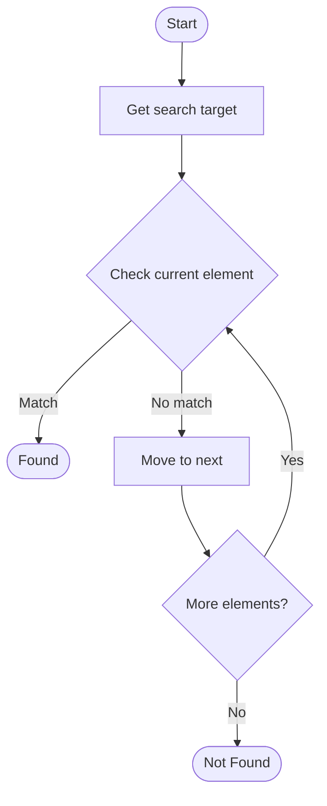

# Intelligent Documentation Search

## Учебные материалы

- [Школьный уровень](school.ru.md)
- [Университетский уровень](univer.ru.md)

## Algorithm Visualization

### Flowchart (ASCII)

```
Intelligent Documentation Search Flowchart:

┌─────────────┐
│   Start     │
└──────┬──────┘
       │
       ▼
┌─────────────┐
│  Get search │
│    target   │
└──────┬──────┘
       │
       ▼
┌─────────────┐      Yes
│  Check     ├──────┐
│  current   │      │
│  element?  │      │
└──────┬──────┘      │
       │ No          │
       ▼             │
┌─────────────┐      │
│   Move to   │      │
│   next      │      │
└──────┬──────┘      │
       │             │
       └─────────────┘
       │
       ▼
┌─────────────┐
│   Found?    │
└──────┬──────┘
       │
       ▼
┌─────────────┐
│    End      │
└─────────────┘
```

### Step-by-Step Execution

```
Intelligent Documentation Search Step-by-Step Execution:

Array: [1, 3, 5, 7, 9, 11]
Target: 7

Step 1: Check middle (index 2, value 5)
[1, 3, 5, 7, 9, 11]
         ↑
5 < 7, search right

Step 2: Check middle of right half (index 4, value 9)
[7, 9, 11]
    ↑
9 > 7, search left

Step 3: Check remaining (index 3, value 7)
[7]
 ↑
Found! Index 3
```

### Interactive Flowchart (Mermaid)



> **Note**: Mermaid diagrams are rendered automatically on GitHub. For local viewing, use a Mermaid-compatible Markdown viewer.

- [Python Implementation](/code/semester_14/lecture_100_documentation_ai/intelligent_search/algorithm.py)
- [Java Implementation](/code/semester_14/lecture_100_documentation_ai/intelligent_search/Algorithm.java)
- [Python Tests](/code/semester_14/lecture_100_documentation_ai/intelligent_search/test_algorithm.py)

What problem does it solve? (1 sentence)  
   Enables semantic and intelligent search over documentation by understanding user intent, using natural language processing, and returning relevant results even when exact keywords don't match.

Intuition (plain-language explanation)  
   Like a smart librarian: Intelligent search is like a smart librarian - you ask a question in natural language (not exact keywords), and they understand what you mean (semantic understanding) and find relevant books (documentation) even if your words don't exactly match the book titles - this makes finding information much easier.

Inputs & Outputs  

  - Input: Search queries, documentation corpus, semantic models, search parameters, user preferences, ranking algorithms.  
  - Output: Relevant search results, ranked documentation, query suggestions, related content, search analytics.

Step-by-step description (5–10 lines max)  
Parse: parse user search query.
Understand: understand query intent using NLP.
Embed: embed query and documentation into vector space.
Search: search documentation using semantic similarity.
Rank: rank results by relevance and quality.
Filter: filter results based on criteria.
Present: present ranked results to user.
Learn: learn from user clicks and feedback.
Refine: refine search algorithm based on usage.
Suggest: suggest related queries and content.

Tiny example (hand-simulated)  
   Intelligent Search: query 'how to handle errors' → understand intent → embed → search semantically → find 'error handling' docs → rank → present top 5 results → Intelligent Search successful.

Time & Space Complexity  

  - Time: O(q + d * s) where q is query processing, d is documentation size, s is search complexity (search complexity).  
  - Space: O(d + e) where d is documentation, e is embeddings (search storage).

Strengths  

- Semantic: understands user intent, not just keywords.
- Relevance: returns highly relevant results.
- Natural: supports natural language queries.

Weaknesses / limitations  

- Complexity: requires sophisticated NLP and embeddings.
- Quality: depends on documentation quality and structure.
- Performance: semantic search can be slower than keyword search.

Compare with alternatives  
    Alternatives: Keyword Search, Full-Text Search, Tag-Based Search, Hybrid Search

30-second explanation (your own words)  
    Semantic search systems that understand user intent and return relevant documentation results using natural language processing and embeddings.

*Sources: Adapted from standard university textbooks and Wikipedia summaries.*


## References

- [Intelligent Search - Wikipedia](https://en.wikipedia.org/wiki/Intelligent%20Search)
