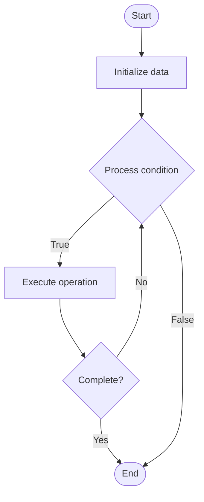

# Natural Language Documentation

1. **Name of Algorithm**  

## Code Files


## Algorithm Visualization

### Flowchart (ASCII)


```
Natural Language Documentation Flowchart:

┌─────────────┐
│   Start     │
└──────┬──────┘
       │
       ▼
┌─────────────┐
│  Initialize │
│   data      │
└──────┬──────┘
       │
       ▼
┌─────────────┐      Yes
│  Process   ├──────┐
│  condition?│      │
└──────┬──────┘      │
       │ No          │
       ▼             │
┌─────────────┐      │
│  Execute   │      │
│  operation │      │
└──────┬──────┘      │
       │             │
       └─────────────┘
       │
       ▼
┌─────────────┐
│    End      │
└─────────────┘
```


### Step-by-Step Execution


```
Natural Language Documentation Step-by-Step Execution:

Input: [example data]

Step 1: Initialize
State: [initial state]

Step 2: Process
State: [intermediate state]

Step 3: Finalize
State: [final state]

Result: [output]
```


### Interactive Flowchart (Mermaid)





> **Note**: Mermaid diagrams are rendered automatically on GitHub. For local viewing, use a Mermaid-compatible Markdown viewer.
- [Python Implementation](semester_14/lecture_100_documentation_ai/natural_language_docs/algorithm.py)
- [Java Implementation](semester_14/lecture_100_documentation_ai/natural_language_docs/Algorithm.java)
- [Python Tests](semester_14/lecture_100_documentation_ai/natural_language_docs/test_algorithm.py)


   Natural Language Documentation

2. **What problem does it solve? (1 sentence)**  
   Creates documentation written in natural, conversational language that is easy to understand for developers of all skill levels, using AI to translate technical concepts into accessible explanations.

3. **Intuition (plain-language explanation)**  
   Like explaining to a friend: Natural language docs are like explaining code to a friend - you use simple, conversational language (not technical jargon), give examples (real-world analogies), and make it easy to understand - this makes documentation accessible to beginners and experienced developers alike.

4. **Inputs & Outputs**  
   - Input: Technical content, documentation goals, target audience, tone preferences, examples, AI models.  
   - Output: Natural language documentation, conversational explanations, accessible tutorials, clear examples, readable guides.

5. **Step-by-step description (5–10 lines max)**  
1. Analyze: analyze technical content and concepts.
2. Simplify: simplify technical language and jargon.
3. Explain: explain concepts in natural language.
4. Analogize: use analogies and real-world examples.
5. Structure: structure content for readability.
6. Format: format for easy reading.
7. Review: review for clarity and accuracy.
8. Test: test with target audience.
9. Refine: refine based on feedback.
10. Maintain: maintain natural language style.

6. **Tiny example (hand-simulated)**  
   Natural Language Docs: analyze API → simplify 'asynchronous' to 'non-blocking' → explain with analogy (like ordering food) → structure → format → review → Natural Language Docs successful.

7. **Time & Space Complexity**  
   - Time: O(c * t) where c is content size, t is translation complexity (doc generation complexity).  
   - Space: O(c + d) where c is content, d is documentation (doc storage).

8. **Strengths**  
- Accessibility: makes documentation accessible to all skill levels.
- Clarity: improves clarity and understanding.
- Engagement: more engaging than technical jargon.

9. **Weaknesses / limitations**  
- Precision: may lose some technical precision.
- Length: natural language can be more verbose.
- Maintenance: requires careful maintenance of tone.

10. **Compare with alternatives**  
    Alternatives: Technical Documentation, Formal Documentation, Code Comments, Video Tutorials

11. **30-second explanation (your own words)**  
    Documentation written in natural, conversational language that makes technical concepts accessible and easy to understand.

*Sources: Adapted from standard university textbooks and Wikipedia summaries.*
