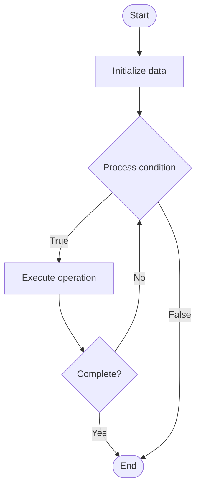

# Personalized Documentation

Name of Algorithm  

## Code Files


## Algorithm Visualization

### Flowchart (ASCII)


```
Personalized Documentation Flowchart:

┌─────────────┐
│   Start     │
└──────┬──────┘
       │
       ▼
┌─────────────┐
│  Initialize │
│   data      │
└──────┬──────┘
       │
       ▼
┌─────────────┐      Yes
│  Process   ├──────┐
│  condition?│      │
└──────┬──────┘      │
       │ No          │
       ▼             │
┌─────────────┐      │
│  Execute   │      │
│  operation │      │
└──────┬──────┘      │
       │             │
       └─────────────┘
       │
       ▼
┌─────────────┐
│    End      │
└─────────────┘
```


### Step-by-Step Execution


```
Personalized Documentation Step-by-Step Execution:

Input: [example data]

Step 1: Initialize
State: [initial state]

Step 2: Process
State: [intermediate state]

Step 3: Finalize
State: [final state]

Result: [output]
```


### Interactive Flowchart (Mermaid)





> **Note**: Mermaid diagrams are rendered automatically on GitHub. For local viewing, use a Mermaid-compatible Markdown viewer.
- [Python Implementation](/code/semester_14/lecture_100_documentation_ai/personalized_docs/algorithm.py)
- [Java Implementation](/code/semester_14/lecture_100_documentation_ai/personalized_docs/Algorithm.java)
- [Python Tests](/code/semester_14/lecture_100_documentation_ai/personalized_docs/test_algorithm.py)


   Personalized Documentation

What problem does it solve? (1 sentence)  
   Customizes documentation content, examples, and recommendations based on user preferences, skill level, role, and learning history to provide tailored documentation experiences.

Intuition (plain-language explanation)  
   Like a personalized tutor: Personalized docs are like a personalized tutor - they adapt to your skill level (beginner vs expert), your role (developer vs designer), and your learning style (prefer examples vs theory) - just as a tutor would customize lessons, personalized docs customize content to help you learn more effectively.

Inputs & Outputs  
   - Input: User profile, skill level, role, preferences, learning history, documentation corpus, personalization models.  
   - Output: Personalized documentation, customized examples, tailored recommendations, adaptive content, user-specific guides.

Step-by-step description (5–10 lines max)  
Profile: create user profile (skill, role, preferences).
Track: track user interactions and learning history.
Analyze: analyze user needs and preferences.
Customize: customize documentation content.
Adapt: adapt examples to user's context.
Recommend: recommend relevant documentation.
Present: present personalized content to user.
Learn: learn from user feedback and behavior.
Update: update personalization based on learning.
Refine: refine personalization algorithms.

Tiny example (hand-simulated)  
   Personalized Docs: profile (beginner, Python) → track interactions → analyze → customize (simple examples) → adapt (Python-specific) → recommend beginner guides → present → Personalized Docs successful.

Time & Space Complexity  
   - Time: O(p + c) where p is personalization, c is content customization (personalization complexity).  
   - Space: O(u + d) where u is user data, d is documentation (personalization storage).

Strengths  
- Relevance: provides highly relevant content.
- Learning: improves learning effectiveness.
- Engagement: increases user engagement.

Weaknesses / limitations  
- Privacy: raises privacy concerns about user tracking.
- Complexity: requires sophisticated personalization algorithms.
- Maintenance: requires maintenance of user profiles.

Compare with alternatives  
    Alternatives: Static Documentation, Role-Based Docs, Skill-Based Docs, Community Recommendations

30-second explanation (your own words)  
    Documentation systems that customize content, examples, and recommendations based on individual user profiles, preferences, and learning history.

*Sources: Adapted from standard university textbooks and Wikipedia summaries.*
