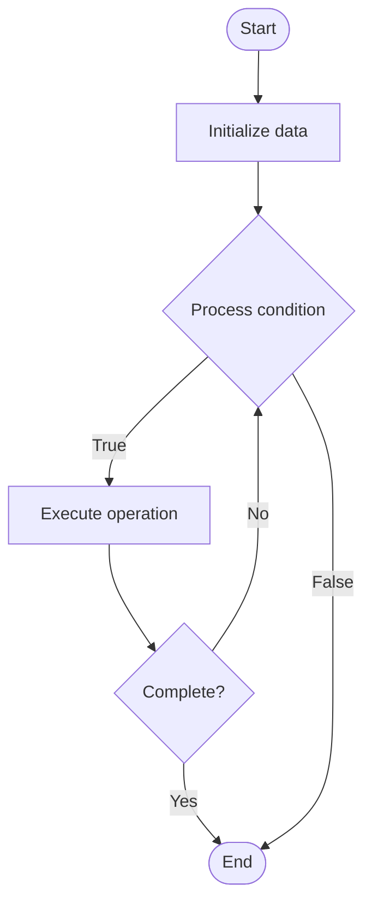

# API Explorer

## Учебные материалы

- [Школьный уровень](school.ru.md)
- [Университетский уровень](univer.ru.md)

## Algorithm Visualization

### Flowchart (ASCII)

```
API Explorer Flowchart:

┌─────────────┐
│   Start     │
└──────┬──────┘
       │
       ▼
┌─────────────┐
│  Initialize │
│   data      │
└──────┬──────┘
       │
       ▼
┌─────────────┐      Yes
│  Process   ├──────┐
│  condition?│      │
└──────┬──────┘      │
       │ No          │
       ▼             │
┌─────────────┐      │
│  Execute   │      │
│  operation │      │
└──────┬──────┘      │
       │             │
       └─────────────┘
       │
       ▼
┌─────────────┐
│    End      │
└─────────────┘
```

### Step-by-Step Execution

```
API Explorer Step-by-Step Execution:

Input: [example data]

Step 1: Initialize
State: [initial state]

Step 2: Process
State: [intermediate state]

Step 3: Finalize
State: [final state]

Result: [output]
```

### Interactive Flowchart (Mermaid)



> **Note**: Mermaid diagrams are rendered automatically on GitHub. For local viewing, use a Mermaid-compatible Markdown viewer.

- [Python Implementation](/code/semester_14/lecture_101_developer_experience/api_explorer/algorithm.py)
- [Java Implementation](/code/semester_14/lecture_101_developer_experience/api_explorer/Algorithm.java)
- [Python Tests](/code/semester_14/lecture_101_developer_experience/api_explorer/test_algorithm.py)

   API Explorer

What problem does it solve? (1 sentence)  
   Provides interactive tools for discovering, testing, and understanding APIs by offering visual interfaces, request builders, response viewers, and documentation integration.

Intuition (plain-language explanation)  
   Like a test drive for APIs: API Explorer is like a test drive for a car - instead of buying blind (using API without testing), you can test drive (explore API) - you can try different features (endpoints), see how it responds (responses), and understand how it works (documentation) before committing to use it.

Inputs & Outputs  

  - Input: API endpoints, request parameters, authentication credentials, API documentation, test data, exploration queries.  
  - Output: API responses, request examples, response schemas, documentation links, test results, exploration history.

Step-by-step description (5–10 lines max)  
Discover: discover available API endpoints.
Select: select endpoint to explore.
Build: build request with parameters.
Authenticate: provide authentication credentials.
Execute: execute API request.
View: view response and status.
Analyze: analyze response structure.
Document: access related documentation.
Test: test different scenarios.
Share: share exploration results.

Tiny example (hand-simulated)  
   API Explorer: discover endpoints → select /users → build request (GET, params) → authenticate → execute → view response (200, JSON) → analyze schema → API Explorer successful.

Time & Space Complexity  

  - Time: O(r) where r is request execution time (API exploration complexity).  
  - Space: O(h + d) where h is history, d is documentation (explorer storage).

Strengths  

- Discovery: helps discover and understand APIs.
- Testing: enables quick API testing.
- Learning: facilitates API learning and experimentation.

Weaknesses / limitations  

- Limitations: may not support all API features.
- Security: requires careful handling of credentials.
- Dependencies: depends on API availability.

Compare with alternatives  
    Alternatives: Command Line Tools, Postman, cURL, API Documentation Only

30-second explanation (your own words)  
    Interactive tools that help developers discover, test, and understand APIs through visual interfaces and integrated documentation.

*Sources: Adapted from standard university textbooks and Wikipedia summaries.*
