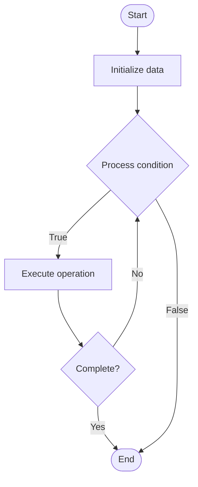

# Developer Portals

## Учебные материалы

- [Школьный уровень](school.ru.md)
- [Университетский уровень](univer.ru.md)

## Algorithm Visualization

### Flowchart (ASCII)

```
Developer Portals Flowchart:

┌─────────────┐
│   Start     │
└──────┬──────┘
       │
       ▼
┌─────────────┐
│  Initialize │
│   data      │
└──────┬──────┘
       │
       ▼
┌─────────────┐      Yes
│  Process   ├──────┐
│  condition?│      │
└──────┬──────┘      │
       │ No          │
       ▼             │
┌─────────────┐      │
│  Execute   │      │
│  operation │      │
└──────┬──────┘      │
       │             │
       └─────────────┘
       │
       ▼
┌─────────────┐
│    End      │
└─────────────┘
```

### Step-by-Step Execution

```
Developer Portals Step-by-Step Execution:

Input: [example data]

Step 1: Initialize
State: [initial state]

Step 2: Process
State: [intermediate state]

Step 3: Finalize
State: [final state]

Result: [output]
```

### Interactive Flowchart (Mermaid)



> **Note**: Mermaid diagrams are rendered automatically on GitHub. For local viewing, use a Mermaid-compatible Markdown viewer.

- [Python Implementation](/code/semester_14/lecture_101_developer_experience/developer_portals/algorithm.py)
- [Java Implementation](/code/semester_14/lecture_101_developer_experience/developer_portals/Algorithm.java)
- [Python Tests](/code/semester_14/lecture_101_developer_experience/developer_portals/test_algorithm.py)

What problem does it solve? (1 sentence)  
   Creates centralized platforms that provide developers with access to APIs, documentation, tools, support, and resources needed to build applications using a platform's services.

Intuition (plain-language explanation)  
   Like a developer's one-stop shop: Developer portals are like a one-stop shop for developers - you have everything in one place: APIs (products), documentation (manuals), tools (utilities), support (help desk), and resources (guides) - just as a shopping mall has everything, a developer portal has everything developers need.

Inputs & Outputs  

  - Input: API documentation, code samples, SDKs, authentication info, support resources, developer tools, community content.  
  - Output: Developer portal website, API access, documentation, code examples, developer tools, support channels, community platform.

Step-by-step description (5–10 lines max)  
Design: design portal structure and navigation.
Integrate: integrate APIs and services.
Document: create comprehensive documentation.
Provide: provide code samples and SDKs.
Authenticate: set up authentication and keys.
Support: establish support channels.
Tools: provide developer tools and utilities.
Community: build community features.
Maintain: maintain and update portal content.
Monitor: monitor developer usage and feedback.

Tiny example (hand-simulated)  
   Developer Portal: design → integrate 10 APIs → document → provide Python SDK → set up auth → support forum → tools → community → maintain → Developer Portal successful.

Time & Space Complexity  

  - Time: O(c) where c is content management complexity (portal complexity).  
  - Space: O(d + t) where d is documentation, t is tools (portal storage).

Strengths  

- Centralization: provides centralized access to resources.
- Efficiency: improves developer onboarding and productivity.
- Community: fosters developer community.

Weaknesses / limitations  

- Maintenance: requires ongoing maintenance and updates.
- Complexity: can become complex with many services.
- Quality: depends on documentation and tool quality.

Compare with alternatives  
    Alternatives: Scattered Resources, Email Support, Basic Documentation, Third-Party Platforms

30-second explanation (your own words)  
    Centralized platforms that provide developers with APIs, documentation, tools, and support resources in one place.

*Sources: Adapted from standard university textbooks and Wikipedia summaries.*
