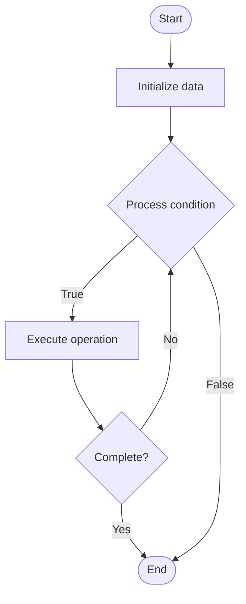

# Developer Feedback Loops

Name of Algorithm  

## Code Files


## Algorithm Visualization

### Flowchart (ASCII)


```
Developer Feedback Loops Flowchart:

┌─────────────┐
│   Start     │
└──────┬──────┘
       │
       ▼
┌─────────────┐
│  Initialize │
│   data      │
└──────┬──────┘
       │
       ▼
┌─────────────┐      Yes
│  Process   ├──────┐
│  condition?│      │
└──────┬──────┘      │
       │ No          │
       ▼             │
┌─────────────┐      │
│  Execute   │      │
│  operation │      │
└──────┬──────┘      │
       │             │
       └─────────────┘
       │
       ▼
┌─────────────┐
│    End      │
└─────────────┘
```


### Step-by-Step Execution


```
Developer Feedback Loops Step-by-Step Execution:

Input: [example data]

Step 1: Initialize
State: [initial state]

Step 2: Process
State: [intermediate state]

Step 3: Finalize
State: [final state]

Result: [output]
```


### Interactive Flowchart (Mermaid)





> **Note**: Mermaid diagrams are rendered automatically on GitHub. For local viewing, use a Mermaid-compatible Markdown viewer.
- [Python Implementation](/code/semester_14/lecture_101_developer_experience/feedback_loops/algorithm.py)
- [Java Implementation](/code/semester_14/lecture_101_developer_experience/feedback_loops/Algorithm.java)
- [Python Tests](/code/semester_14/lecture_101_developer_experience/feedback_loops/test_algorithm.py)


   Developer Feedback Loops

What problem does it solve? (1 sentence)  
   Establishes mechanisms for collecting, processing, and acting on developer feedback to improve products, documentation, and developer experience continuously.

Intuition (plain-language explanation)  
   Like a feedback system: Developer feedback loops are like a feedback system - developers provide input (feedback), the system processes it (analysis), and improvements are made (action) - just as a thermostat adjusts temperature based on feedback, feedback loops adjust products based on developer input.

Inputs & Outputs  
   - Input: Developer feedback, usage metrics, error reports, feature requests, support tickets, survey responses, community discussions.  
   - Output: Processed feedback, prioritized improvements, product updates, documentation updates, feature releases, developer communications.

Step-by-step description (5–10 lines max)  
Collect: collect feedback from multiple channels.
Aggregate: aggregate feedback from various sources.
Analyze: analyze feedback for patterns and priorities.
Prioritize: prioritize feedback based on impact and feasibility.
Plan: plan improvements and updates.
Implement: implement improvements.
Communicate: communicate changes to developers.
Measure: measure impact of improvements.
Iterate: iterate based on results.
Close: close feedback loop with updates.

Tiny example (hand-simulated)  
   Feedback Loop: collect 100 feedback items → aggregate → analyze → prioritize (top 5) → plan → implement → communicate → measure → iterate → Feedback Loop successful.

Time & Space Complexity  
   - Time: O(f * a) where f is feedback volume, a is analysis complexity (feedback processing complexity).  
   - Space: O(f + m) where f is feedback, m is metrics (feedback storage).

Strengths  
- Improvement: drives continuous improvement.
- Engagement: increases developer engagement.
- Quality: improves product and documentation quality.

Weaknesses / limitations  
- Volume: can be overwhelmed by feedback volume.
- Prioritization: requires careful prioritization.
- Resources: requires resources to act on feedback.

Compare with alternatives  
    Alternatives: No Feedback, Ad-Hoc Feedback, Annual Surveys, Internal Only

30-second explanation (your own words)  
    Structured processes for collecting, analyzing, and acting on developer feedback to continuously improve products and developer experience.

*Sources: Adapted from standard university textbooks and Wikipedia summaries.*
