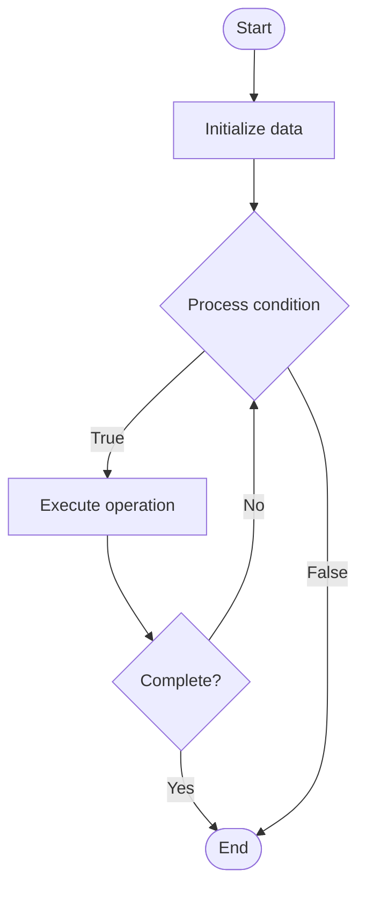

# Developer Onboarding Automation

## Учебные материалы

- [Школьный уровень](school.ru.md)
- [Университетский уровень](univer.ru.md)

## Algorithm Visualization

### Flowchart (ASCII)

```
Developer Onboarding Automation Flowchart:

┌─────────────┐
│   Start     │
└──────┬──────┘
       │
       ▼
┌─────────────┐
│  Initialize │
│   data      │
└──────┬──────┘
       │
       ▼
┌─────────────┐      Yes
│  Process   ├──────┐
│  condition?│      │
└──────┬──────┘      │
       │ No          │
       ▼             │
┌─────────────┐      │
│  Execute   │      │
│  operation │      │
└──────┬──────┘      │
       │             │
       └─────────────┘
       │
       ▼
┌─────────────┐
│    End      │
└─────────────┘
```

### Step-by-Step Execution

```
Developer Onboarding Automation Step-by-Step Execution:

Input: [example data]

Step 1: Initialize
State: [initial state]

Step 2: Process
State: [intermediate state]

Step 3: Finalize
State: [final state]

Result: [output]
```

### Interactive Flowchart (Mermaid)



> **Note**: Mermaid diagrams are rendered automatically on GitHub. For local viewing, use a Mermaid-compatible Markdown viewer.

- [Python Implementation](/code/semester_14/lecture_101_developer_experience/onboarding_automation/algorithm.py)
- [Java Implementation](/code/semester_14/lecture_101_developer_experience/onboarding_automation/Algorithm.java)
- [Python Tests](/code/semester_14/lecture_101_developer_experience/onboarding_automation/test_algorithm.py)

What problem does it solve? (1 sentence)  
   Automates the developer onboarding process by providing guided setup, automated configuration, interactive tutorials, and progress tracking to reduce time-to-first-success.

Intuition (plain-language explanation)  
   Like an automated welcome tour: Developer onboarding automation is like an automated welcome tour - when you arrive (sign up), you get a guided tour (setup wizard), automated setup (configuration), interactive tutorials (learning), and progress tracking (checklist) - this helps you get started quickly and successfully.

Inputs & Outputs  

  - Input: Developer signup, platform configuration, tutorial content, setup scripts, progress tracking, completion criteria.  
  - Output: Onboarded developers, configured environments, completed tutorials, progress reports, success metrics, support resources.

Step-by-step description (5–10 lines max)  
Welcome: welcome new developers.
Guide: guide through setup process.
Configure: automate environment configuration.
Tutorial: provide interactive tutorials.
Track: track onboarding progress.
Validate: validate setup and understanding.
Support: provide support during onboarding.
Complete: mark onboarding as complete.
Follow-up: follow up with additional resources.
Measure: measure onboarding success metrics.

Tiny example (hand-simulated)  
   Onboarding: welcome → guide setup → configure API keys → tutorial (5 steps) → track progress → validate → support → complete → follow-up → Onboarding successful (15 min).

Time & Space Complexity  

  - Time: O(s + t) where s is setup time, t is tutorial time (onboarding complexity).  
  - Space: O(c + p) where c is content, p is progress (onboarding storage).

Strengths  

- Speed: reduces time-to-first-success.
- Consistency: ensures consistent onboarding experience.
- Success: improves onboarding success rates.

Weaknesses / limitations  

- Complexity: requires careful design and maintenance.
- Flexibility: may not fit all developer needs.
- Resources: requires resources to create and maintain.

Compare with alternatives  
    Alternatives: Manual Onboarding, Documentation Only, Video Tutorials, Community Support

30-second explanation (your own words)  
    Automated systems that guide developers through setup, configuration, and learning to reduce onboarding time and improve success rates.

*Sources: Adapted from standard university textbooks and Wikipedia summaries.*
