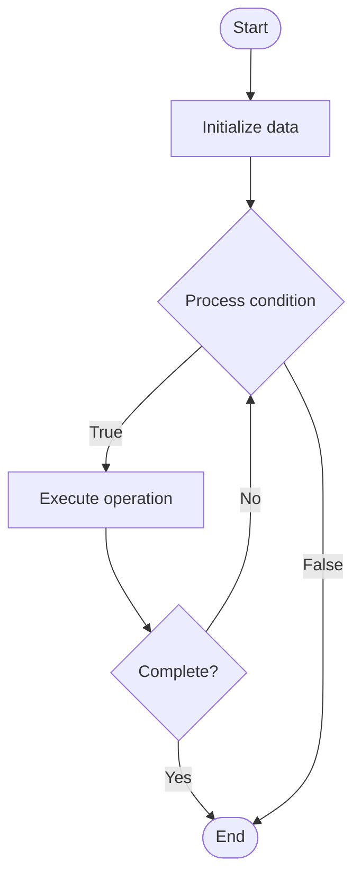

# Developer Sandbox Environments

## Учебные материалы

- [Школьный уровень](school.ru.md)
- [Университетский уровень](univer.ru.md)

## Algorithm Visualization

### Flowchart (ASCII)

```
Developer Sandbox Environments Flowchart:

┌─────────────┐
│   Start     │
└──────┬──────┘
       │
       ▼
┌─────────────┐
│  Initialize │
│   data      │
└──────┬──────┘
       │
       ▼
┌─────────────┐      Yes
│  Process   ├──────┐
│  condition?│      │
└──────┬──────┘      │
       │ No          │
       ▼             │
┌─────────────┐      │
│  Execute   │      │
│  operation │      │
└──────┬──────┘      │
       │             │
       └─────────────┘
       │
       ▼
┌─────────────┐
│    End      │
└─────────────┘
```

### Step-by-Step Execution

```
Developer Sandbox Environments Step-by-Step Execution:

Input: [example data]

Step 1: Initialize
State: [initial state]

Step 2: Process
State: [intermediate state]

Step 3: Finalize
State: [final state]

Result: [output]
```

### Interactive Flowchart (Mermaid)



> **Note**: Mermaid diagrams are rendered automatically on GitHub. For local viewing, use a Mermaid-compatible Markdown viewer.

- [Python Implementation](/code/semester_14/lecture_101_developer_experience/sandbox_environments/algorithm.py)
- [Java Implementation](/code/semester_14/lecture_101_developer_experience/sandbox_environments/Algorithm.java)
- [Python Tests](/code/semester_14/lecture_101_developer_experience/sandbox_environments/test_algorithm.py)

What problem does it solve? (1 sentence)  
   Provides isolated, safe testing environments where developers can experiment with APIs, test code, and learn without affecting production systems or requiring complex local setup.

Intuition (plain-language explanation)  
   Like a playground: Sandbox environments are like a playground - you can play (test), experiment (try things), and learn (practice) in a safe space without breaking anything (production) - just as a playground is safe for kids, sandboxes are safe for developers to experiment.

Inputs & Outputs  

  - Input: Developer requests, environment templates, API access, test data, resource limits, time limits, isolation requirements.  
  - Output: Sandbox environments, API access, test data, isolated resources, usage metrics, environment snapshots.

Step-by-step description (5–10 lines max)  
Request: developer requests sandbox environment.
Provision: provision isolated environment.
Configure: configure environment with APIs and data.
Access: provide access credentials.
Use: developer uses sandbox for testing.
Monitor: monitor resource usage and limits.
Snapshot: create environment snapshots.
Reset: reset environment when needed.
Cleanup: cleanup expired environments.
Report: report usage and metrics.

Tiny example (hand-simulated)  
   Sandbox: request → provision isolated env → configure APIs → access → test code → monitor → snapshot → reset → Sandbox successful.

Time & Space Complexity  

  - Time: O(p + u) where p is provisioning time, u is usage time (sandbox complexity).  
  - Space: O(e + d) where e is environment, d is data (sandbox storage).

Strengths  

- Safety: provides safe testing environment.
- Convenience: eliminates need for local setup.
- Learning: facilitates learning and experimentation.

Weaknesses / limitations  

- Resources: requires infrastructure resources.
- Limitations: may have resource and time limits.
- Isolation: requires careful isolation and security.

Compare with alternatives  
    Alternatives: Local Development, Production Testing, Staging Environments, Virtual Machines

30-second explanation (your own words)  
    Isolated testing environments that allow developers to experiment with APIs and test code safely without affecting production systems.

*Sources: Adapted from standard university textbooks and Wikipedia summaries.*
