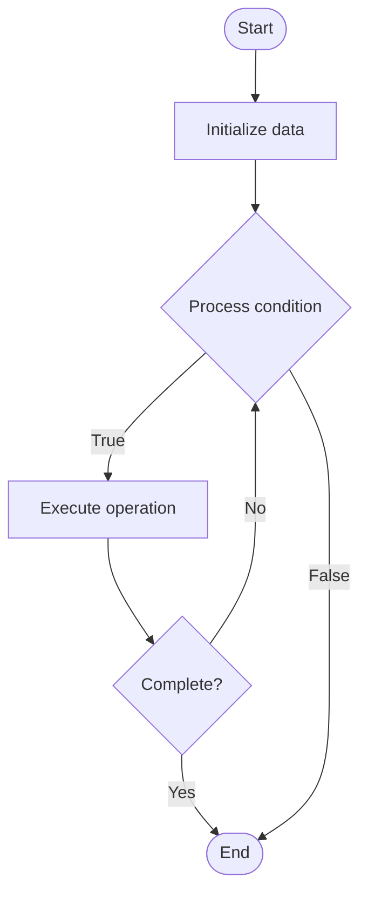

# Interactive Tutorial Systems

## Учебные материалы

- [Школьный уровень](school.ru.md)
- [Университетский уровень](univer.ru.md)

## Algorithm Visualization

### Flowchart (ASCII)

```
Interactive Tutorial Systems Flowchart:

┌─────────────┐
│   Start     │
└──────┬──────┘
       │
       ▼
┌─────────────┐
│  Initialize │
│   data      │
└──────┬──────┘
       │
       ▼
┌─────────────┐      Yes
│  Process   ├──────┐
│  condition?│      │
└──────┬──────┘      │
       │ No          │
       ▼             │
┌─────────────┐      │
│  Execute   │      │
│  operation │      │
└──────┬──────┘      │
       │             │
       └─────────────┘
       │
       ▼
┌─────────────┐
│    End      │
└─────────────┘
```

### Step-by-Step Execution

```
Interactive Tutorial Systems Step-by-Step Execution:

Input: [example data]

Step 1: Initialize
State: [initial state]

Step 2: Process
State: [intermediate state]

Step 3: Finalize
State: [final state]

Result: [output]
```

### Interactive Flowchart (Mermaid)



> **Note**: Mermaid diagrams are rendered automatically on GitHub. For local viewing, use a Mermaid-compatible Markdown viewer.

- [Python Implementation](/code/semester_14/lecture_101_developer_experience/tutorial_systems/algorithm.py)
- [Java Implementation](/code/semester_14/lecture_101_developer_experience/tutorial_systems/Algorithm.java)
- [Python Tests](/code/semester_14/lecture_101_developer_experience/tutorial_systems/test_algorithm.py)

What problem does it solve? (1 sentence)  
   Creates interactive, step-by-step tutorials that guide developers through learning APIs, tools, and concepts with hands-on exercises, code examples, and progress tracking.

Intuition (plain-language explanation)  
   Like an interactive textbook: Tutorial systems are like an interactive textbook - you read (instructions), do exercises (hands-on), get feedback (validation), and track progress (checklist) - just as a textbook guides learning, tutorials guide developers through learning.

Inputs & Outputs  

  - Input: Tutorial content, code examples, exercises, validation rules, progress tracking, completion criteria, learning paths.  
  - Output: Interactive tutorials, code exercises, validation feedback, progress tracking, completion certificates, learning analytics.

Step-by-step description (5–10 lines max)  
Design: design tutorial structure and content.
Create: create interactive content and exercises.
Validate: set up validation for exercises.
Track: implement progress tracking.
Present: present tutorials to developers.
Guide: guide developers through steps.
Validate: validate exercise completion.
Feedback: provide feedback and hints.
Complete: mark tutorials as complete.
Analyze: analyze learning analytics.

Tiny example (hand-simulated)  
   Tutorial: design 10-step tutorial → create exercises → validate code → track progress → present → guide → validate step 3 → feedback → complete → Tutorial successful.

Time & Space Complexity  

  - Time: O(t * e) where t is tutorial steps, e is exercise complexity (tutorial complexity).  
  - Space: O(c + p) where c is content, p is progress (tutorial storage).

Strengths  

- Learning: improves learning effectiveness.
- Engagement: increases developer engagement.
- Progress: tracks learning progress.

Weaknesses / limitations  

- Creation: requires time to create quality tutorials.
- Maintenance: requires maintenance as APIs change.
- Flexibility: may not fit all learning styles.

Compare with alternatives  
    Alternatives: Documentation Only, Video Tutorials, Written Guides, Community Learning

30-second explanation (your own words)  
    Interactive systems that guide developers through learning with step-by-step tutorials, hands-on exercises, and progress tracking.

*Sources: Adapted from standard university textbooks and Wikipedia summaries.*
