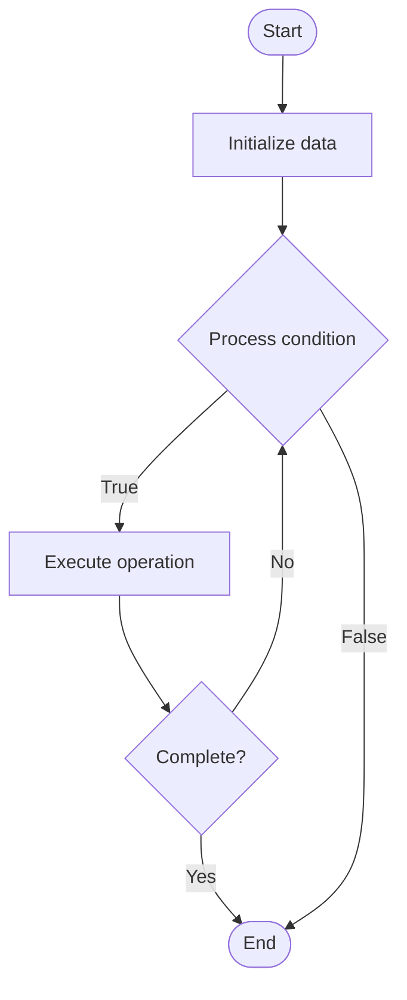

# Community Analytics

## Учебные материалы

- [Школьный уровень](school.ru.md)
- [Университетский уровень](univer.ru.md)

## Algorithm Visualization

### Flowchart (ASCII)

```
Community Analytics Flowchart:

┌─────────────┐
│   Start     │
└──────┬──────┘
       │
       ▼
┌─────────────┐
│  Initialize │
│   data      │
└──────┬──────┘
       │
       ▼
┌─────────────┐      Yes
│  Process   ├──────┐
│  condition?│      │
└──────┬──────┘      │
       │ No          │
       ▼             │
┌─────────────┐      │
│  Execute   │      │
│  operation │      │
└──────┬──────┘      │
       │             │
       └─────────────┘
       │
       ▼
┌─────────────┐
│    End      │
└─────────────┘
```

### Step-by-Step Execution

```
Community Analytics Step-by-Step Execution:

Input: [example data]

Step 1: Initialize
State: [initial state]

Step 2: Process
State: [intermediate state]

Step 3: Finalize
State: [final state]

Result: [output]
```

### Interactive Flowchart (Mermaid)



> **Note**: Mermaid diagrams are rendered automatically on GitHub. For local viewing, use a Mermaid-compatible Markdown viewer.

- [Python Implementation](/code/semester_14/lecture_102_community_management/community_analytics/algorithm.py)
- [Java Implementation](/code/semester_14/lecture_102_community_management/community_analytics/Algorithm.java)
- [Python Tests](/code/semester_14/lecture_102_community_management/community_analytics/test_algorithm.py)

What problem does it solve? (1 sentence)  
   Analyzes community engagement, participation, and health by tracking metrics like activity levels, contribution patterns, member growth, and sentiment to inform community management decisions.

Intuition (plain-language explanation)  
Like a health checkup for communities: Community analytics is like a health checkup - you measure various metrics (activity, growth, engagement), analyze the results (patterns, trends), and identify issues (declining engagement) - just as a doctor checks your health, analytics check community health.

Inputs & Outputs  

  - Input: Community data, activity logs, member information, contribution data, engagement metrics, time periods, analysis parameters.  
  - Output: Analytics reports, engagement metrics, growth trends, participation patterns, health scores, recommendations.

Step-by-step description (5–10 lines max)  
Collect: collect community data and metrics.
Aggregate: aggregate data across time periods.
Analyze: analyze engagement and participation patterns.
Measure: measure key metrics (DAU, MAU, contributions).
Trend: identify trends and patterns.
Compare: compare metrics across time periods.
Score: calculate community health scores.
Report: generate analytics reports.
Recommend: recommend actions based on insights.
Monitor: monitor metrics continuously.

Tiny example (hand-simulated)  
   Community Analytics: collect data → aggregate → analyze → measure (1000 DAU, 5000 MAU) → trend (growing) → compare → score (8/10) → report → recommend → Community Analytics successful.

Time & Space Complexity  

  - Time: O(d * a) where d is data volume, a is analysis complexity (analytics complexity).  
  - Space: O(d + m) where d is data, m is metrics (analytics storage).

Strengths  

- Insights: provides valuable insights into community health.
- Decision-making: informs community management decisions.
- Optimization: helps optimize community engagement.

Weaknesses / limitations  

- Privacy: raises privacy concerns about data collection.
- Complexity: requires sophisticated analysis techniques.
- Interpretation: requires careful interpretation of metrics.

Compare with alternatives  
    Alternatives: Manual Tracking, Basic Metrics, Third-Party Analytics, No Analytics

30-second explanation (your own words)  
Analytics systems that track and analyze community engagement, participation, and health metrics to inform community management.

*Sources: Adapted from standard university textbooks and Wikipedia summaries.*
