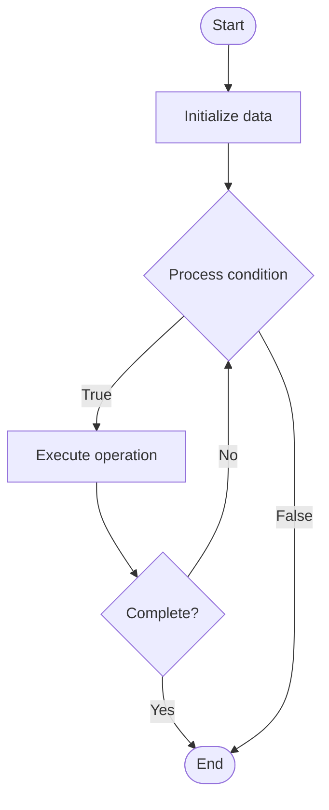

# Community Platforms

Name of Algorithm  

## Code Files


## Algorithm Visualization

### Flowchart (ASCII)


```
Community Platforms Flowchart:

┌─────────────┐
│   Start     │
└──────┬──────┘
       │
       ▼
┌─────────────┐
│  Initialize │
│   data      │
└──────┬──────┘
       │
       ▼
┌─────────────┐      Yes
│  Process   ├──────┐
│  condition?│      │
└──────┬──────┘      │
       │ No          │
       ▼             │
┌─────────────┐      │
│  Execute   │      │
│  operation │      │
└──────┬──────┘      │
       │             │
       └─────────────┘
       │
       ▼
┌─────────────┐
│    End      │
└─────────────┘
```


### Step-by-Step Execution


```
Community Platforms Step-by-Step Execution:

Input: [example data]

Step 1: Initialize
State: [initial state]

Step 2: Process
State: [intermediate state]

Step 3: Finalize
State: [final state]

Result: [output]
```


### Interactive Flowchart (Mermaid)





> **Note**: Mermaid diagrams are rendered automatically on GitHub. For local viewing, use a Mermaid-compatible Markdown viewer.
- [Python Implementation](/code/semester_14/lecture_102_community_management/community_platforms/algorithm.py)
- [Java Implementation](/code/semester_14/lecture_102_community_management/community_platforms/Algorithm.java)
- [Python Tests](/code/semester_14/lecture_102_community_management/community_platforms/test_algorithm.py)


   Community Platforms

What problem does it solve? (1 sentence)  
   Provides platforms and tools for building, managing, and growing developer communities with features like forums, chat, events, content sharing, and member management.

Intuition (plain-language explanation)  
   Like a town square: Community platforms are like a town square - you have spaces for discussion (forums), real-time chat (chat), events (meetups), sharing (content), and management (administration) - just as a town square brings people together, community platforms bring developers together.

Inputs & Outputs  
   - Input: Platform configuration, community rules, member data, content, events, moderation settings, integration requirements.  
   - Output: Community platform, forums, chat channels, event management, content library, member directory, analytics dashboard.

Step-by-step description (5–10 lines max)  
Choose: choose platform or build custom.
Configure: configure platform settings and rules.
Setup: set up forums, chat, and features.
Onboard: onboard initial members.
Moderate: establish moderation and governance.
Engage: engage community with content and events.
Grow: grow community through outreach.
Manage: manage members and content.
Analyze: analyze community health and engagement.
Iterate: iterate on platform and features.

Tiny example (hand-simulated)  
   Community Platform: choose platform → configure → setup forums → onboard 100 members → moderate → engage → grow to 1000 → manage → analyze → Community Platform successful.

Time & Space Complexity  
   - Time: O(s + m) where s is setup time, m is management time (platform complexity).  
   - Space: O(c + m) where c is content, m is members (platform storage).

Strengths  
- Engagement: facilitates community engagement.
- Growth: supports community growth.
- Management: provides tools for community management.

Weaknesses / limitations  
- Maintenance: requires ongoing maintenance and moderation.
- Resources: requires resources to build and maintain.
- Quality: depends on community participation and quality.

Compare with alternatives  
    Alternatives: No Platform, Basic Forums, Social Media, Third-Party Platforms

30-second explanation (your own words)  

*Sources: Adapted from standard university textbooks and Wikipedia summaries.*
