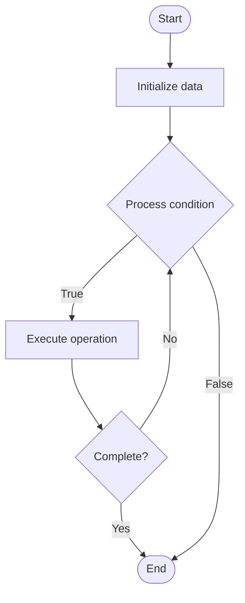

# Contribution Management

1. **Name of Algorithm**  

## Code Files


## Algorithm Visualization

### Flowchart (ASCII)


```
Contribution Management Flowchart:

┌─────────────┐
│   Start     │
└──────┬──────┘
       │
       ▼
┌─────────────┐
│  Initialize │
│   data      │
└──────┬──────┘
       │
       ▼
┌─────────────┐      Yes
│  Process   ├──────┐
│  condition?│      │
└──────┬──────┘      │
       │ No          │
       ▼             │
┌─────────────┐      │
│  Execute   │      │
│  operation │      │
└──────┬──────┘      │
       │             │
       └─────────────┘
       │
       ▼
┌─────────────┐
│    End      │
└─────────────┘
```


### Step-by-Step Execution


```
Contribution Management Step-by-Step Execution:

Input: [example data]

Step 1: Initialize
State: [initial state]

Step 2: Process
State: [intermediate state]

Step 3: Finalize
State: [final state]

Result: [output]
```


### Interactive Flowchart (Mermaid)





> **Note**: Mermaid diagrams are rendered automatically on GitHub. For local viewing, use a Mermaid-compatible Markdown viewer.
- [Python Implementation](semester_14/lecture_102_community_management/contribution_management/algorithm.py)
- [Java Implementation](semester_14/lecture_102_community_management/contribution_management/Algorithm.java)
- [Python Tests](semester_14/lecture_102_community_management/contribution_management/test_algorithm.py)


   Contribution Management

2. **What problem does it solve? (1 sentence)**  
   Manages and facilitates community contributions by providing contribution guidelines, review processes, recognition systems, and tools for tracking and rewarding contributions.

3. **Intuition (plain-language explanation)**  
   Like a contribution coordinator: Contribution management is like a contribution coordinator - you set guidelines (rules), review contributions (quality control), recognize contributors (rewards), and track contributions (metrics) - just as a coordinator manages volunteers, contribution management manages community contributors.

4. **Inputs & Outputs**  
   - Input: Contributions, contribution guidelines, review criteria, contributor information, recognition rules, tracking data.  
   - Output: Reviewed contributions, contributor recognition, contribution metrics, guidelines, review reports, contribution history.

5. **Step-by-step description (5–10 lines max)**  
1. Define: define contribution guidelines and processes.
2. Accept: accept contributions from community.
3. Review: review contributions for quality and compliance.
4. Provide: provide feedback to contributors.
5. Approve: approve contributions that meet criteria.
6. Integrate: integrate approved contributions.
7. Recognize: recognize and reward contributors.
8. Track: track contribution metrics and history.
9. Improve: improve processes based on feedback.
10. Maintain: maintain contribution guidelines and processes.

6. **Tiny example (hand-simulated)**  
   Contribution Management: define guidelines → accept PR → review → feedback → approve → integrate → recognize contributor → track → Contribution Management successful.

7. **Time & Space Complexity**  
   - Time: O(c * r) where c is contributions, r is review time (contribution management complexity).  
   - Space: O(c + h) where c is contributions, h is history (contribution storage).

8. **Strengths**  
- Quality: ensures contribution quality.
- Engagement: encourages community contributions.
- Recognition: recognizes and rewards contributors.

9. **Weaknesses / limitations**  
- Time: requires time for review and management.
- Complexity: can be complex with many contributions.
- Resources: requires resources for review and recognition.

10. **Compare with alternatives**  
    Alternatives: No Management, Basic Review, Automated Review, External Review

11. **30-second explanation (your own words)**  
    Systems and processes for managing community contributions, including guidelines, review, recognition, and tracking.

*Sources: Adapted from standard university textbooks and Wikipedia summaries.*
