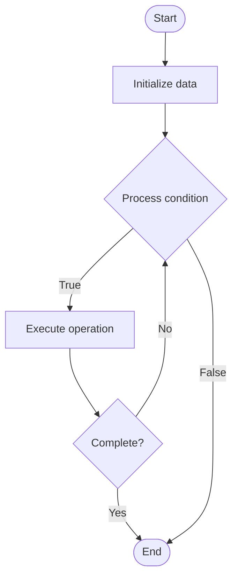

# Community Engagement Metrics

1. **Name of Algorithm**  

## Code Files


## Algorithm Visualization

### Flowchart (ASCII)


```
Community Engagement Metrics Flowchart:

┌─────────────┐
│   Start     │
└──────┬──────┘
       │
       ▼
┌─────────────┐
│  Initialize │
│   data      │
└──────┬──────┘
       │
       ▼
┌─────────────┐      Yes
│  Process   ├──────┐
│  condition?│      │
└──────┬──────┘      │
       │ No          │
       ▼             │
┌─────────────┐      │
│  Execute   │      │
│  operation │      │
└──────┬──────┘      │
       │             │
       └─────────────┘
       │
       ▼
┌─────────────┐
│    End      │
└─────────────┘
```


### Step-by-Step Execution


```
Community Engagement Metrics Step-by-Step Execution:

Input: [example data]

Step 1: Initialize
State: [initial state]

Step 2: Process
State: [intermediate state]

Step 3: Finalize
State: [final state]

Result: [output]
```


### Interactive Flowchart (Mermaid)





> **Note**: Mermaid diagrams are rendered automatically on GitHub. For local viewing, use a Mermaid-compatible Markdown viewer.
- [Python Implementation](semester_14/lecture_102_community_management/engagement_metrics/algorithm.py)
- [Java Implementation](semester_14/lecture_102_community_management/engagement_metrics/Algorithm.java)
- [Python Tests](semester_14/lecture_102_community_management/engagement_metrics/test_algorithm.py)


   Community Engagement Metrics

2. **What problem does it solve? (1 sentence)**  
   Measures and tracks community engagement through metrics like active users, participation rates, content creation, response times, and sentiment to assess community health and guide engagement strategies.

3. **Intuition (plain-language explanation)**  
   Like a fitness tracker for communities: Engagement metrics are like a fitness tracker - you measure various activities (posts, replies, participation), track trends (increasing/decreasing), and assess health (engagement score) - just as a fitness tracker monitors your activity, engagement metrics monitor community activity.

4. **Inputs & Outputs**  
   - Input: Community activity data, member data, content data, time periods, metric definitions, analysis parameters.  
   - Output: Engagement metrics, participation rates, activity trends, health scores, engagement reports, recommendations.

5. **Step-by-step description (5–10 lines max)**  
1. Define: define engagement metrics and KPIs.
2. Collect: collect activity and participation data.
3. Calculate: calculate engagement metrics.
4. Track: track metrics over time.
5. Analyze: analyze trends and patterns.
6. Compare: compare metrics across segments.
7. Score: calculate engagement scores.
8. Report: generate engagement reports.
9. Recommend: recommend engagement strategies.
10. Monitor: monitor metrics continuously.

6. **Tiny example (hand-simulated)**  
   Engagement Metrics: define (DAU, posts, replies) → collect → calculate (1000 DAU, 500 posts/day) → track → analyze → compare → score (7.5/10) → report → recommend → Engagement Metrics successful.

7. **Time & Space Complexity**  
   - Time: O(d * c) where d is data volume, c is calculation complexity (metrics complexity).  
   - Space: O(d + m) where d is data, m is metrics (metrics storage).

8. **Strengths**  
- Measurement: provides quantitative measurement of engagement.
- Insights: reveals engagement patterns and trends.
- Optimization: helps optimize engagement strategies.

9. **Weaknesses / limitations**  
- Interpretation: requires careful interpretation of metrics.
- Privacy: raises privacy concerns about data collection.
- Completeness: may not capture all aspects of engagement.

10. **Compare with alternatives**  
    Alternatives: No Metrics, Basic Counts, Qualitative Assessment, Third-Party Analytics

11. **30-second explanation (your own words)**  
    Metrics and systems for measuring and tracking community engagement to assess health and guide engagement strategies.

*Sources: Adapted from standard university textbooks and Wikipedia summaries.*
