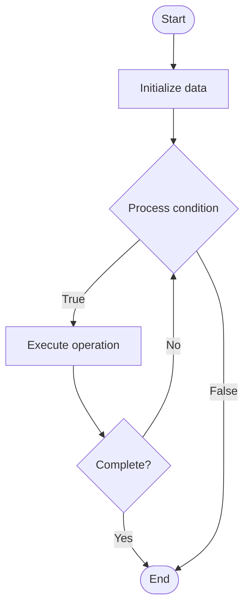

# Community Knowledge Sharing

## Учебные материалы

- [Школьный уровень](school.ru.md)
- [Университетский уровень](univer.ru.md)

## Algorithm Visualization

### Flowchart (ASCII)

```
Community Knowledge Sharing Flowchart:

┌─────────────┐
│   Start     │
└──────┬──────┘
       │
       ▼
┌─────────────┐
│  Initialize │
│   data      │
└──────┬──────┘
       │
       ▼
┌─────────────┐      Yes
│  Process   ├──────┐
│  condition?│      │
└──────┬──────┘      │
       │ No          │
       ▼             │
┌─────────────┐      │
│  Execute   │      │
│  operation │      │
└──────┬──────┘      │
       │             │
       └─────────────┘
       │
       ▼
┌─────────────┐
│    End      │
└─────────────┘
```

### Step-by-Step Execution

```
Community Knowledge Sharing Step-by-Step Execution:

Input: [example data]

Step 1: Initialize
State: [initial state]

Step 2: Process
State: [intermediate state]

Step 3: Finalize
State: [final state]

Result: [output]
```

### Interactive Flowchart (Mermaid)



> **Note**: Mermaid diagrams are rendered automatically on GitHub. For local viewing, use a Mermaid-compatible Markdown viewer.

- [Python Implementation](/code/semester_14/lecture_102_community_management/knowledge_sharing/algorithm.py)
- [Java Implementation](/code/semester_14/lecture_102_community_management/knowledge_sharing/Algorithm.java)
- [Python Tests](/code/semester_14/lecture_102_community_management/knowledge_sharing/test_algorithm.py)

What problem does it solve? (1 sentence)  
   Facilitates knowledge sharing within developer communities by providing platforms, tools, and incentives for sharing expertise, best practices, and solutions.

Intuition (plain-language explanation)  
   Like a knowledge library: Knowledge sharing is like a knowledge library - community members contribute knowledge (books), organize it (catalog), and share it (lending) - just as a library facilitates knowledge access, knowledge sharing facilitates community learning.

Inputs & Outputs  

  - Input: Knowledge content, contributor information, organization schemes, search capabilities, sharing incentives, quality criteria.  
  - Output: Knowledge base, organized content, searchable resources, contributor recognition, quality ratings, sharing metrics.

Step-by-step description (5–10 lines max)  
Create: create knowledge sharing platform.
Organize: organize knowledge into categories.
Contribute: enable community contributions.
Curate: curate and quality-check content.
Search: provide search and discovery tools.
Share: facilitate knowledge sharing.
Recognize: recognize knowledge contributors.
Update: update and maintain knowledge base.
Measure: measure knowledge sharing impact.
Improve: improve platform and processes.

Tiny example (hand-simulated)  
   Knowledge Sharing: create platform → organize (10 categories) → contribute (100 articles) → curate → search → share → recognize top contributors → update → Knowledge Sharing successful.

Time & Space Complexity  

  - Time: O(c * q) where c is content, q is quality check time (knowledge sharing complexity).  
  - Space: O(k + m) where k is knowledge, m is metadata (knowledge storage).

Strengths  

- Learning: facilitates community learning.
- Efficiency: reduces duplicate questions and answers.
- Value: creates valuable community resource.

Weaknesses / limitations  

- Quality: requires quality control and curation.
- Maintenance: requires ongoing maintenance.
- Participation: depends on community participation.

Compare with alternatives  
    Alternatives: No Sharing, Informal Sharing, External Resources, Paid Content

30-second explanation (your own words)  
    Platforms and processes for facilitating knowledge sharing within developer communities to enable learning and collaboration.

*Sources: Adapted from standard university textbooks and Wikipedia summaries.*
