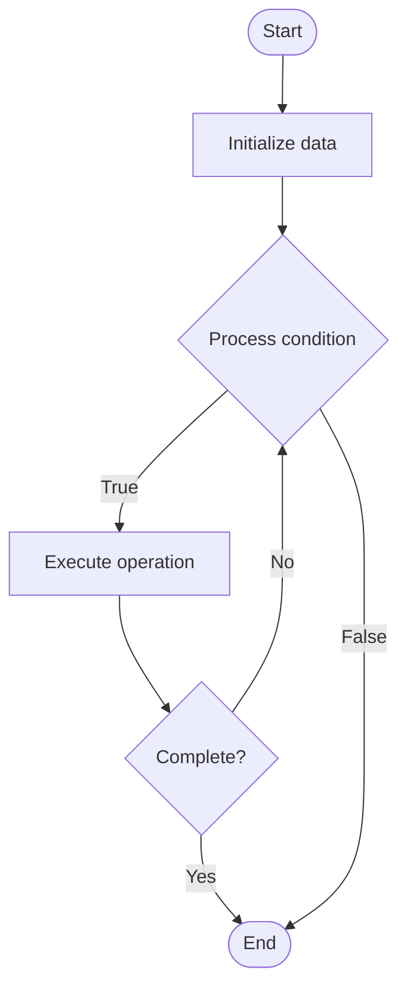

# Community Moderation Automation

1. **Name of Algorithm**  

## Code Files


## Algorithm Visualization

### Flowchart (ASCII)


```
Community Moderation Automation Flowchart:

┌─────────────┐
│   Start     │
└──────┬──────┘
       │
       ▼
┌─────────────┐
│  Initialize │
│   data      │
└──────┬──────┘
       │
       ▼
┌─────────────┐      Yes
│  Process   ├──────┐
│  condition?│      │
└──────┬──────┘      │
       │ No          │
       ▼             │
┌─────────────┐      │
│  Execute   │      │
│  operation │      │
└──────┬──────┘      │
       │             │
       └─────────────┘
       │
       ▼
┌─────────────┐
│    End      │
└─────────────┘
```


### Step-by-Step Execution


```
Community Moderation Automation Step-by-Step Execution:

Input: [example data]

Step 1: Initialize
State: [initial state]

Step 2: Process
State: [intermediate state]

Step 3: Finalize
State: [final state]

Result: [output]
```


### Interactive Flowchart (Mermaid)





> **Note**: Mermaid diagrams are rendered automatically on GitHub. For local viewing, use a Mermaid-compatible Markdown viewer.
- [Python Implementation](semester_14/lecture_102_community_management/moderation_automation/algorithm.py)
- [Java Implementation](semester_14/lecture_102_community_management/moderation_automation/Algorithm.java)
- [Python Tests](semester_14/lecture_102_community_management/moderation_automation/test_algorithm.py)


   Community Moderation Automation

2. **What problem does it solve? (1 sentence)**  
   Automates community moderation tasks like spam detection, content filtering, rule enforcement, and user management using AI and rule-based systems to maintain community quality at scale.

3. **Intuition (plain-language explanation)**  
   Like automated security guards: Moderation automation is like automated security guards - they monitor activity (content), detect problems (spam, violations), take action (remove, warn), and escalate when needed (human review) - just as security guards maintain order, moderation automation maintains community quality.

4. **Inputs & Outputs**  
   - Input: Community content, user behavior, moderation rules, AI models, escalation criteria, moderation history.  
   - Output: Moderated content, flagged items, automated actions, moderation reports, escalation alerts, quality metrics.

5. **Step-by-step description (5–10 lines max)**  
1. Define: define moderation rules and criteria.
2. Monitor: monitor community content and behavior.
3. Detect: detect violations using rules and AI.
4. Classify: classify content and behavior.
5. Action: take automated actions (remove, warn, flag).
6. Escalate: escalate complex cases to humans.
7. Learn: learn from moderation decisions.
8. Update: update rules and models.
9. Report: generate moderation reports.
10. Improve: improve automation based on results.

6. **Tiny example (hand-simulated)**  
   Moderation Automation: define rules → monitor → detect spam (10 items) → classify → remove → escalate 2 complex cases → learn → update → Moderation Automation successful.

7. **Time & Space Complexity**  
   - Time: O(c * d) where c is content, d is detection complexity (moderation complexity).  
   - Space: O(r + m) where r is rules, m is models (moderation storage).

8. **Strengths**  
- Scale: enables moderation at scale.
- Consistency: ensures consistent moderation.
- Efficiency: reduces manual moderation workload.

9. **Weaknesses / limitations**  
- Accuracy: may have false positives/negatives.
- Context: may miss context and nuance.
- Bias: may have algorithmic bias.

10. **Compare with alternatives**  
    Alternatives: Manual Moderation, Rule-Based Only, AI-Only, Hybrid Approaches

11. **30-second explanation (your own words)**  
    Automated systems that use AI and rules to moderate community content and behavior, maintaining quality at scale.

*Sources: Adapted from standard university textbooks and Wikipedia summaries.*
