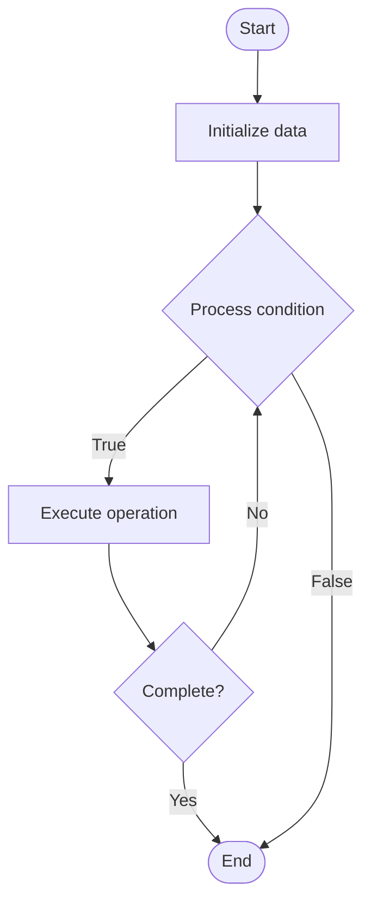

# AI-Powered Customer Support

## Учебные материалы

- [Школьный уровень](school.ru.md)
- [Университетский уровень](univer.ru.md)

## Algorithm Visualization

### Flowchart (ASCII)

```
AI-Powered Customer Support Flowchart:

┌─────────────┐
│   Start     │
└──────┬──────┘
       │
       ▼
┌─────────────┐
│  Initialize │
│   data      │
└──────┬──────┘
       │
       ▼
┌─────────────┐      Yes
│  Process   ├──────┐
│  condition?│      │
└──────┬──────┘      │
       │ No          │
       ▼             │
┌─────────────┐      │
│  Execute   │      │
│  operation │      │
└──────┬──────┘      │
       │             │
       └─────────────┘
       │
       ▼
┌─────────────┐
│    End      │
└─────────────┘
```

### Step-by-Step Execution

```
AI-Powered Customer Support Step-by-Step Execution:

Input: [example data]

Step 1: Initialize
State: [initial state]

Step 2: Process
State: [intermediate state]

Step 3: Finalize
State: [final state]

Result: [output]
```

### Interactive Flowchart (Mermaid)



> **Note**: Mermaid diagrams are rendered automatically on GitHub. For local viewing, use a Mermaid-compatible Markdown viewer.

- [Python Implementation](/code/semester_14/lecture_95_support_advanced/ai_powered_support/algorithm.py)
- [Java Implementation](/code/semester_14/lecture_95_support_advanced/ai_powered_support/Algorithm.java)
- [Python Tests](/code/semester_14/lecture_95_support_advanced/ai_powered_support/test_algorithm.py)

   AI-Powered Customer Support

What problem does it solve? (1 sentence)  
   Enhances customer support with AI capabilities like chatbots, automated responses, intelligent routing, sentiment analysis, and knowledge base integration to improve response times and support quality.

Intuition (plain-language explanation)  
   Like an AI assistant for support: AI-powered support is like having an AI assistant for customer support - it handles common questions (chatbot), routes complex issues (intelligent routing), understands sentiment (sentiment analysis), and learns from interactions (ML) - just as an assistant helps, AI helps support teams provide better service.

Inputs & Outputs  

  - Input: Support tickets, customer queries, knowledge base, conversation history, sentiment data, routing rules, AI models.  
  - Output: Automated responses, routed tickets, sentiment analysis, support recommendations, resolution suggestions, support metrics.

Step-by-step description (5–10 lines max)  
Receive: receive customer support requests.
Analyze: analyze request using NLP and AI.
Classify: classify request type and priority.
Route: route to appropriate support channel or agent.
Respond: generate automated responses when possible.
Sentiment: analyze customer sentiment.
Suggest: suggest solutions from knowledge base.
Escalate: escalate complex issues to humans.
Learn: learn from resolutions and feedback.
Improve: improve AI models and responses.

Tiny example (hand-simulated)  
   AI Support: receive query → analyze → classify (billing) → route → respond (automated) → sentiment (neutral) → suggest solution → resolve → AI Support successful.

Time & Space Complexity  

  - Time: O(q * a) where q is queries, a is AI processing time (AI support complexity).  
  - Space: O(k + m) where k is knowledge base, m is models (AI support storage).

Strengths  

- Speed: provides fast response times.
- Scale: handles high volume of requests.
- Consistency: ensures consistent support quality.

Weaknesses / limitations  

- Complexity: complex issues may require human intervention.
- Accuracy: may have limitations in understanding context.
- Training: requires training data and model maintenance.

Compare with alternatives  
    Alternatives: Human-Only Support, Rule-Based Automation, Hybrid Support, Self-Service Only

30-second explanation (your own words)  
    AI-enhanced customer support systems that use chatbots, intelligent routing, and automation to improve support efficiency and quality.

*Sources: Adapted from standard university textbooks and Wikipedia summaries.*
