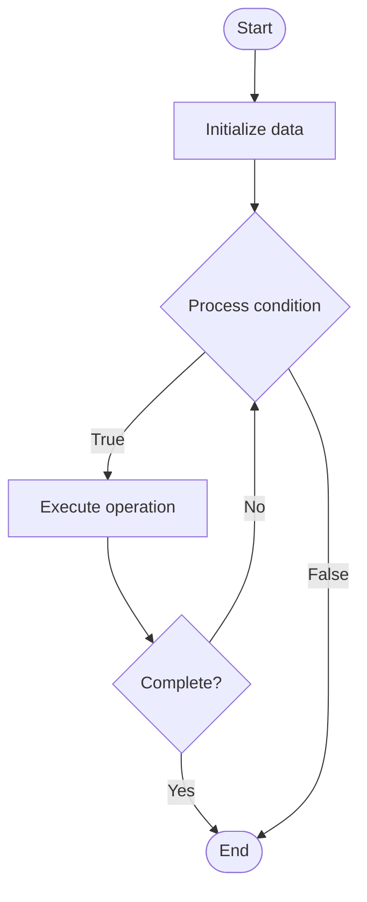

# Advanced Chatbots

## Учебные материалы

- [Школьный уровень](school.ru.md)
- [Университетский уровень](univer.ru.md)

## Algorithm Visualization

### Flowchart (ASCII)

```
Advanced Chatbots Flowchart:

┌─────────────┐
│   Start     │
└──────┬──────┘
       │
       ▼
┌─────────────┐
│  Initialize │
│   data      │
└──────┬──────┘
       │
       ▼
┌─────────────┐      Yes
│  Process   ├──────┐
│  condition?│      │
└──────┬──────┘      │
       │ No          │
       ▼             │
┌─────────────┐      │
│  Execute   │      │
│  operation │      │
└──────┬──────┘      │
       │             │
       └─────────────┘
       │
       ▼
┌─────────────┐
│    End      │
└─────────────┘
```

### Step-by-Step Execution

```
Advanced Chatbots Step-by-Step Execution:

Input: [example data]

Step 1: Initialize
State: [initial state]

Step 2: Process
State: [intermediate state]

Step 3: Finalize
State: [final state]

Result: [output]
```

### Interactive Flowchart (Mermaid)



> **Note**: Mermaid diagrams are rendered automatically on GitHub. For local viewing, use a Mermaid-compatible Markdown viewer.

- [Python Implementation](/code/semester_14/lecture_95_support_advanced/chatbot_advanced/algorithm.py)
- [Java Implementation](/code/semester_14/lecture_95_support_advanced/chatbot_advanced/Algorithm.java)
- [Python Tests](/code/semester_14/lecture_95_support_advanced/chatbot_advanced/test_algorithm.py)

What problem does it solve? (1 sentence)  
Creates sophisticated chatbots with natural language understanding, context awareness, multi-turn conversations, integration with backend systems, and learning capabilities for effective customer interactions.

Intuition (plain-language explanation)  
   Like a smart conversational assistant: Advanced chatbots are like smart conversational assistants - they understand natural language (not just keywords), remember context (conversation history), handle complex conversations (multi-turn), and integrate with systems (APIs) - just as a human assistant would, but available 24/7.

Inputs & Outputs  

  - Input: User messages, conversation context, knowledge base, backend APIs, user preferences, conversation history, training data.  
  - Output: Chatbot responses, conversation flows, API calls, context updates, user satisfaction, conversation analytics.

Step-by-step description (5–10 lines max)  
Receive: receive user message.
Understand: understand intent using NLP.
Context: retrieve conversation context.
Process: process request with context.
Integrate: integrate with backend systems if needed.
Generate: generate appropriate response.
Context: update conversation context.
Learn: learn from interaction.
Improve: improve responses based on feedback.
Analytics: track conversation analytics.

Tiny example (hand-simulated)  
   Advanced Chatbot: receive 'check order status' → understand intent → context → process → integrate API → generate response → update context → Advanced Chatbot successful.

Time & Space Complexity  

  - Time: O(m * n) where m is message processing, n is NLP complexity (chatbot complexity).  
  - Space: O(k + c) where k is knowledge, c is context (chatbot storage).

Strengths  

- Natural: provides natural conversation experience.
- Context: maintains conversation context.
- Integration: integrates with backend systems.

Weaknesses / limitations  

- Complexity: requires sophisticated NLP and training.
- Limitations: may have limitations in complex scenarios.
- Maintenance: requires ongoing training and maintenance.

Compare with alternatives  
    Alternatives: Simple Chatbots, Rule-Based Bots, Human Support, Hybrid Approaches

30-second explanation (your own words)  
Sophisticated chatbots with natural language understanding, context awareness, and system integration for effective customer interactions.

*Sources: Adapted from standard university textbooks and Wikipedia summaries.*
