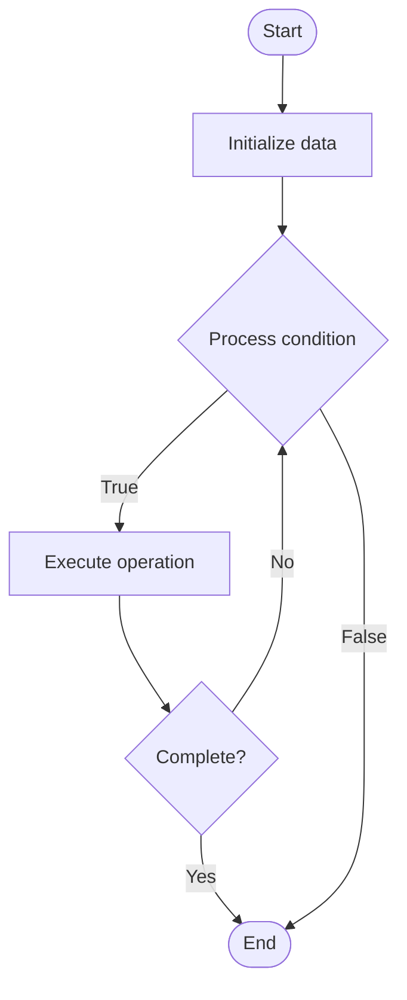

# Knowledge Graphs for Support

## Учебные материалы

- [Школьный уровень](school.ru.md)
- [Университетский уровень](univer.ru.md)

## Algorithm Visualization

### Flowchart (ASCII)

```
Knowledge Graphs for Support Flowchart:

┌─────────────┐
│   Start     │
└──────┬──────┘
       │
       ▼
┌─────────────┐
│  Initialize │
│   data      │
└──────┬──────┘
       │
       ▼
┌─────────────┐      Yes
│  Process   ├──────┐
│  condition?│      │
└──────┬──────┘      │
       │ No          │
       ▼             │
┌─────────────┐      │
│  Execute   │      │
│  operation │      │
└──────┬──────┘      │
       │             │
       └─────────────┘
       │
       ▼
┌─────────────┐
│    End      │
└─────────────┘
```

### Step-by-Step Execution

```
Knowledge Graphs for Support Step-by-Step Execution:

Input: [example data]

Step 1: Initialize
State: [initial state]

Step 2: Process
State: [intermediate state]

Step 3: Finalize
State: [final state]

Result: [output]
```

### Interactive Flowchart (Mermaid)



> **Note**: Mermaid diagrams are rendered automatically on GitHub. For local viewing, use a Mermaid-compatible Markdown viewer.

- [Python Implementation](/code/semester_14/lecture_95_support_advanced/knowledge_graph/algorithm.py)
- [Java Implementation](/code/semester_14/lecture_95_support_advanced/knowledge_graph/Algorithm.java)
- [Python Tests](/code/semester_14/lecture_95_support_advanced/knowledge_graph/test_algorithm.py)

   Knowledge Graphs for Support

What problem does it solve? (1 sentence)  
   Uses knowledge graphs to represent and query support information, enabling intelligent question answering, relationship discovery, and context-aware support recommendations.

Intuition (plain-language explanation)  
   Like a connected knowledge map: Knowledge graphs are like a connected knowledge map - information is represented as nodes (concepts) and edges (relationships), allowing you to navigate connections (related topics), discover relationships (dependencies), and answer questions (queries) - just as a map shows connections, knowledge graphs show information connections.

Inputs & Outputs  

  - Input: Support knowledge, entity relationships, query questions, context information, graph structure, query parameters.  
  - Output: Knowledge graph, query results, relationship discoveries, context-aware answers, recommendation paths, graph visualizations.

Step-by-step description (5–10 lines max)  
Extract: extract entities and relationships from knowledge.
Build: build knowledge graph structure.
Connect: connect related entities and concepts.
Query: enable graph queries and traversal.
Answer: answer questions using graph queries.
Discover: discover relationships and patterns.
Recommend: recommend related information.
Visualize: visualize graph structure and relationships.
Update: update graph as knowledge evolves.
Optimize: optimize graph queries and structure.

Tiny example (hand-simulated)  
   Knowledge Graph: extract entities → build graph (1000 nodes, 5000 edges) → connect → query 'how to reset password' → answer → discover related topics → recommend → Knowledge Graph successful.

Time & Space Complexity  

  - Time: O(q * g) where q is query complexity, g is graph size (knowledge graph complexity).  
  - Space: O(n + e) where n is nodes, e is edges (graph storage).

Strengths  

- Relationships: captures relationships between concepts.
- Discovery: enables relationship discovery.
- Context: provides context-aware answers.

Weaknesses / limitations  

- Construction: requires effort to build and maintain.
- Complexity: can become complex with large graphs.
- Quality: depends on knowledge quality and completeness.

Compare with alternatives  
    Alternatives: Flat Knowledge Base, Search-Based, FAQ Lists, Documentation

30-second explanation (your own words)  
    Knowledge graphs that represent support information as connected entities and relationships, enabling intelligent querying and recommendations.

*Sources: Adapted from standard university textbooks and Wikipedia summaries.*
