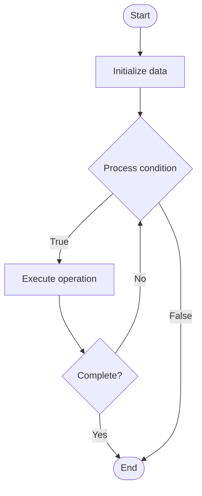

# Sentiment Analysis for Support

1. **Name of Algorithm**  

## Code Files


## Algorithm Visualization

### Flowchart (ASCII)


```
Sentiment Analysis for Support Flowchart:

┌─────────────┐
│   Start     │
└──────┬──────┘
       │
       ▼
┌─────────────┐
│  Initialize │
│   data      │
└──────┬──────┘
       │
       ▼
┌─────────────┐      Yes
│  Process   ├──────┐
│  condition?│      │
└──────┬──────┘      │
       │ No          │
       ▼             │
┌─────────────┐      │
│  Execute   │      │
│  operation │      │
└──────┬──────┘      │
       │             │
       └─────────────┘
       │
       ▼
┌─────────────┐
│    End      │
└─────────────┘
```


### Step-by-Step Execution


```
Sentiment Analysis for Support Step-by-Step Execution:

Input: [example data]

Step 1: Initialize
State: [initial state]

Step 2: Process
State: [intermediate state]

Step 3: Finalize
State: [final state]

Result: [output]
```


### Interactive Flowchart (Mermaid)





> **Note**: Mermaid diagrams are rendered automatically on GitHub. For local viewing, use a Mermaid-compatible Markdown viewer.
- [Python Implementation](semester_14/lecture_95_support_advanced/sentiment_analysis/algorithm.py)
- [Java Implementation](semester_14/lecture_95_support_advanced/sentiment_analysis/Algorithm.java)
- [Python Tests](semester_14/lecture_95_support_advanced/sentiment_analysis/test_algorithm.py)


   Sentiment Analysis for Support

2. **What problem does it solve? (1 sentence)**  
   Analyzes customer sentiment in support interactions to identify frustrated customers, prioritize urgent cases, route to appropriate agents, and improve support quality through emotional understanding.

3. **Intuition (plain-language explanation)**  
Like reading emotions: Sentiment analysis is like reading emotions - you analyze text (customer messages) to understand feelings (positive, negative, neutral), identify urgency (frustrated customers), and respond appropriately (prioritize, route) - just as you read someone's emotions, sentiment analysis reads customer emotions.

4. **Inputs & Outputs**  
   - Input: Customer messages, support tickets, conversation history, sentiment models, classification rules, context information.  
   - Output: Sentiment scores, emotion classifications, urgency flags, routing recommendations, sentiment trends, support insights.

5. **Step-by-step description (5–10 lines max)**  
1. Collect: collect customer messages and interactions.
2. Preprocess: preprocess text for analysis.
3. Analyze: analyze sentiment using NLP models.
4. Classify: classify sentiment (positive, negative, neutral).
5. Score: assign sentiment scores.
6. Flag: flag urgent or negative cases.
7. Route: route based on sentiment and urgency.
8. Track: track sentiment trends over time.
9. Report: generate sentiment reports.
10. Improve: improve support based on sentiment insights.

6. **Tiny example (hand-simulated)**  
   Sentiment Analysis: collect messages → preprocess → analyze → classify (negative) → score (-0.8) → flag urgent → route to senior agent → Sentiment Analysis successful.

7. **Time & Space Complexity**  
   - Time: O(m * s) where m is messages, s is sentiment analysis complexity (sentiment analysis complexity).  
   - Space: O(m + m) where m is messages, m is models (sentiment storage).

8. **Strengths**  
- Understanding: provides emotional understanding of customers.
- Prioritization: helps prioritize urgent cases.
- Quality: improves support quality and customer satisfaction.

9. **Weaknesses / limitations**  
- Accuracy: may have limitations in accuracy.
- Context: may miss context and sarcasm.
- Bias: may have cultural or linguistic bias.

10. **Compare with alternatives**  
    Alternatives: No Sentiment Analysis, Manual Assessment, Keyword-Based, Hybrid Approaches

11. **30-second explanation (your own words)**  
NLP systems that analyze customer sentiment in support interactions to understand emotions, prioritize cases, and improve support quality.

*Sources: Adapted from standard university textbooks and Wikipedia summaries.*
