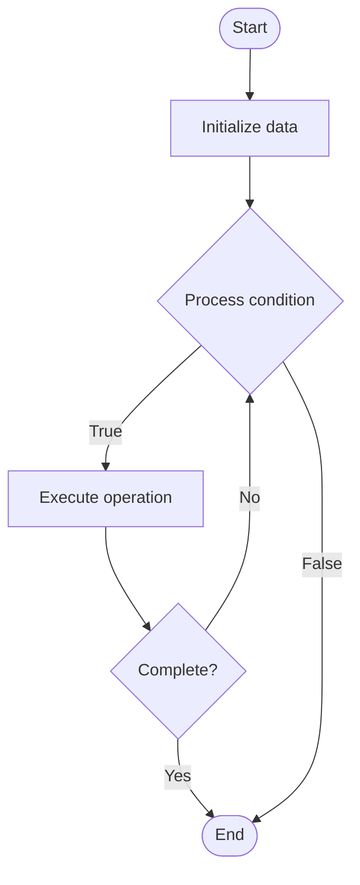

# Support Analytics

## Учебные материалы

- [Школьный уровень](school.ru.md)
- [Университетский уровень](univer.ru.md)

## Algorithm Visualization

### Flowchart (ASCII)

```
Support Analytics Flowchart:

┌─────────────┐
│   Start     │
└──────┬──────┘
       │
       ▼
┌─────────────┐
│  Initialize │
│   data      │
└──────┬──────┘
       │
       ▼
┌─────────────┐      Yes
│  Process   ├──────┐
│  condition?│      │
└──────┬──────┘      │
       │ No          │
       ▼             │
┌─────────────┐      │
│  Execute   │      │
│  operation │      │
└──────┬──────┘      │
       │             │
       └─────────────┘
       │
       ▼
┌─────────────┐
│    End      │
└─────────────┘
```

### Step-by-Step Execution

```
Support Analytics Step-by-Step Execution:

Input: [example data]

Step 1: Initialize
State: [initial state]

Step 2: Process
State: [intermediate state]

Step 3: Finalize
State: [final state]

Result: [output]
```

### Interactive Flowchart (Mermaid)



> **Note**: Mermaid diagrams are rendered automatically on GitHub. For local viewing, use a Mermaid-compatible Markdown viewer.

- [Python Implementation](/code/semester_14/lecture_95_support_advanced/support_analytics/algorithm.py)
- [Java Implementation](/code/semester_14/lecture_95_support_advanced/support_analytics/Algorithm.java)
- [Python Tests](/code/semester_14/lecture_95_support_advanced/support_analytics/test_algorithm.py)

What problem does it solve? (1 sentence)  
Analyzes support operations data to measure performance, identify trends, optimize workflows, and make data-driven decisions to improve support quality and efficiency.

Intuition (plain-language explanation)  
Like a dashboard for support: Support analytics is like a dashboard for support operations - you collect data (tickets, responses, resolutions), analyze it (metrics, trends), and use insights (optimization, decisions) - just as a car dashboard shows speed and fuel, support analytics shows performance and efficiency.

Inputs & Outputs  

  - Input: Support tickets, response times, resolution data, customer satisfaction, agent performance, workflow data, time periods.  
  - Output: Analytics reports, performance metrics, trend analysis, optimization recommendations, insights, dashboards.

Step-by-step description (5–10 lines max)  
Collect: collect support operation data.
Aggregate: aggregate data across time periods.
Calculate: calculate key performance metrics.
Analyze: analyze trends and patterns.
Visualize: visualize data in dashboards.
Identify: identify areas for improvement.
Recommend: recommend optimization strategies.
Report: generate analytics reports.
Monitor: monitor metrics continuously.
Optimize: optimize based on insights.

Tiny example (hand-simulated)  
   Support Analytics: collect data → aggregate → calculate (avg response: 2h, resolution: 8h) → analyze → visualize → identify bottlenecks → recommend → Support Analytics successful.

Time & Space Complexity  

  - Time: O(d * a) where d is data volume, a is analysis complexity (analytics complexity).  
  - Space: O(d + m) where d is data, m is metrics (analytics storage).

Strengths  

- Insights: provides valuable insights into support operations.
- Optimization: helps optimize support workflows.
- Decision-making: enables data-driven decision making.

Weaknesses / limitations  

- Data quality: depends on data quality and completeness.
- Complexity: requires sophisticated analysis techniques.
- Interpretation: requires careful interpretation of metrics.

Compare with alternatives  
    Alternatives: No Analytics, Basic Metrics, Manual Analysis, Third-Party Analytics

30-second explanation (your own words)  
Analytics systems that analyze support operations data to measure performance, identify trends, and optimize workflows.

*Sources: Adapted from standard university textbooks and Wikipedia summaries.*
